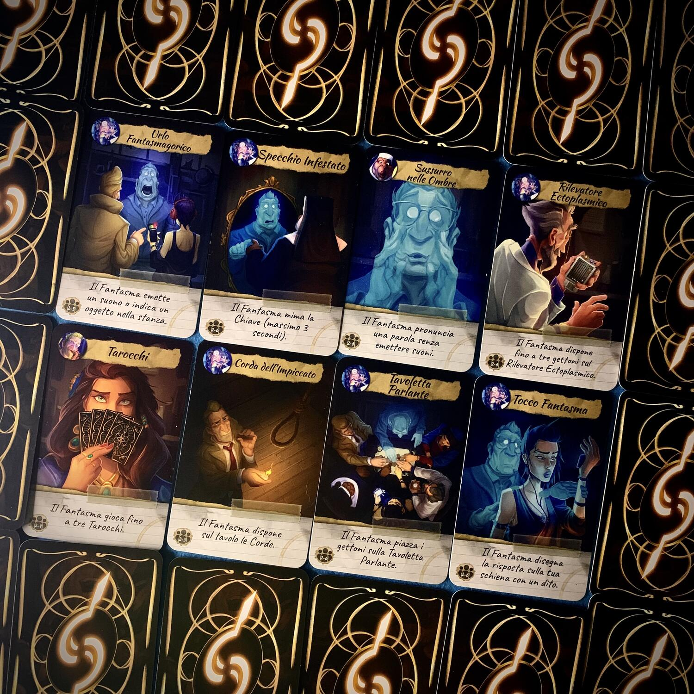
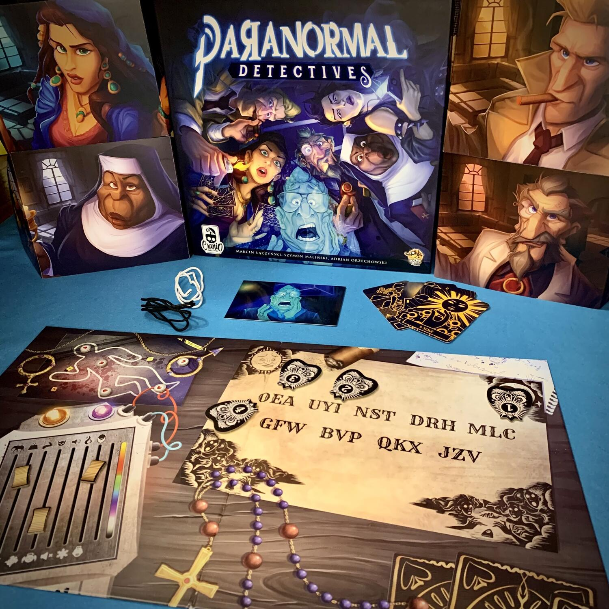

<Setting>

  Non appena apri le palpebre… ti travolge lo shock più grande della tua vita,
  che per inciso è appena terminata… <strong>ormai sei un fantasma</strong>!{" "}
   
  Con orrore, abbassi lo sguardo in cerca del tuo corpo e vedi uno strano gruppo
  di persone intente a studiare i tuoi resti mortali. Sono… <strong>    Detectives</strong>!  
  Beh, almeno una buona notizia… Ora devi trovare il modo di{" "}
  <strong>comunicare </strong>con<strong>loro</strong>, che stanno indagando per
  scoprire come è finita la tua vita.

</Setting>

<Rules>

  Paranormal Detectives è un <strong>party game</strong> di{" "}
  <strong>deduzione competitivo</strong>.  
  Un giocatore interpreterà <strong>il ruolo del fantasma</strong> di una vittima
  appena deceduta, mentre gli <strong>altri</strong> giocatori saranno dei <strong>    detectives</strong>. 
  <strong>Usando</strong> le loro <strong>abilità</strong> psichiche, i
  detectives dovranno <strong>collaborare</strong> col fantasma, facendo domande
  sui dettagli del crimine. Il fantasma potrà <strong>rispondere</strong> in
  modi <strong>strani</strong> e <strong>criptici</strong>, ad esempio
  utilizzando due cordicelle, manipolando tarocchi, sfruttando una tavola ouija,
  disegnando attraverso la mano di un detective la chiave e tanti altri.
   
  Lo scopo è quello di dare risposta a 5 interrogativi ben precisi, i classici
  Chi, Perché, Dove, Come e Arma del delitto.
   A <strong>turno</strong>, ogni <strong>giocatore</strong> potrà <strong>    porre</strong> una <strong>domanda</strong> al fantasma, associando ad essa una delle
  sue <strong>carte</strong> disponibili.
   
  Una volta che un giocatore avrà formulato due ipotesi non potrà continuare a giocare.
   
  Vince chi per primo risponde correttamente alle 5 domande.

</Rules>

<Feedback>

  Questo gioco colpisce sin dalla prima partita grazie alla sua{" "}
  <strong>estrema facilità</strong> e alla sua capacità di{" "}
  <strong>vasto coinvolgimento</strong>. 
  <strong>Giocando</strong>nei <strong>panni</strong> di un <strong>    detective</strong> bisogna <strong>capire</strong> quale sia la <strong>    domanda giusta</strong> da porre in quell’esatto momento… e soprattutto con che carta. È importante
  stare sempre attenti per ascoltare le domande degli altri giocatori, poichè quasi
  ogni carta gode di una risposta pubblica.
   
  <strong>Giocando</strong> da <strong>fantasma</strong>, invece, ci si può <strong>    sbizzarrire</strong> nei modi più creativi per <strong>dare</strong> le <strong>    risposte</strong> richieste.
   
  Per quanto riguarda la <strong>rigiocabilità</strong>, il gioco gode di un'<strong>    elevata longevità</strong> grazie alle numerose carte caso presenti nella scatola di gioco e all'app
  disponibile sia sull <a href="https://apps.apple.com/it/app/paranormal-detectives/id1484425840">
    <strong>App Store</strong>
  </a> che su <a href="https://play.google.com/store/apps/details?id=com.luckyduckgames.paranormaldetectives&hl=it&gl=US">
    <strong>Google Play</strong>
  </a>. 
  Questo gioco è poi una gioia per gli occhi, visti i{" "}
  <strong>materiali di gioco eccellenti</strong>, le{" "}
  <strong>illustrazioni piacevolissime</strong> ed il{" "}
  <strong>regolamento ben scritto</strong>. Ottimo sia per giocare in famiglia
  che con la giusta compagnia di amici.
   
   
  La tavola ouija sembra aver scritto…  
  <a href="https://www.dungeondice.it/21460-paranormal-detectives.html?dda=9A5FB278F">
    {" "}
    L O &nbsp; T R O V I &nbsp; Q U I{" "}
  </a>
   
  <strong>Ouch!</strong>

</Feedback>
