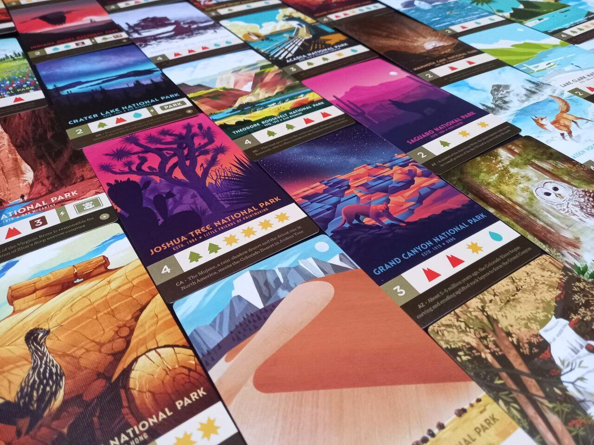
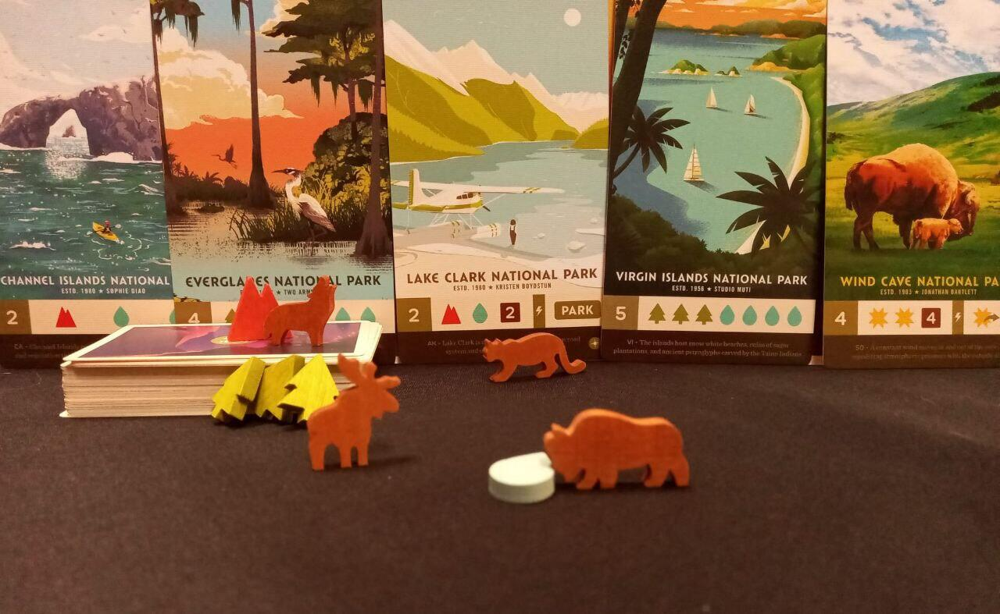

<Setting>

  Sogni immense brughiere dove pascolano bisonti, alte foreste di sequoie e
  canyon in stile film western? Resti stupito davanti ai documentari sulla flora
  e la fauna del Parco di Yellowstone, agli scorci mozzafiato del Parco delle
  Montagne Rocciose e ti chiedi chi vive nel Parco della Death Valley? Parks è
  un gioco che ti farà visitare tutti i Parchi nazionali degli Stati Uniti
  attraverso le splendide illustrazioni di Fifty-Nine Parks. Insieme agli altri
  giocatori vestirete i panni di escursionisti che raccolgono risorse lungo il
  sentiero, grazie alle quali potrete visitare i Parchi che forniranno punti a
  fine partita.
   

</Setting>

<Rules>

  Parks si sviluppa su quattro round detti stagioni che determinano la lunghezza
  del percorso e alcune delle risorse iniziali. Al termine della preparazione,
  il tabellone di gioco si presenta come un percorso, composto da 6 tessere
  sito, che procede da sinistra verso destra.  
  Nel proprio turno il giocatore deve muovere uno dei suoi escursionisti in un sito
  non occupato da altri esploratori e che si trovi “in avanti” rispetto al suo esploratore.
  Una volta occupato il nuovo sito, il giocatore ottiene risorse o compie delle azioni
  e, giunti alla fine del sentiero, a tutti i giocatori è concesso visitare un Parco,
  ovvero spendere le risorse accumulate per ottenere la carta raffigurante il Parco
  e i relativi punti a fine partita.  
  Terminate le quattro stagioni, i giocatori contano i punti ottenuti dai Parchi
  e dalle eventuali fotografie scattate durante l’escursione. Il segnalino Primo
  giocatore fornisce un ulteriore punto al suo possessore. Naturalmente, il
  giocatore con più punti è il vincitore.
   

</Rules>

<Feedback>

  Il gioco si presenta ricco di componenti, molto colorato, con token in legno
  raffiguranti alcuni degli iconici animali che popolano i Parchi Nazionali,
  splendidamente illustrati dal collettivo di artisti di Fifty-Nine Parks.{" "}
   
  Sebbene il grandioso impatto visivo faccia pregustare una vivida immersione, questo
  aspetto è "raffreddato" dalla natura astratta del gioco. I diversi elementi grafici
  sono più funzionali alle meccaniche che alla resa dell'ambientazione vera e propria.{" "}
   
  Nonostante queste "pecche", Parks rimane uno dei titoli più giocati nelle
  serate in famiglia. L’immediatezza delle regole, i componenti degni di una
  versione deluxe e le illustrazioni superlative costituiscono sicuramente dei
  validi punti di forza. Per non parlare della cura nell’inserto ad opera di
  Game Trayz: due contenitori che consentono di riporre i componenti nella
  scatola e che possono anche essere utilizzati durante le partite.  

</Feedback>

