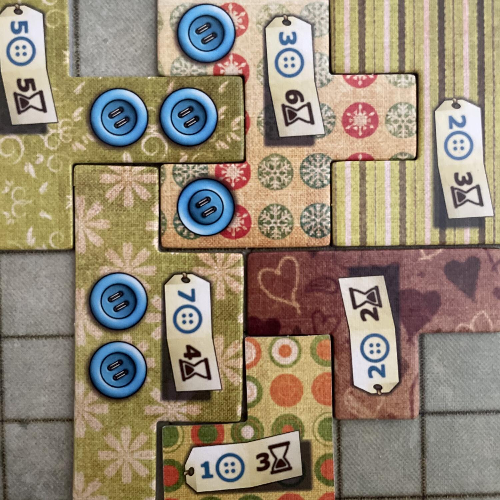
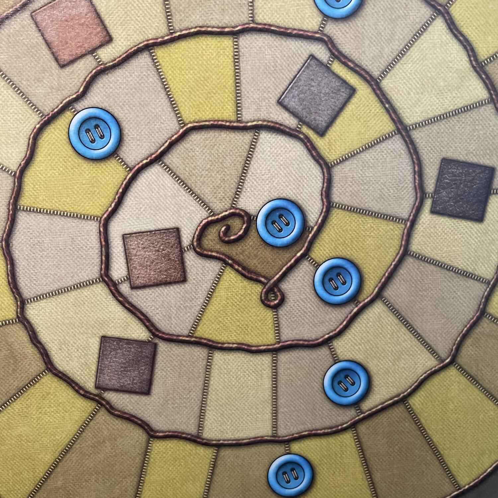
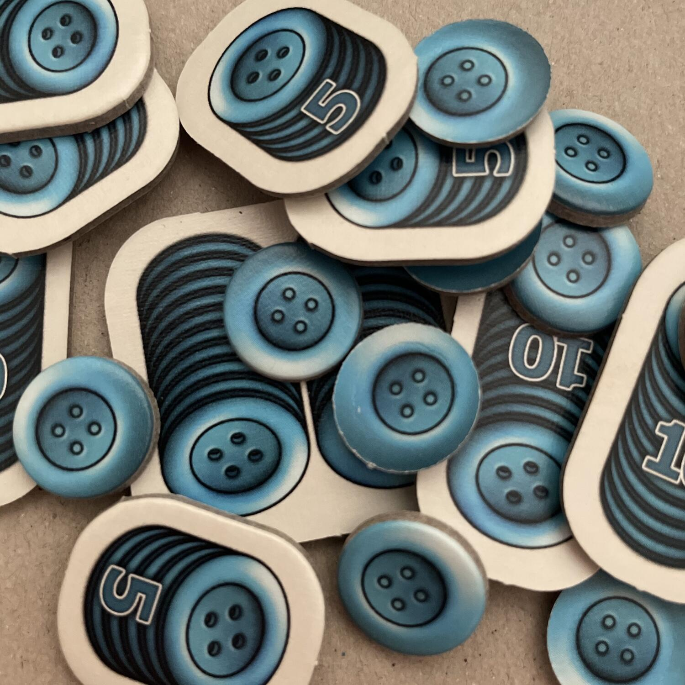

<Setting>

  Dicesi "patchwork" quella <strong>tecnica di cucito</strong> consistente
  nell’unione di vari pezzi di stoffa che formano un disegno più grande. In
  passato era un modo per sfruttare i ritagli di stoffa avanzati per creare capi
  d’abbigliamento e trapunte, mentre oggi… è diventato un gioco da tavolo in cui{" "}
  <strong>due stilisti</strong> si sfideranno nella creazione di “tessuti”
  strepitosi, usando “stoffe” pregiate. La vostra <strong>trapunta</strong>, per
  essere davvero di qualità, richiederà impegno e tempo, soprattutto se le pezze
  disponibili non combaceranno tra loro. Scegliete dunque le{" "}
  <strong>pezze</strong> con molta attenzione e fate una bella scorta di{" "}
  <strong>bottoni</strong>, non solo per finire la vostra trapunta, ma anche per
  renderla più bella di quella del vostro avversario.
   

</Setting>

<Rules>

  Ogni giocatore prende 1 <strong>Plancia Trapunta</strong>, 1{" "}
  <strong>Segnalino Tempo</strong> e 5 <strong>Bottoni</strong> (saranno la
  valuta). Collocate la <strong>Plancia Tempo</strong> al centro del tavolo, i
  vostri segnalini tempo sulla relativa casella di partenza e le{" "}
  <strong>Pezze Speciali</strong> sulle relative caselle. Le altre pezze vanno
  collocate in cerchio attorno a questa plancia. La{" "}
  <strong>Pedina Neutrale</strong> va piazzata tra la pezza più piccola (1x2) e
  quella successiva in senso orario. La <strong>Pezza Speciale</strong>{" "}
  <strong>7x7</strong> va messa da parte.
   
  Ogni giocatore svolge un numero variabile di turni consecutivi, finché il
  proprio segnalino tempo non raggiunge o supera quello dell’avversario.
   
  Durante il proprio turno, un giocatore può far <strong>Avanzare</strong> il
  segnalino tempo oppure <strong>Prendere e Collocare una Pezza</strong>: se si
  Avanza il segnalino tempo, si occupa la casella immediatamente successiva al
  segnalino tempo dell’avversario e si riceve 1 bottone per ogni casella di cui
  si è avanzato; se si Prende e Colloca una Pezza, se ne sceglie una tra le 3
  davanti alla pedina neutrale in senso orario, se ne paga il costo in bottoni e
  la si colloca senza sovrapporla ad altre sulla propria plancia; infine, si fa
  Avanzare il proprio segnalino tempo sulla plancia del numero di caselle
  indicato sull’etichetta della pezza. Ogni volta che si supera una casella con
  una Pezza Speciale, la si prende e la si colloca sulla plancia trapunta, dove
  fungerà da “rattoppo” alle caselle singole rimaste vuote; ogni volta che si
  supera una casella con un Bottone, si riceve un numero di bottoni pari a
  quelli rappresentati sulle pezze presenti sulla vostra trapunta. Il primo
  giocatore a riempire completamente un quadrato 7x7 di caselle sulla propria
  plancia trapunta riceverà la tessera speciale 7x7 che vale 7 punti a fine
  partita.
   
  <strong>La partita termina quando</strong> entrambi i segnalini tempo
  raggiungono l’ultima casella della plancia tempo. Se un segnalino sta per
  essere mosso oltre l’ultima casella, si ferma semplicemente sull’ultima
  casella. Se ciò avviene mentre si esegue l’azione Avanzare, riceverete i
  bottoni soltanto per il numero effettivo di caselle di cui vi siete mossi. Per
  calcolare il punteggio si conta il numero di bottoni rimasti, a cui si
  aggiunge il valore della tessera speciale e si sottraggono 2 punti per ogni
  casella vuota sulla propria plancia trapunta.
   

</Rules>

<Feedback>

  Cottage Gar… ehm, volevo dire, Patchwork è, tutto sommato,{" "}
  <strong>un giochino con una meccanica interessante</strong>. Uwe Rosenberg,
  che ci ha abituato alla sua onnipresenza nel mondo dei giochi da tavolo,
  avendo frequentato una gran quantità di generi, in Patchwork non ci propone un
  Eurogame classico sullo stile di Agricola o di Caverna (al nostro autore piace
  citarsi…), né la vivacità di un titolo più di medio peso, come Nova Luna (
  <Link to="/reviews/nova-luna/">Recensione</Link>) o Sagani (gli piace sì!):
  piuttosto, in questo piccolo e contenuto <strong>astratto</strong>, reso accattivante
  dalla scaltrezza del sistema di gioco, di fatto ci fornisce una prima versione
  del meno fortunato <strong>Cottage Garden</strong>. Ora, più che di fronte a
  un’autocitazione, direi che siamo quasi di fronte a un autoplagio: le
  meccaniche principali di Cottage Garden sono sostanzialmente una{" "}
  <strong>rivisitazione</strong> di quelle di Patchwork, con la scelta di
  tessere da piazzare sulla plancia personale, attingendole a un “serpente” già
  predisposto al centro del tavolo, e con l’idea vincente (evidentemente
  all’origine del meccanismo del suo successore) che bisogna scegliere il pezzo
  che avvantaggia maggiormente noi e meno l’avversario tra i primi 3 di volta in
  volta disponibili… Ma se siete alla ricerca di una sfida un po’ più
  articolata, e meno ridondante, vi suggerirei di rivolgere la vostra attenzione
  direttamente a Cottage Garden, senza passare da Patchwork (a meno che non
  siate grandi amanti di questo tipo di tessuto).
   
  Parlando di strategia, si può certamente dire che Patchwork offre una sfida,
  ma <strong>non lo paragonerei neanche lontanamente agli scacchi</strong>, come
  invece è stato (arditamente) fatto: il livello di profondità strategica che
  precede la scelta di ogni mossa in Patchwork è, direi, drammaticamente
  inferiore rispetto agli scacchi e i tatticismi sono limitati a una scelta che
  ha molte meno implicazioni, tanto sul breve quanto sul medio termine (e se la
  durata non fosse così contenuta, direi anche sul lungo termine).
   
  <strong>Ormai ridondante nella sua originalità</strong>, data l’esistenza di
  un successore, Patchwork non brillava per rigiocabilità nemmeno quando era
  figlio unico: certo, potete farvi tutte le partite che volete e ogni volta la
  composizione finale sulla vostra plancia sarà diversa dalla precedente, ma
  dopo due o tre partite il gioco potrebbe già venirvi a noia. Non si può dire
  che questa eventuale noia dipenderebbe da banalità (
  <strong>non conosco giochi di Rosenberg “banali”</strong>), ma nemmeno che la
  sfida sia “interessantissima”, né tanto meno che sia tale “per chiunque”.
  Patchwork sarà anche longevo nella diversità strategica che ogni sfida vi
  porrà, ma non lo sarà altrettanto nell’offrirvi una crescita nella vostra
  comprensione strategica della meccanica o nelle emozioni che vi susciterà.{" "}
   

</Feedback>

