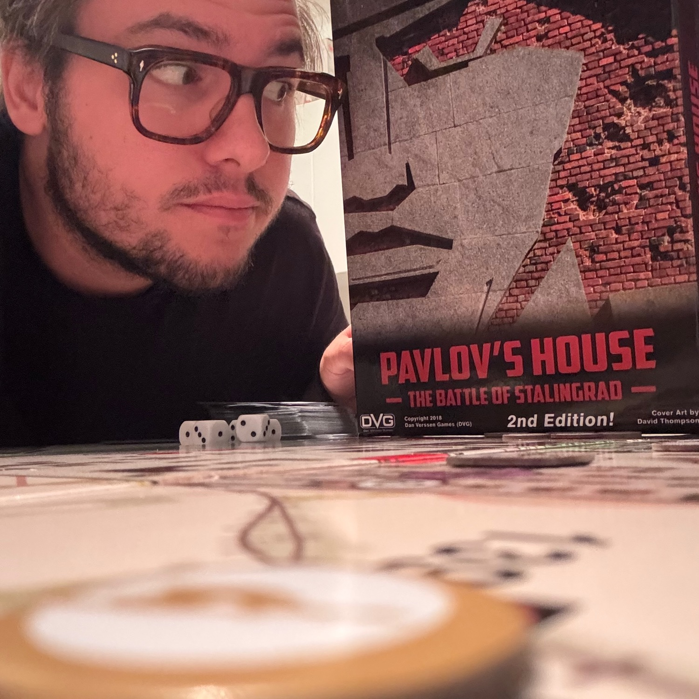
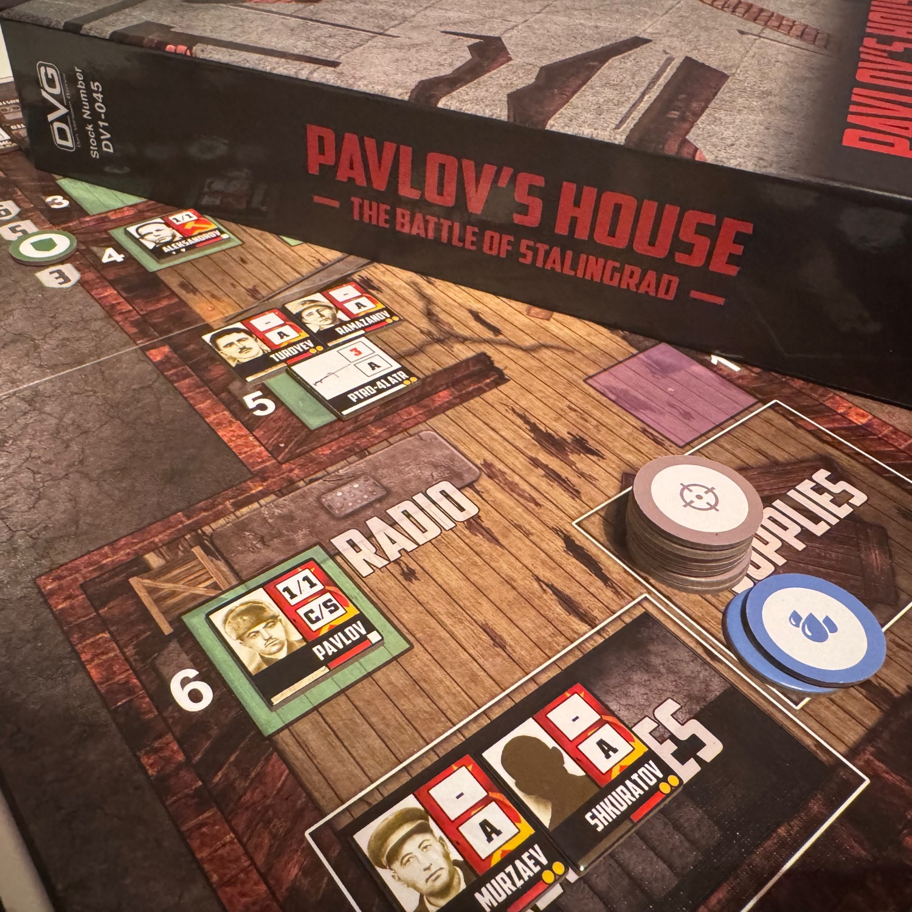
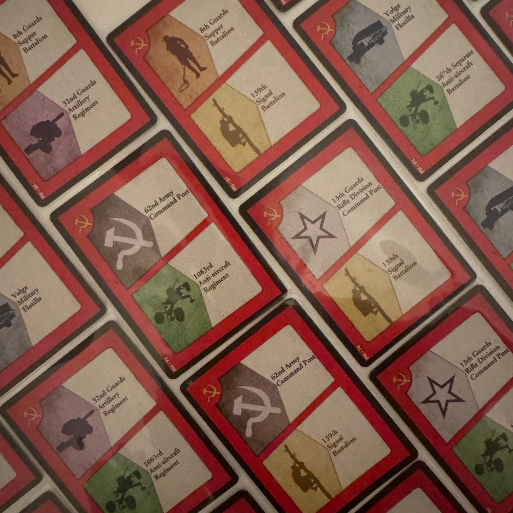

<Setting>

  Nella Casa di Pavlov, ogni giorno era un inferno che si ripeteva. Io e i miei compagni eravamo pochi, ma ci siamo aggrappati a quel palazzo come se fosse l'ultimo pezzo di terra rimasto sulla Terra. I tedeschi ci attaccavano da ogni lato, bombe e proiettili cadevano come pioggia incessante. Eppure, ci siamo rialzati ogni volta. Fame, freddo, paura: niente poteva spezzarci. Le mura di quel rudere erano ormai la nostra fortezza, e i nostri cuori, pieni di rabbia e coraggio, la nostra arma più potente. Sapevamo che non potevamo cedere. 
<strong>La Casa di Pavlov sarebbe rimasta sovietica, a qualunque costo.</strong>

</Setting>

<Rules>

 Pavlov’s House è caratterizzato da un <strong>tabellone suddiviso in tre sezioni</strong>: la casa di Pavlov sulla sinistra, Piazza 9 Gennaio nel centro e il Volga sulla destra. Queste sezioni offrono una visione completa della difesa, dal livello tattico dentro la casa, all'avanzata nemica attorno ad essa, fino al supporto strategico delle forze sovietiche lungo il Volga.  
Ogni turno si giocherà in una di queste sezioni, da destra verso sinistra, in altrettante fasi: la fase "Carte Sovietiche", la fase "Carte Wehrmacht" e la fase "Pedine Sovietiche".  
Nella <strong>prima fase</strong>, il giocatore pesca quattro carte dal mazzo sovietico e può usarne fino a tre per <strong>compiere azioni</strong>. Ogni carta ha due azioni possibili tra le quali scegliere e queste permettono di muovere risorse come cibo e munizioni verso la casa, di reclutare unità e armi e di potenziare le retrovie sovietiche, come le telecomunicazioni o le contraeree. 
La <strong>seconda fase</strong> rappresenta l’avanzata e gli <strong>attacchi delle forze tedesche</strong>. Si rivelano tre carte Wehrmacht e si risolvono gli effetti di ciascuna prima di passare alla successiva. Le carte possono provocare danni diretti ai nostri soldati, alle difese della casa o alle nostre retrovie, oppure farci attaccare direttamente dai soldati che invaderanno la piazza e che noi dovremo tenere a bada. 
Nell' <strong>ultima fase</strong>, si muovono e si <strong>attivano le pedine sovietiche</strong> nella casa. Ogni turno permette di muovere fino a tre pedine e compiere tre azioni, come sparare contro gli invasori o prepararsi a sopprimere quelli che verranno nel futuro.  
L'obiettivo è quello di difendere la casa e respingere le forze nemiche prima che riescano ad entrare nella struttura o a ridurre le difese a zero. 
Alla fine del turno, si ripete il ciclo fino a esaurire il mazzo delle carte Wehrmacht o fino a che, di noi, non rimane più nulla.

</Rules>

<Feedback>

  Ormai ci ho preso gusto con i solitari ambientati nella seconda guerra mondiale e cosa poteva seguire <Link to="/reviews/halls-of-hegra/">Halls of Hegra</Link> se non Pavlov’s House? 
Pavlov’s House è il solitario perfetto se quello che cerchi è un gioco leggero ambientato nella <strong>epicissima battaglia di Stalingrado</strong> (se ne cerchi uno più tosto, dai invece un’occhiata a <Link to="/reviews/undaunted-stalingrad/">questo</Link>). 
Sono sicuramente di parte a parlavi di questo titolo, in quanto <Link to="/designers/david-thompson">David Thompson</Link> è uno dei miei autori preferiti, se non <strong>IL mio autore preferito</strong>… e non ci posso fare nulla :)   
Partiamo con le precisazioni: <strong>Pavlov’s House è un gioco dove si tira una vagonata di dadi</strong>. Ogni singola azione che faremo e che faranno i nazisti è governata dall'alea. Il gioco consiste proprio nel capire come piegare la casualità a nostro vantaggio, nel prendere delle decisioni basate sulla probabilità che qualcosa accada, nel gestire al meglio il rischio. Ogni singola carta che pescherete nella prima fase vi darà una scelta tra due azioni possibili ed è qui che dovrete capire cosa vi fa correre meno rischi e, al contempo, vi fa ottenere un vantaggio sul nemico. <strong>Vegetare sicuramente non è la soluzione.</strong> A inizio partita tutto è molto casuale, ovviamente, ma dopo i primi 2-3 turni, prende senso: si capisce che scelte fare nella parte destra della plancia, sia per potersi difendere dagli attacchi dei nazisti, sia per poter colpire al meglio direttamente dalla casa.  
Una volta imparati una decina di simboli (ci sono comunque dei fogli di recap) tutto gira liscio e in 45 min riuscite a vivere un'esperienza completa, in <strong>una montagna russa tra frustrazione e adrenalina</strong> che vi farà alzare dalla sedia con l'impressione di aver fatto qualcosa di davvero molto bello.  
Nella scatola, ci sono anche delle <strong>varianti</strong> che rendono il gioco più "interessante", rendendo i nazisti ancora più determinati a conquistare la nostra amata casa. Dopo la prima partita vinta in modalità standard, vi rifiuterete di giocare senza queste modifiche!  
Thompson, sulla stessa falsariga, ha disegnato anche <Link to="/reviews/castle-itter-the-strangest-battle-of-wwii/">Castle Itter</Link> e "Lanzerath Ridge"… che mi sa che è meglio che vado a recuperare!

</Feedback>

