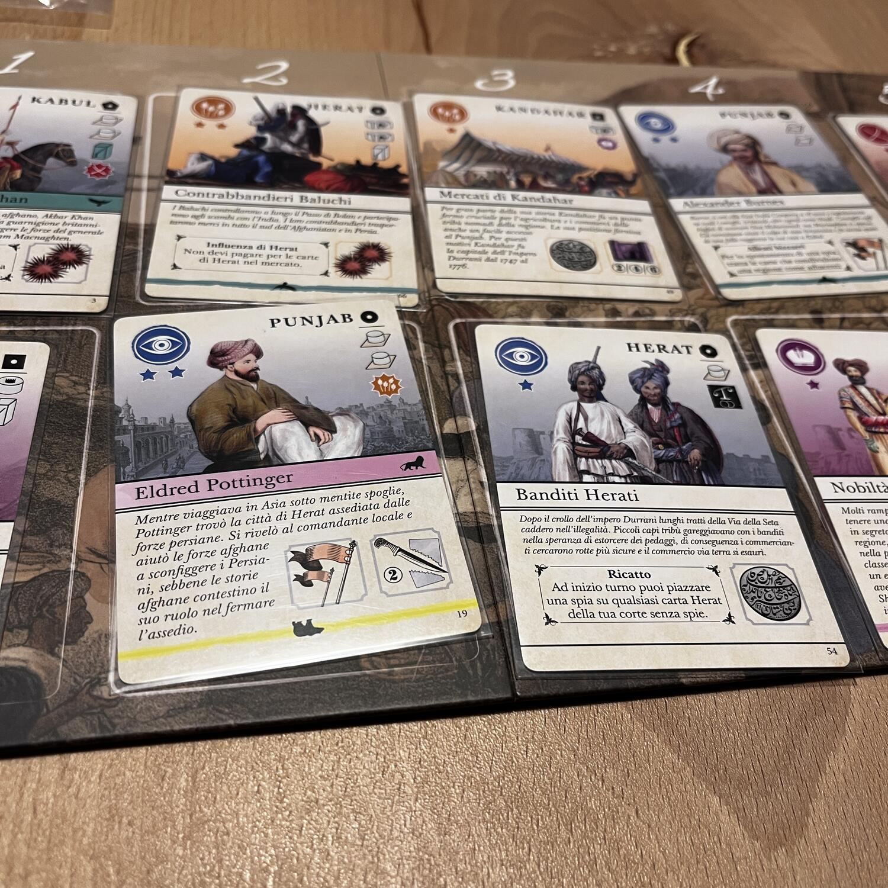
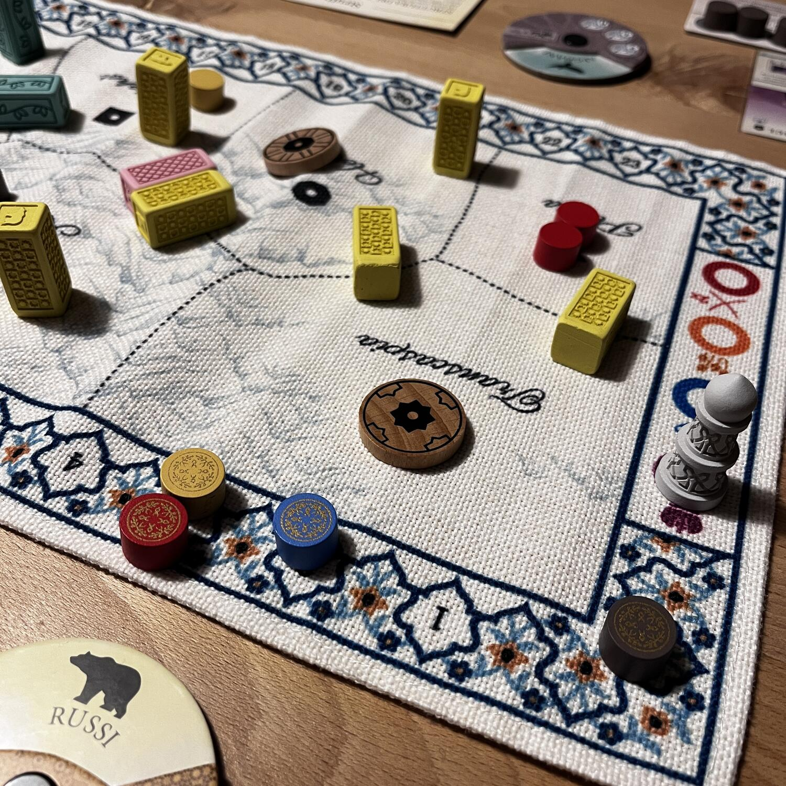

<Setting>

  Afghanistan, XIX secolo: il Grande Gioco. In una regione scombussolata da
  forze afghane, britanniche e russe, dovrete cercare di portare al successo la
  vostra tribù tramite manovre politiche, attacchi mirati e tradimenti… Chi ne
  uscirà vincitore?

</Setting>

<Rules>

  I giocatori assumono il ruolo di leader tribali che lottano per il potere
  nella regione. Il gioco è diviso in round, a loro volta suddivisi in fasi.
  Durante ogni fase, i giocatori effettuano azioni per influenzare gli eventi
  della regione e per prepararsi alla fase successiva.
   
  I giocatori hanno la possibilità di acquisire denaro, reclutare truppe,
  costruire strade, stringere alleanze con le altre tribù, estendere la propria
  rete di spie, controllare regioni, uccidere personaggi pericolosi e manipolare
  l'allineamento politico della regione. Inoltre potranno cambiare la loro
  coalizione scegliendo tra: Afghanistan, Britannia o Russia, i principali
  "Giocatori" del Grande Gioco.
   
  I giocatori possono effettuare due azioni normalmente e altre eventuali azioni
  gratis se corrispondenti all'allineamento politico della situazione corrente
  date dalle carte giocate durante il gioco. Azioni disponibili saranno infatti
  anche l'acquisto dal mercato e il posizionamento nella propria "corte" di
  queste carte, motore nevralgico di Pax Pamir !
   
  Il successo nel gioco dipende dalla capacità di equilibrare le risorse e la
  forza militare, di stringere alleanze strategiche, di gestire gli eventi
  imprevedibili che si verificano durante il gioco, di sfruttare al meglio le
  coalizione e l'allineamento politico.
   
  In Pax Pamir Second Edition il giocatore che accumula la maggior parte dei
  punti vittoria alla fine del gioco è dichiarato vincitore.

</Rules>

<Feedback>

  Pax Pamir non è un gioco facile e l'autore, quello di{" "}
  <Link to="/reviews/root">Root</Link>, ha creato un prodotto decisamente non
  per tutti. Molti pezzi si muovono sulla plancia di gioco. Le interazioni tra i
  giocatori saranno molteplici e durante una partita bisognerà tenere
  sott’occhio tutti i movimenti, senza contare l'imprevedibilità delle mosse di
  un avversario che possono stravolgere una partita in un batter d’occhio.
  Evidentemente, questo gioco saprà premiare coloro che gli dedicheranno del
  tempo: sapere quando muoversi, quando ottenere una carta o qual è il modo
  migliore per massimizzare le proprie risorse in un dato momento può cambiare
  il corso della partita, ma solo l’esperienza vi consentirà questo livello di
  padronanza. Volete un gioco che vi tenga al tavolo partita dopo partita, a
  patto che gli dedichiate il tempo necessario? Pax Pamir fa senz’altro per voi.
  In caso contrario non occorre preoccuparsi: ci saranno certamente altri giochi
  di <Link to="/mechanisms/negoziazione">Negoziazione</Link> che faranno al caso
  vostro!

</Feedback>

