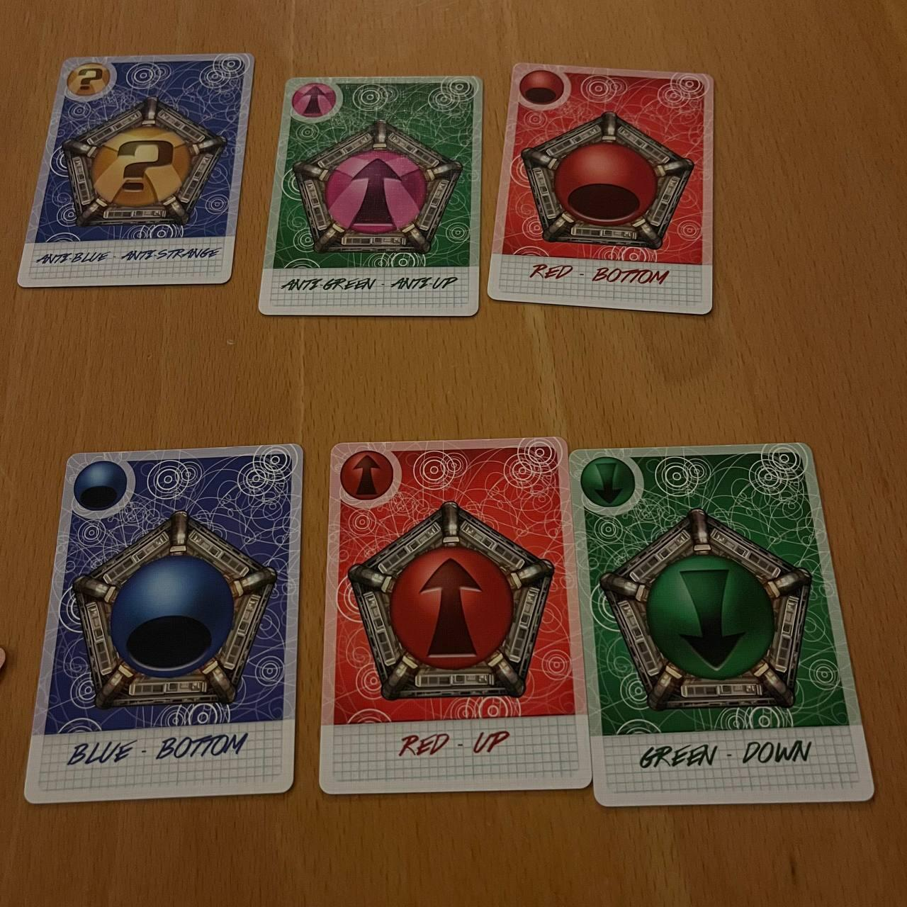
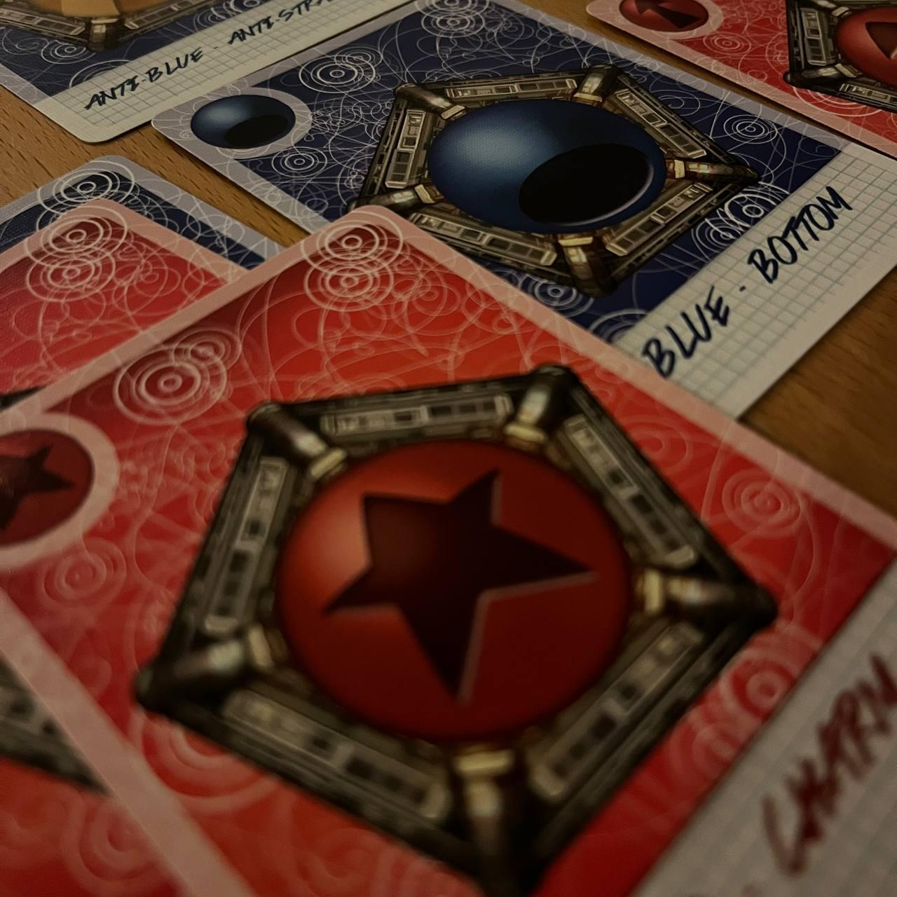
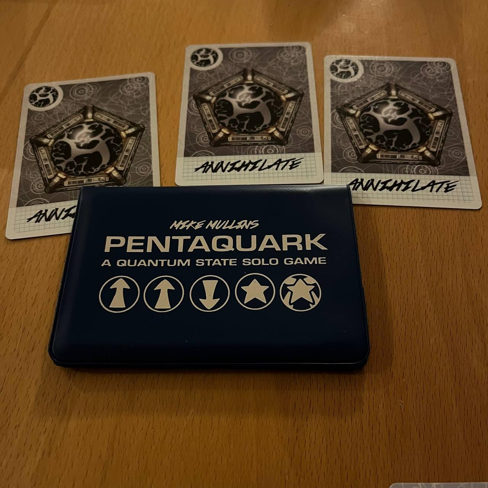

<Setting>

Sei uno scienziato incaricato di studiare i Quark. I tuoi studi potrebbero rivoluzionare il sapere scientifico e la vita dell’uomo stessa! 
Devi solo trovare quella particolare struttura… il <strong>Pentaquark</strong>!  
La sua posizione è ignota, quasi leggendaria, ma forse tu hai capito dove guardare, e grazie alle potenti attrezzature in tuo possesso potresti riuscire nel miracolo.   <strong>Per la scienza!</strong>

</Setting>

<Rules>

  Pentaquark è un <Link to="/mechanisms/solitario"> Solitario </Link> che
  somiglia molto ad un normale <Link to="/mechanisms/puzzle">Puzzle</Link>. Ad
  ogni round di gioco si dovrà esaurire il mazzo di 15 carte nel corso di vari
  turni. All’inizio del turno vengono pescate tre carte: una carta andrà
  posizionata nella sezione <em>Background</em> , una nel <em>Detector</em> e
  una scartata. Ogni volta che il mazzo finirà bisognerà girarlo in modo di
  avere le carte con il lato opposto visibile e aggiungere ad esso una carta
  negativa chiama{" "}
  <strong>    <em>Annihilate</em></strong>{" "}
  in grado di distruggere le altre carte quando appare. Il gioco continuerà fino
  a che il giocatore avrà combinato le carte nel Detector in modo da formare il
  Pentaquark, vincendo la partita, oppure quando troppe carte saranno state
  distrutte.  
  Il vero gioco sta nell’attenzione che bisogna prestare alla combinazione dei quark:
  ci sono delle regole specifiche da seguire e, se non si sta attenti, si rischia
  di perdere delle carte durante il processo.

</Rules>

<Feedback>

  Pentaquark è un gioco/puzzle tanto piccolo quanto interessante. La sua
  longevità è determinata da una curva di apprendimento molto piana e diversa
  per ogni possibile strategia. Una volta “decifrato il codice”, il tutto si
  riduce alla mera fortuna. Sta a voi capire se questo lo rende un gioco adatto
  o voi o su cui potete passare oltre.

</Feedback>

