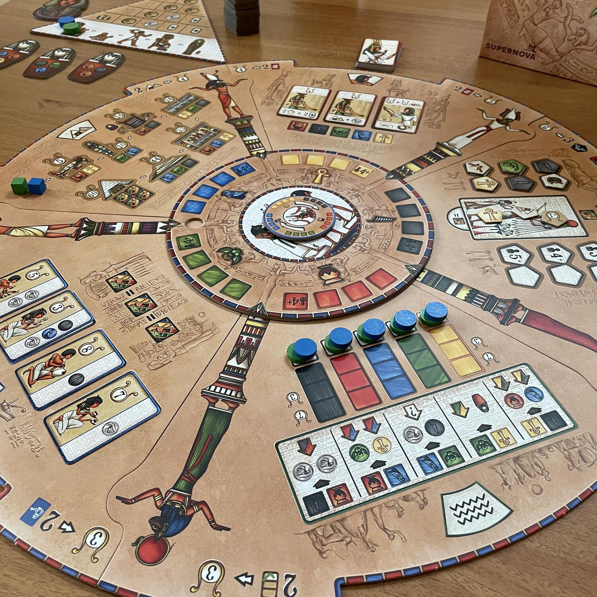
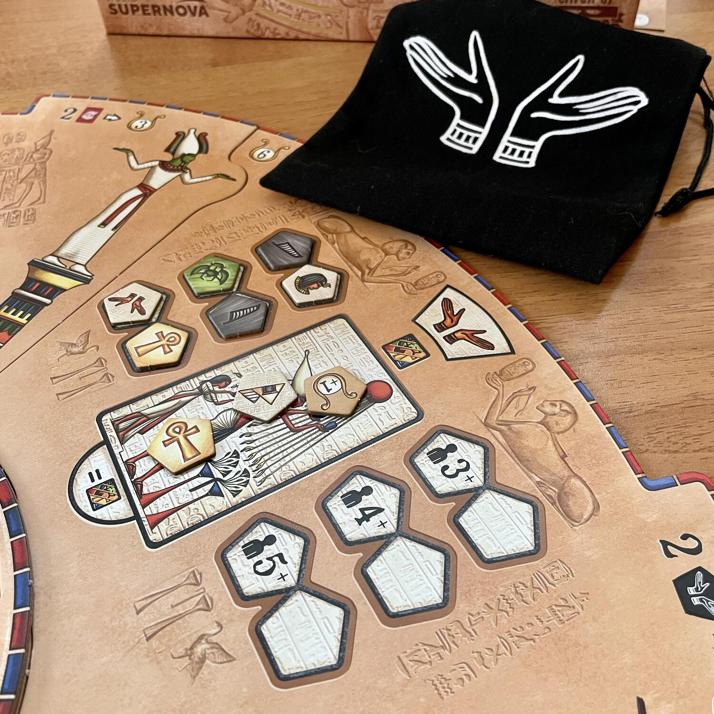
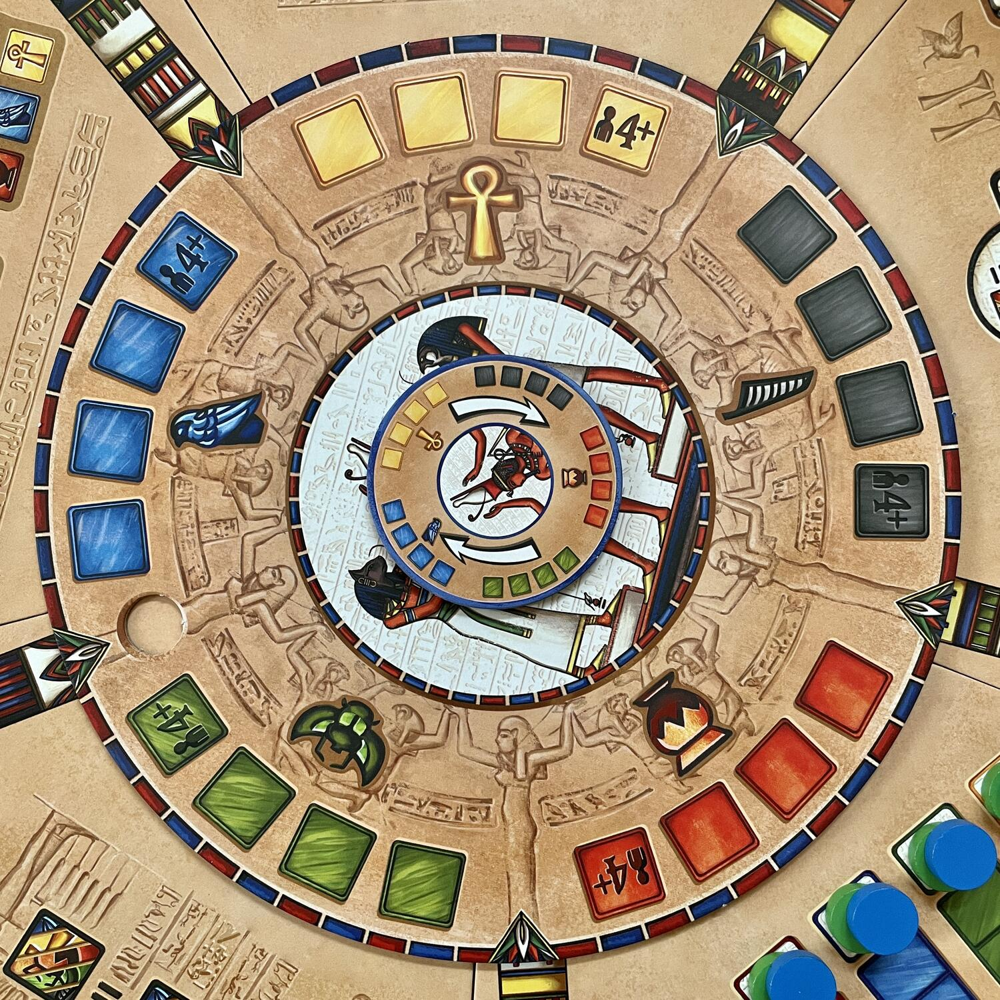

<Setting>

  In <em>Pharaon </em>dovrete prepararvi per il viaggio verso l’aldilà ottenendo
  il supporto dei nobili e degli artigiani per costruire una magnifica camera
  sepolcrale.
   
  A differenza di quanto possa sembrare, in questo gioco non c’è nulla di
  macabro o funesto e l’ambientazione si riduce quasi esclusivamente al comparto
  estetico in stile Antico Egitto.
   

</Setting>

<Rules>

  Le meccaniche di base del gioco sono la gestione risorse e il piazzamento
  lavoratori (che sono rappresentati non da pedine, bensì da "risorse di
  accesso"), il tutto vincolato alla <strong>ruota centrale</strong> che rende
  dinamica e variabile ogni partita. Il tabellone di gioco inoltre è composto da
  diversi settori che vanno assemblati casualmente.
   
  Ad ogni turno le risorse che consentono l’accesso alle singole azioni cambiano
  seguendo l’andamento della porzione girevole del tabellone. Per svolgere
  un'azione si deve quindi:
   
  <ol>
    <li>      pagare il <strong>costo di accesso</strong>, ovvero la risorsa indicata sulla ruota in corrispondenza del settore scelto;</li>
    <li>      pagare il <strong>costo dell'azione</strong> vera e propria, diverso per ognuna, dal quale è possibile scontare la risorsa utilizzata per accedere a quell'area.</li>
  </ol>
       
      Questo secondo passaggio rende molto strategico il gioco perché costringe
      i giocatori a pianificare le proprie mosse in anticipo, in modo da
      ottimizzare al meglio le risorse a disposizione.
       
      Le azioni possibili sono:
  <ul>
    <li>      Area delle Offerte: in questa sezione è possibile prendere alcuni dei token presenti che vengono utilizzati come sostituti delle risorse oppure possono fornire PV;</li>
    <li>      Area dei Nobili: si prende una delle carte disponibili che forniscono, oltre a PV, un’abilità istantanea o permanente;</li>
    <li>      Area del Nilo: pagando determinate risorse si avanza su una serie di tracciati e a fine partita si ottengono PV a seconda della posizione raggiunta;</li>
    <li>      Area degli Artigiani: si sceglie una carta che fornisce PV e risorse immediate;</li>
    <li>      Area della Camera Sepolcrale: si avanza sul tracciato e alla fine si ottengono PV in base alla stanza raggiunta.</li>
  </ul>
       
      Quindi ogni azione, seppur in misura differente, fornisce punti vittoria;
      a queste si aggiungono degli obiettivi indicati sul tabellone che cambiano
      in base a come è stato assemblato).

</Rules>

<Feedback>

  Le caratteristiche che più apprezzo di Pharaon sono due:
   
  <ul>
    <li>      la componente dinamica dovuta alla ruota centrale che gira e che porta i giocatori a pianificare anche le azioni future (minimizzando l’impatto della fortuna);</li>
    <li>      la variabilità di ogni partita data in primis dall’assemblaggio del tabellone.</li>
  </ul>
      La grafica e la simbologia di gioco sono molto chiare, mentre a livello di
      ambientazione non è particolarmente d'impatto.
       
      Parlando di interazione, direi che è abbastanza presente dal momento che
      occupando spazi di accesso sulla ruota, si potrebbe impedire ad altri
      giocatori di accedere a quell'azione per un turno, oltre al classico
      "compro la carta o prendo i token di cui tu avevi bisogno".
       
      Nel complesso non è un gioco che fa gridare al miracolo o al capolavoro,
      ma funziona bene, offre quel giusto livello di sfida e lo trovo comunque
      adatto a tutti e premia l’esperienza.

</Feedback>

