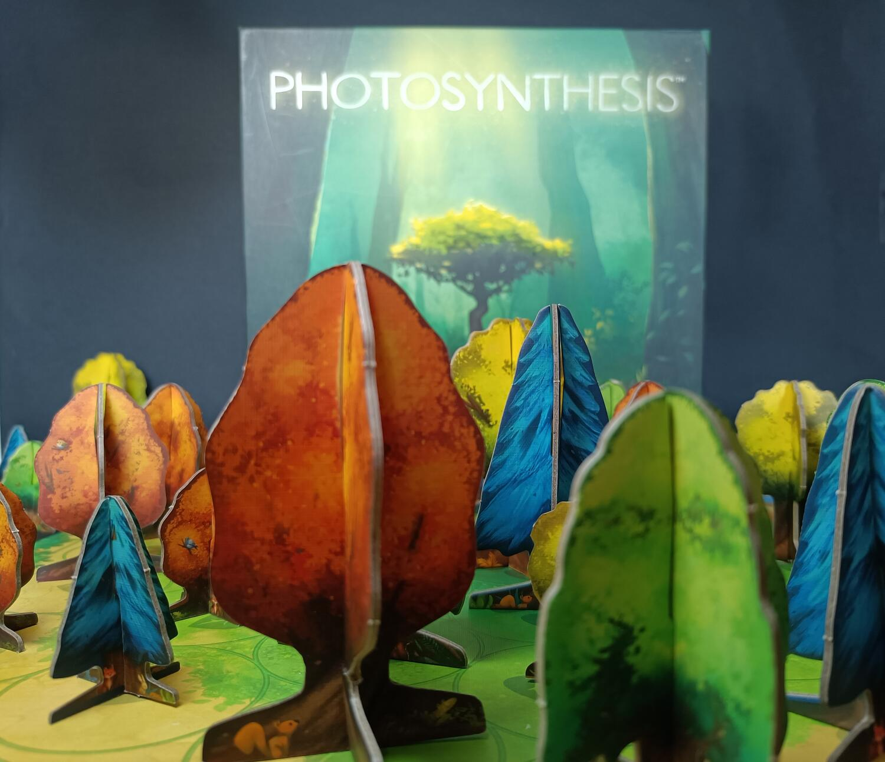

<Setting>

  Come già avrete capito dal nome, i protagonisti assoluti di questo gioco sono
  gli <strong>alberi</strong>. Ci ritroviamo in una bellissima radura sita in un
  bosco, dove dovremo far crescere alberi, assorbire luce dal sole e piantare
  semi, per guadagnarci il titolo di miglior specie di albero.

</Setting>

<Rules>

  All'inizio della preparazione ogni giocatore riceve plancia e materiali della
  specie di albero scelta, le dispone in ordine sulla plancia di gioco e mette
  da parte i componenti rimanenti, che costituiranno la sua{" "}
  <strong>Riserva</strong>. Posizionate il Sole nel suo spazio di partenza e a
  turno, partendo dall'ultimo giocatore, bisognerà posizionare due alberi negli
  spazi perimetrali del tabellone. A questo punto il gioco può iniziare.
    Ad inizio di ogni turno, il Sole cambia posizione illuminando gli alberi
  da angolazioni diverse; in base a quanta luce prendono i vostri alberi guadagnerete{" "}
  <strong>punti luce</strong>, che sono la moneta di scambio per far crescere il
  vostro <strong> bio-impero</strong>. Ma non pensate che sia così semplice: gli
  alberi fanno <strong>ombra</strong>, che può aumentare in base all'altezza dell'albero,
  e saranno molte le volte in cui metterete i bastoni tra le ruote ai vostri avversari
  con alberi più alti, ma altrettante quelle in cui vi ostacolerete da soli.
   
  Le azioni sono poche ma permettono tantissime strategie e molti modi di giocare
  diversi:
  <ul>
    <li>      <strong>Comprare un albero o un seme</strong>: cioè spostarlo dalla
      plancia alla Riserva, poiché potremo piazzare solo alberi o semi presenti
      in quella zona.</li>
    <li>      <strong>Spargere semi</strong>: gli alberi possono spargere semi, e a
      seconda di quanto sono alti, la distanza della semina aumenta.</li>
    <li>      <strong>Far crescere un albero</strong>: sostituire un albero più piccolo
      con uno più alto e riposizionarlo sulla plancia dove potrà essere
      ricomprato (se la plancia è piena l'albero/seme sarà scartato e non potrà
      essere usato per tutta la partita): infatti gli spazi disponibili sulla
      plancia sono limitati e i primi alberi che compreremo costeranno di meno
      rispetto a quelli acquistati dopo.</li>
    <li>      <strong>Tagliare un albero</strong>: quando un albero sarà cresciuto al
      massimo potremo tagliarlo e ottenere un gettone a seconda della posizione
      dell'albero nella radura; più un albero è centrale più punti si
      guadagneranno.</li>
  </ul>
  <strong>Regola importante</strong>: si può effettuare una sola azione per esagono,
  quindi un albero non potrà crescere e seminare, o crescere e essere tagliato nello
  stesso turno.
   
  La partita si conclude quando il sole ha completato tre rivoluzioni intorno alla
  radura; a quel punto il giocatore con più punti vince.

</Rules>

<Feedback>

  Già dall'unboxing si possono osservare la cura nei dettagli e i colori dei
  materiali che fanno diventare una gioia per gli occhi ogni partita.
  Photosyntesis non è solo bello da giocare ma è anche bello da{" "}
  <strong>verde</strong>. Saranno tante le volte in cui vi fermerete a guardare
  la radura che si popola di alberi di varie specie e di diversa altezza. I
  materiali sono tutti in <strong>cartone</strong>, niente plastica, in tema
  ecologia, resistenti, colorati e facili da assemblare.
   
  Le meccaniche e il regolamento sono semplici da capire e da spiegare, ben
  descritte nelle plance, che permettono così al gioco di essere molto più
  fruibile. Ma non pensate che sia un gioco facile, anzi, pur avendo poche e
  semplici regole, Photosyntesis è molto strategico e complesso, e in presenza
  di più giocatori avremo momenti in cui qualche minuto di pianificazione vi
  aiuterà a non soccombere alla rapida crescita della natura.
   
  In conclusione, Photosyntesis è un buon gioco introduttivo: regole semplici e
  facili da spiegare ma con molta strategia dietro, materiali curati e
  resistenti, interazione tra giocatori molta ma non stressante, grazie alla
  rotazione del sole intorno al tabellone, adatto anche a giocatori esperti e
  soprattutto ad <strong>amanti della natura</strong>.

</Feedback>

