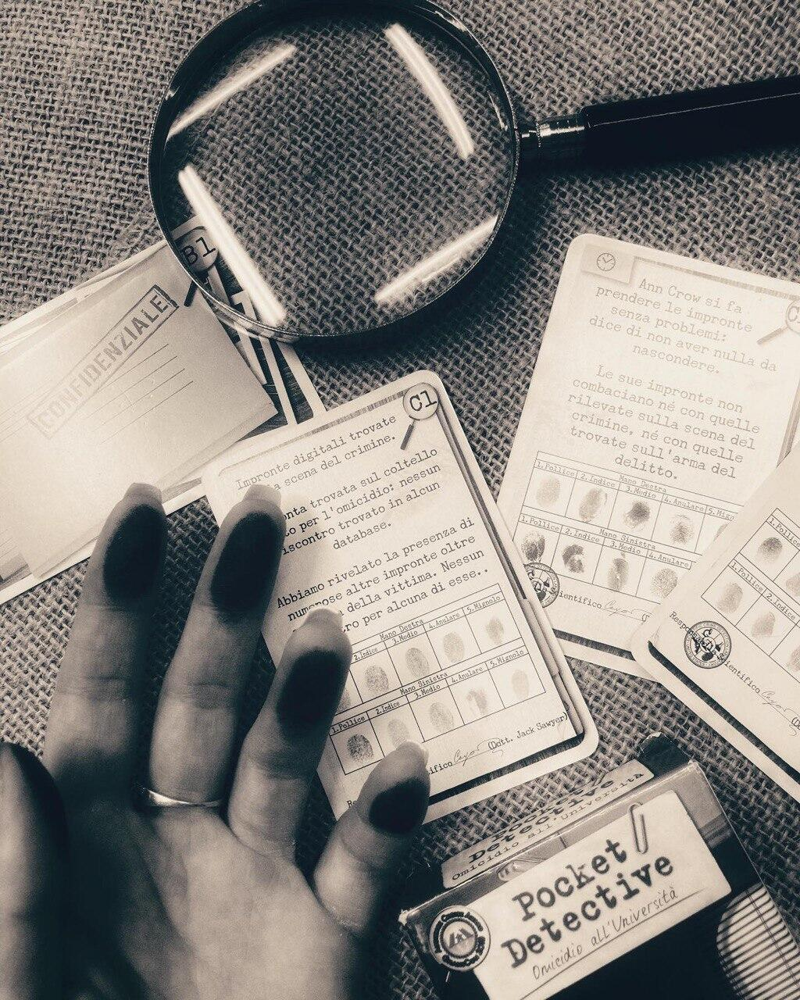

<Setting>

  La stanza è in penombra, nell’aria si respira unodore acre di fumo e una luce
  fioca illumina i dossier sparsi sulla scrivania.
   
  La sigaretta che ti eri acceso ormai è solo un mozzicone nel posacenere e il
  tuo camminare impaziente rivela la verità: hai disperatamente bisogno di nuovo
  caso da risolvere.
   
  D’un tratto lo scricchiolare della porta ti distoglie dai tuoi pensieri, il
  capo ti si para davanti e sembra proprio avere la soluzione ai tuoi problemi:
  un morto richiede tutta la tua attenzione.

</Setting>

<Rules>

  Incredibile ma vero: tutto quello che servirà per risolvere il caso si trova
  in sole 70 carte e… nella vostra mente!
   
   
  Il gioco è impostato in questo modo: le carte sono divise in 7 gruppi identificati
  ognuno da una lettera dalla A alla G; questi rappresentano le diverse tipologie
  di piste che potrai seguire durante l’indagine e che non dovrai assolutamente svelare
  finché non verrà indicato!
   
   
  È un cooperativo a turni, quindi anche se tutti i partecipanti possono
  osservare ed analizzare le carte svelate e confrontarsi sui passi da fare,
  spetterà solamente al giocatore attivo decidere quale pista seguire!
   
   
  Infine, essendo un deduttivo puro, non sarà necessario indagare a fondo ogni singola
  pista per giungere alla soluzione, soprattutto perché ognuna di esse vi costerà
  del tempo indicato sulle carte con il simbolo di un orologio; più orologi verranno
  raccolti durante l’indagine, più punti verranno tolti a fine partita. In egual
  modo funziona la tensione, indicata sulle carte con la faccina triste, dovuta alle
  piste sbagliate!

</Rules>

<Feedback>

  Per quanto 70 carte possano sembrare poche per creare un gioco intrigante, in
  Pocket Detective tutto funziona alla perfezione: la suddivisione in mazzetti
  permette una disposizione delle piste chiara e facilmente raggiungibile per
  tutti i giocatori, e la meccanica semplice ma efficace del trascorrere del
  tempo e dell’aumentare dell’ansia creano quel tanto di suspance che basta per
  catturare tutta la vostra attenzione.
   
  E’ sicuramente un gioco assai portatile, pronto da giocare in qualsiasi
  momento ed in qualsiasi luogo; perfetto sulla spiaggia così come durante un
  pic nic in montagna o come riscaldamento per il cinghialone della serata.
  Inoltre, è l’ideale come pensiero per un secret santa ludico dove il budget è
  limitato, ma si cercano sempre opzioni d’impatto!
   
  Non è un gioco indispensabile in collezione, ed essendo one shot un’ottima
  soluzione potrebbe anche essere quella di reperirlo in qualche mercatino così
  da ridargli vita sul vostro tavolo per poi regalarlo a qualche amico!
   
   
  Resta comunque indiscusso che per gli amanti dei giochi investigativi è sicuramente
  da provare.

</Feedback>

