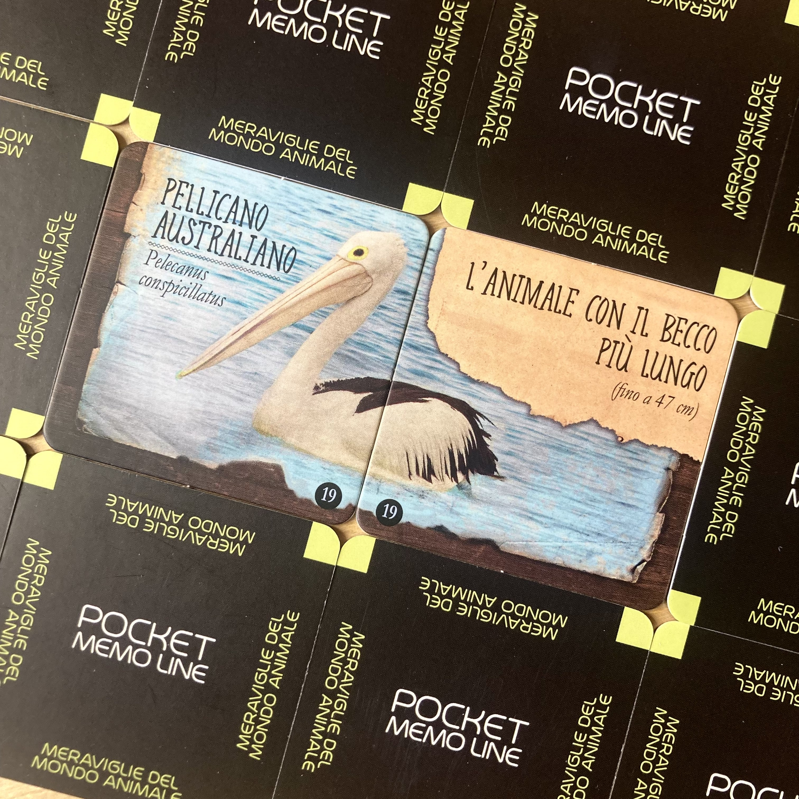
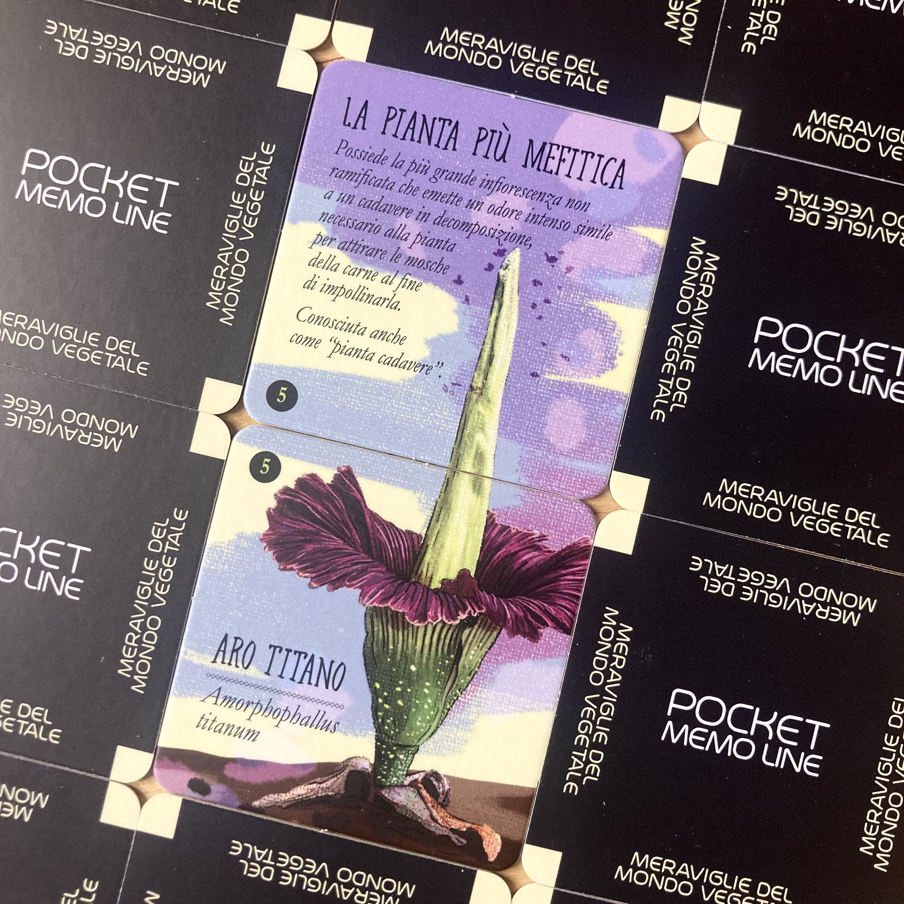
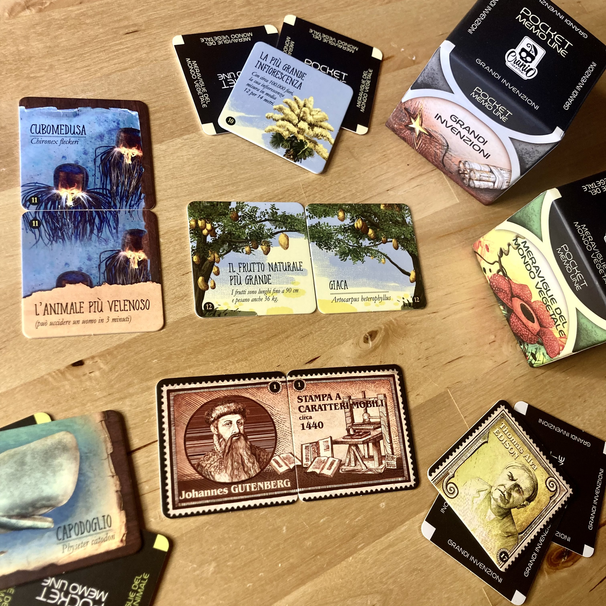

<Setting>

  Una delle bellezze di questa linea di memory è che potete<strong> scegliere</strong> voi{" "}
  <strong>l’ambientazione</strong> che preferite!  
  Si possono solcare le onde della storia con <strong>Grandi Invenzioni</strong> o tuffarsi nella natura con <em>    Meraviglie del Mondo Animale{" "}</em>e <em>Vegetale</em>, o ancora tornare tra i banchi di scuola durante le interrogazioni di geografia con
  <em> Capitali d’Europa</em> e<em> del Mondo</em>!
   E non è finita qui, perché gli argomenti tra cui scegliere sono ben <strong>8</strong>!

</Setting>

<Rules>

  Su su, non vorrete mica che vi racconti le regole del memory, vero?! Eheheh…
   
  Il funzionamento è evidentemente quello di ogni memory che si rispetti, ma, a differenza del più classico di questi
  titoli, non dovrete trovare coppie di immagini identiche, bensì <strong>COMPLEMENTARI</strong> che, tra l’altro, si
  potranno formare sia in <strong>verticale</strong> che in <strong>orizzontale</strong>! 
  La tipologia delle immagini cambierà da tema a tema: ad esempio, in Grandi Invenzioni troverete da una parte l’invenzione
  con la data di riferimento e dall’altra l’inventore. Ma non sempre sarà così intuitivo il riconoscimento; potrete allora
  ricorrere a due <strong>trucchetti</strong>:  
  <ul>
    <li>      <strong>avvicinare le due tessere</strong> per controllare effettivamente che il disegno combaci;</li>
    <li>      <strong>sbirciare il numero</strong> in basso che ovviamente sarà uguale su entrambe le tessere!</li>
  </ul>
  Sarà dichiarato vincitore chi avrà trovato il maggior numero di coppie quando non ci saranno più tessere da rivelare.

</Rules>

<Feedback>

  Se vi dicessi che questa collana è bellissima e che dovete assolutamente provarne almeno uno, vi basta? Perché tutto
  quello che posso dirvi si riduce davvero a questa frase!
   
  Ogni aspetto di questo gioco è <strong>positivo</strong>: le <strong>immagini</strong> sono molto belle e{" "}
  <strong>particolari</strong>, il dover trovare coppie complementari è <strong>sfidante</strong> e ti fa venir voglia
  di fare una partita dopo l’altra, la situazione si può ribaltare da un momento all’altro perché non è assolutamente un
  memory banale…
   
  Inoltre possono essere facilmente utilizzati per <strong>scopi educativi </strong>: sono un modo ottimo per far
  ricordare le bandiere o le capitali ad un bambino, per fargli scoprire il mondo attraverso i grandi monumenti
  realizzati nella storia e farli appassionare al curioso mondo delle piante e degli animali il tutto facendoli
  divertire! E sì, anche gli adulti si divertiranno a rispolverare quelle nozioni abbandonate in un angolino del
  cervello!  
  Insomma, ha davvero tutte le “tessere” in regola per essere un “<strong>must have</strong>” di ogni collezione!

</Feedback>

