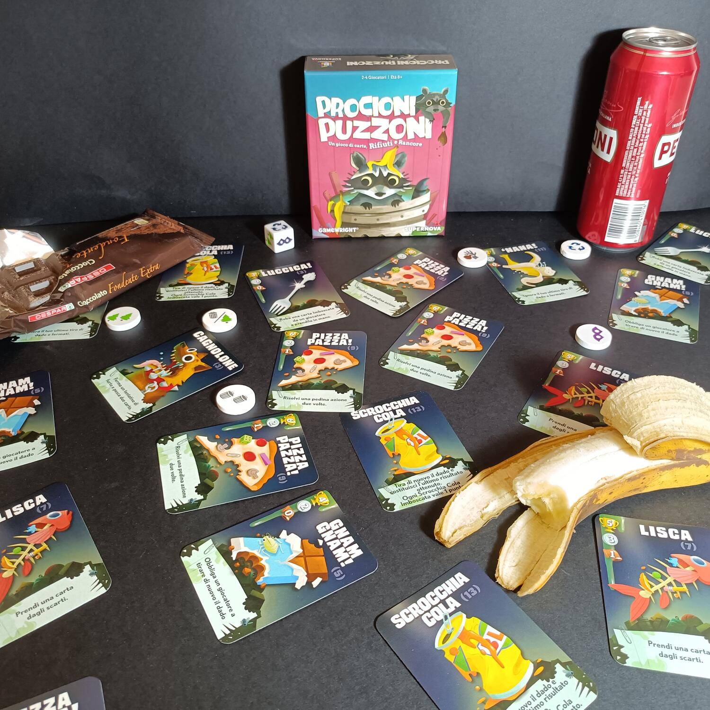

<Setting>

  Siete dei procioni, puzzolenti e mangioni. Il vostro scopo sarà quello di
  accumulare e imboscare il maggior numero di spazzatura e cibo. Ovviamente,
  alcune risorse saranno più rare e prelibate di altre, e non sempre la fortuna
  sarà dalla vostra parte. Sfruttate al meglio la vostra astuzia e le risorse a
  vostra disposizione, e fregate i vostri avversari nella corsa per il cibo.
  Solo il procione più puzzone e sveglio sarà il vincitore!

</Setting>

<Rules>

  In <em>Procioni puzzoni</em> il vostro scopo sarà quello di imboscare il
  maggior numero di spazzatura, stando attenti ai vostri avversari. Ad inizio
  partita ogni giocatore riceve un numero di carte in base all’ordine di gioco.
  Le carte, in Procioni puzzoni, possono essere sia risorse da utilizzare per
  modificare la fortuna o infastidire gli avversari, o preziose risorse da
  conservare e mettere da parte per ottenere punti vittoria. Quindi state
  attenti a non consumarne troppe, poiché solo il giocatore con più punti
  vittoria sarà dichiarato il Procione più puzzone!
   
  Ad inizio di ogni turno, un giocatore dovrà lanciare un dado, composto da 6
  simboli diversi. Dopo ogni lancio, il giocatore riceverà il segnalino del
  risultato, e potrà decidere se fermarsi o continuare. Nel caso in cui uscisse
  un simbolo già uscito, allora, il giocatore <strong>sballerebbe</strong>{" "}
  terminando immediatamente il suo turno. Ovviamente, numerose carte permettono
  di modificare il risultato del dado, o di salvarsi in questo caso. Inoltre, i
  Procioni più impavidi saranno ricompensati! Se riuscirete ad ottenere tutti i
  simboli avrete diritto ad un’altro turno, ma con al massimo tre simboli: non
  male vero?!?
   
  Una volta lanciato il dado e presi i segnalini, il giocatore può decidere se
  giocare o no carte dalla propria mano, per attivare qualche effetto o abilità.
  Successivamente, in ordine, potrà attivare gli effetti dei vari simboli
  ottenuti. Questi ultimi permetteranno di pescare nuove carte,{" "}
  <strong>imboscarle</strong>, cioè metterle da parte come punti vittoria, o
  eventualmente rubare dagli avversari.
   
  La partita termina alla fine del turno del giocatore che terminerà il mazzo di
  pesca. A quel punto, si conteranno i punti vittoria. Per ogni tipologia di
  carte, si vedrà chi ne ha la maggioranza; il primo giocatore, ovviamente,
  otterrà il primo premio, il secondo il secondo e così via. In caso di
  pareggio, i giocatori otterranno lo stesso premio meno un punto. Inoltre, ogni
  Scrocchia Cola messa da parte varrà un punto vittoria. Merce rara, non
  credete?
   
  Il giocatore che avrà ottenuto più punti vittoria sarà dichiarato il
  vincitore!

</Rules>

<Feedback>

  <em>Procioni puzzoni</em> è stata una scoperta del Napoli Comicon del 2022.
  Fin da subito affascinano la grafica e i disegni, ma a primo impatto un
  giocatore navigato può avere l’impressione che non si tratti di un gioco per
  sé. Uno dei tanti filler usciti negli ultimi anni senza né arte né parte. Ma è
  qui che si sbaglierebbe completamente. <em>Procioni puzzoni</em> è fantastico.
  Un filler che racchiude sì un gioco semplice e immediato, ma che con il tempo,
  l’esperienza e ovviamente con il gruppo giusto di giocatori può diventare un
  gioco davvero molto profondo. La possibilità di poter calcolare quante e quali
  carte i giocatori potrebbero aver messo da parte, e ovviamente la possibilità
  sia di usare una carta che di imboscarla, vi porrà di fronte a numerose scelte
  durante la partita. Ovviamente non stiamo parlando di alti livelli, ma{" "}
  <em>Procioni puzzoni</em> è ambivalente. Può essere giocato sia come un
  giochino tranquillo, con amici e parenti, sia come un gioco strategico e
  studiato per tutti coloro che cercano una sfida in più. La rapidità di ogni
  partita, inoltre, vi costringerà ad intavolarlo più volte in una serata, per
  una rivincita dopo l’altra. Ovviamente il fattore fortuna è sempre presente,
  ma con le numerose carte a vostra disposizione questo fattore viene ben
  limato. Sicuramente <em>Procioni puzzoni</em> dà il meglio di sé in quattro
  giocatori, permettendo di avere un maggior numero di interazioni. I tempi
  morti non sono molti, anche se nelle prime partite bisognerà semplicemente
  prendere dimestichezza con le varie tipologie di carte. Non c’è dubbio:{" "}
  <em>Procioni puzzoni</em> fa il suo dovere, anzi, supera di gran lunga le
  aspettative. Un titolo ben costruito, che sicuramente vi affascinerà per le
  sue meccaniche semplici ma che nascondono una buona dose di strategia. Un
  filler da tenere sempre a portata di mano o nello zaino nei lunghi viaggi.
  Adatto sia per le famiglie che per i giocatori abituali. Cercatelo e
  imboscatelo anche voi!

</Feedback>

