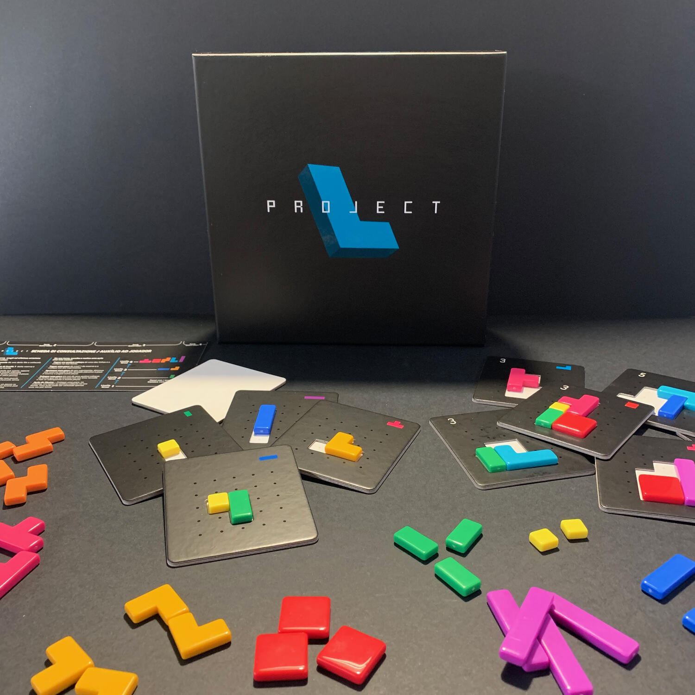
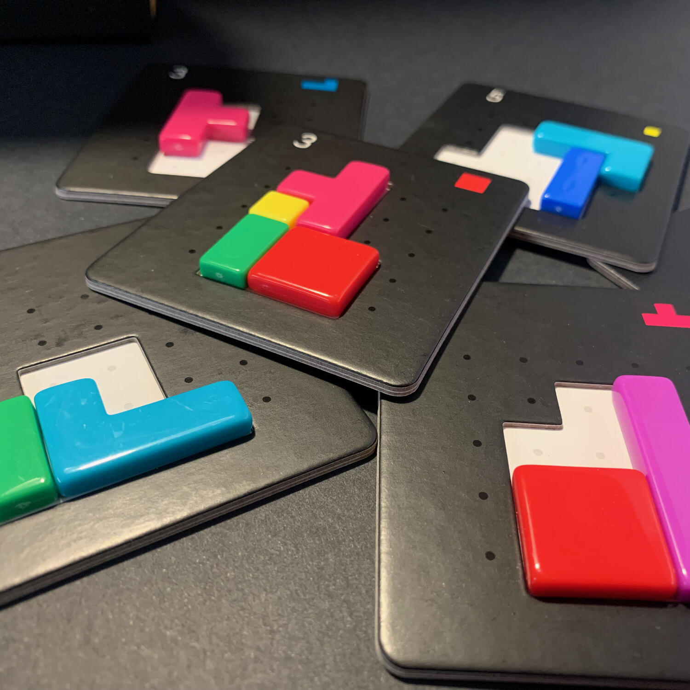

<Setting>

  Polimini colorati che scendono dall'alto, canti popolari russi in versione
  8-bit e l'incomprensione di come si riesca a essere maniacalmente ordinati in
  un videogioco mentre mamma ricorda sempre di mettere a posto la stanza. Vi
  ricorda qualcosa? Forse quei lunghi pomeriggi ad aspettare quel pezzo
  longilineo, quello che lo aspetti per una vita, ma che quando arriva ti
  risolve tutto?
   
  L'ansia di posizionare il pezzo peggiore nel posto peggiore, la realizzazione
  che quella mossa ti saboterà per il resto della partita e la felicità che si
  provava nel risolvere quel danno sono tutte emozioni che vengono riportate in
  questo gioco.

</Setting>

<Rules>

  Un quadrato giallo 1x1 e un rettangolo verde 2x1 saranno i polimini per
  cominciare questa sfida all'ultimo forma in acrilico.  
  I pezzi saranno utilizzati per completare tessere puzzle che si dividono tra bianche
  e nere. Le prime, più semplici, meno fruttuose in termini di punti vittoria ma
  che faranno ottenere pezzi interessanti, le seconde all'antitesi delle prime.
   
  Ogni volta che una di queste viene completata, i pezzi su di essa torneranno nella
  nostra riserva, una nuova forma colorata entrerà a far parte nelle vostre grazie
  e alcuni punti vittoria vi faranno tirare un sospiro di sollievo.  
  Il gioco si basa su turni di tre mosse nei quali potete ottenere nuove tessere
  puzzle, ottenere quadrati gialli 1x1, migliorare pezzi o posizionare polinomi
  sui puzzle.
   
  La partita si concluderà con il terminare delle tessere nere e il giocatore
  che avrà fatto più punti sarà decretato il vincitore.

</Rules>

<Feedback>

  "Costruisci pezzi, sviluppa un motore, migliora la tua strategia e vinci la
  partita!" Questo è quello che si legge sulla scatola e direi che c'è dentro
  proprio tutto.
   
  Project L è un gioco tanto semplice quanto elegante che sicuramente non
  lascerà la mia collezione: una gioia per gli occhi e per il tatto.
   
  Siamo davanti a un gioiellino giocabile da chiunque ed in grado di non
  annoiare i giocatori più esperti. I secondi avranno un occhio sulla propria
  plancia e uno su quella degli altri giocatori in modo da trovare il modo
  migliore per ottimizzare le proprie mosse, sabotando al contempo quelle degli
  avversari! Un gioco che saprà soddisfare il palato di tutti!

</Feedback>

