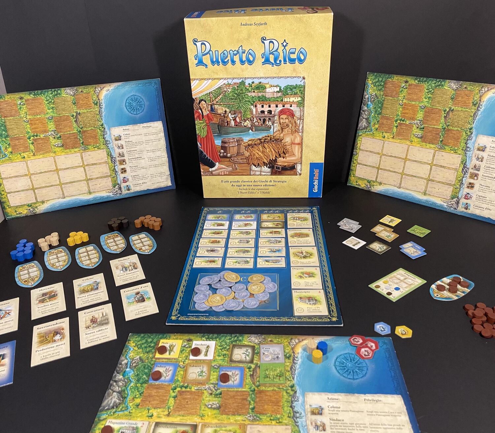
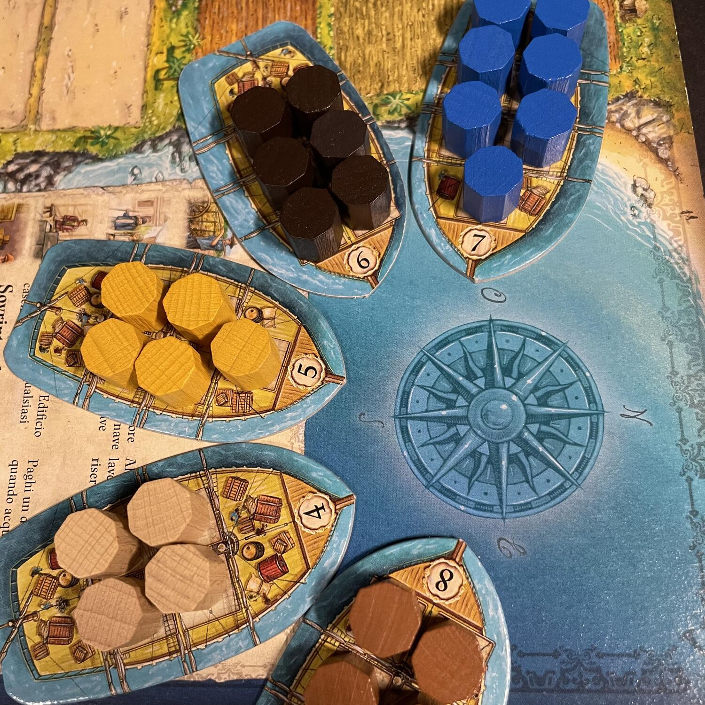

<Setting>

  Nell'eterna primavera-estate della prospera isola di Puerto Rico, aspiranti
  governatori del Nuovo Mondo faranno di tutto per arricchirsi e guadagnare il
  prestigio che spetta al loro rango. Costruite una luminosa cittadina,
  amministrate lussureggianti piantagioni, inviate nobili e coloni alle loro
  rispettive occupazioni, avviate una fiorente industria produttiva, vendete le
  merci che sopravanzano al mercato locale e impacchettate il resto per inviarlo
  nel Vecchio Mondo!

</Setting>

<Rules>

  Selezionate un certo ammontare complessivo di lavoratori, punti vittoria,
  carte ruolo, navi da carico e pile di tessere piantagione, con variazioni a
  seconda del numero di giocatori seduti al tavolo. Ogni giocatore parte con una
  plancia personale, una singola piantagione di grano o di indaco, un set di
  dobloni diverso a seconda del suo posizionamento relativo nell'ordine di turno
  iniziale e tanta fame di gloria. A partire dal primo giocatore, determinato
  casualmente, e poi in senso orario, ciascuno sceglie uno dei ruoli
  disponibili: Mercante, Sindaco, Colono, Cercatore d'oro, Costruttore,
  Artigiano (in alcune edizioni Sovrintendente) o Capitano. Ogni azione verrà
  svolta in ordine dal giocatore che l'ha selezionata (il quale sarà l'unico a
  godere anche del relativo beneficio) e, sempre in senso orario, da tutti gli
  altri, prima di passare alla successiva. Quando tutti i giocatori avranno
  svolto le azioni scelte per quel turno di gioco, le azioni torneranno
  disponibili per il successivo e su quelle rimaste in giacenza si depositerà
  una moneta, che le renderà più appetibili per le selezioni successive. Il
  Sindaco consente di ottenere nuovi lavoratori, il Colono nuove piantagioni e
  cave, il Costruttore di costruire nuovi edifici, l'Artigiano di produrre merci
  in base alle piantagioni e alle relative fabbriche attivate dai lavoratori, il
  Capitano di spedire le merci sulle navi in cambio di punti vittoria, il
  Mercante di vendere merci all'Emporio, il Cercatore d'oro di ottenere un
  doblone dalla banca. La fonte dei punti vittoria risiede essenzialmente in una
  coppia di elementi: gli edifici, tra i quali quelli speciali, e le merci
  spedite tramite l'azione Capitano. La partita si conclude quando qualcuno
  riempie i 12 spazi della propria isola oppure quando non ci sono più punti
  vittoria o coloni da distribuire, cosa che innesca la conclusione dell'ultimo
  turno, durante il quale i restanti punti assegnati andranno annotati invece
  che distribuiti dalla riserva.

</Rules>

<Feedback>

  Puerto Rico è uno di quei classici ormai passati alla storia del gioco da
  tavolo con cui vale davvero la pena avere iniziato una collezione. È il tipico
  peso medio con cui si riesce a staccare il Risiko-dipendente dalla sua caccia
  forsennata al triplo 6 facendolo sedere a un tavolo altrettanto strategico,
  dove però la fortuna ha pochissimo peso. Ma rispetto ai pesi medi in
  circolazione, questo gioco ha qualcosa in più… A testimoniare la qualità di un
  titolo sempreverde si ergono le innumerevoli edizioni di lusso e non, con
  l'introduzione di espansioni come <em>I Nuovi Edifici</em> e <em>I Nobili</em>  , che colorano ulteriormente un titolo già di per sé completo e autonomo. I
  materiali qualitativamente variano a seconda dell'edizione: i cartoncini
  possono essere più o meno spessi e più o meno illustrati, ma il gioco funziona
  ugualmente alla grande. Consigliato a tutti, neofiti, appassionati, dinosauri,
  eldar, antichi e zucconi: Puerto Rico non vi deluderà.

</Feedback>

