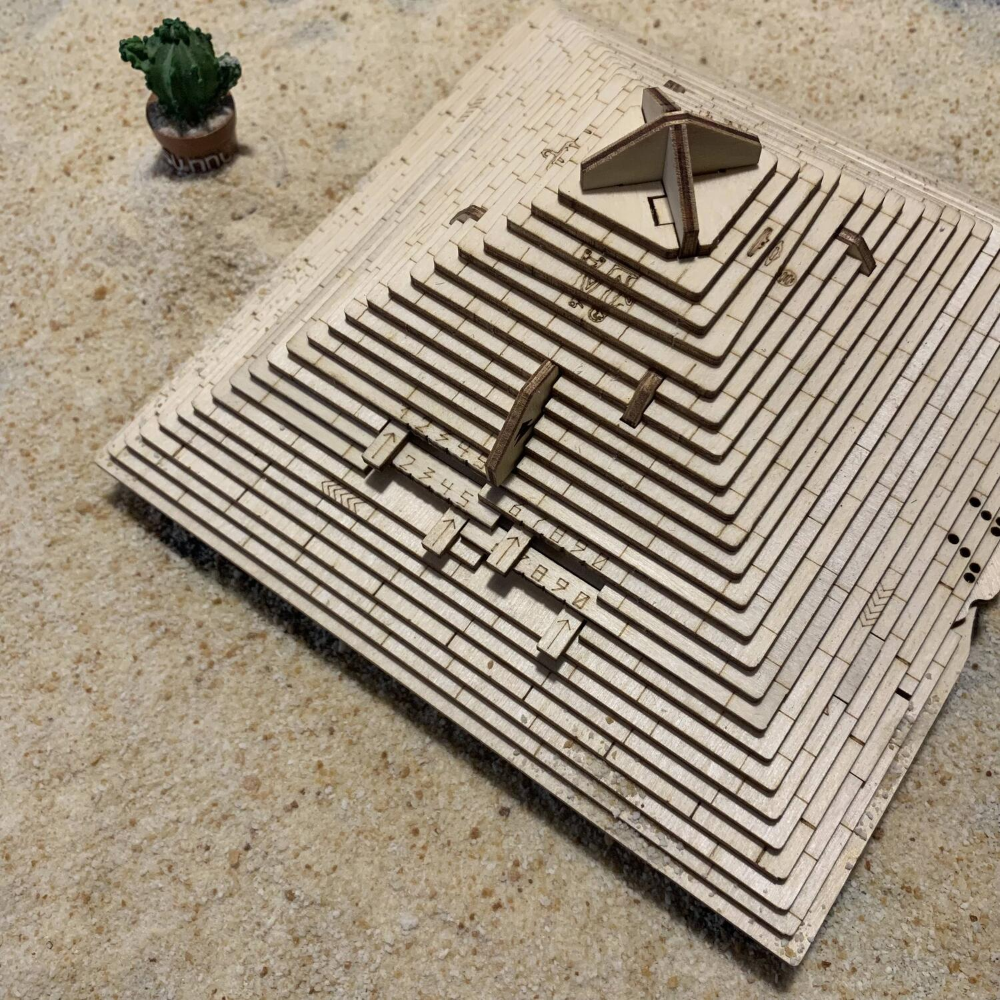
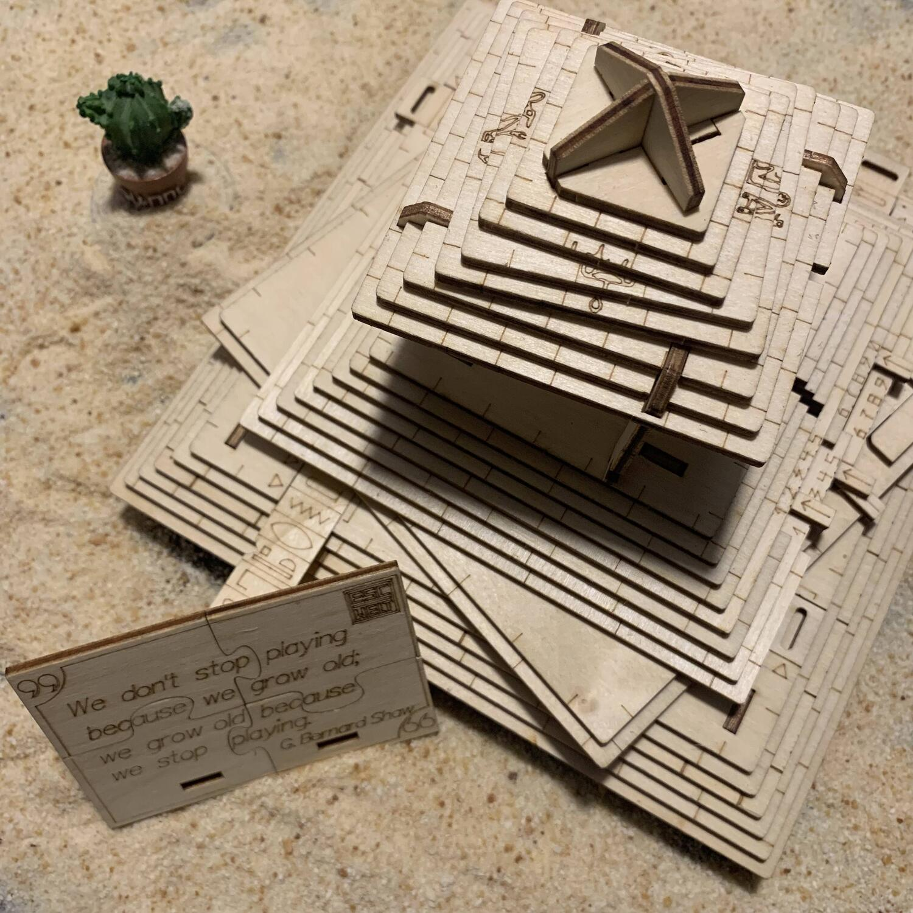

<Setting>

  525 a.C., Egitto. L'ultimo Stato indipendente dell'antichità viene conquistato
  dai Persiani. Cambyses II, figlio di Ciro, si dichiara nuovo faraone.
  Nonostante ciò, non ha alcun potere sulla terra che ha conquistato. I
  sacerdoti egizi custodiscono la camera del tesoro della conoscenza, la vera
  fonte del potere. Nascosti nelle profondità di un'antica piramide, i sacerdoti
  hanno lasciato trappole e indovinelli magici per respingere gli esploratori
  più avventati.  
  Né Cambyses né gli scienziati più colti dell'Impero persiano riuscirono a risolvere
  gli enigmi e a raggiungere la sacra saggezza degli Egizi.  
  Ora, dopo migliaia di anni, avete l'opportunità di accedere alla camera del
  tesoro della conoscenza. Avete il coraggio necessario per risolvere tutti gli
  enigmi degli antichi sacerdoti e ottenere la saggezza perduta? Cosa state
  aspettando? L'avventura vi aspetta!

</Setting>

<Rules>

  Per giocare a Quest Pyramid non c'è bisogno di sapere niente, nessun
  regolamento da leggere e nessun dettaglio da imparare. Vi basta prendere in
  mano la scatola (la grande piramide), osservarla, capovolgerla, decifrarla con
  l'unico scopo di aprirla e scoprire tutti i segreti dei sacerdoti egizi.
   
  Sulla scatola sono presenti 4 enigmi, tutti abbastanza intuitivi e immediati.
  Enigma dopo enigma la piramide prenderà una nuova forma, ruoterà, verrà
  capovolta, fino a che non verrà profanata per ottenere la saggezza perduta.
   
  Tutto quello che vi serve è in bella mostra: riuscirete a capirlo?

</Rules>

<Feedback>

  Prosegue l’avventura nella soluzione delle scatole di EscapeWelt.
   
  Dopo <Link to="/reviews/fort-knox">Fort Knox</Link> e{" "}
  <Link to="/reviews/space-box">Space Box</Link>, veniamo catapultati in Egitto,
  con il fine principe di aprire una piramide "inviolabile". Questa volta, ci
  troviamo dinanzi a una scatola leggermente più complicata di Fort Knox ma
  sicuramente più semplice e diretta di Space Box.
   
  Bisognerà affrontare 4 enigmi in successione per arrivare alla “conoscenza”.
  Tra questi, l'ultimo enigma è molto intrigante e vale di per sé il tempo speso
  per la risoluzione.
   
  Il fattore che si apprezza di più di questo titolo è l'abilità mostrata dai
  designer nel rendere una forma semplice e definita come una piramide e nel
  poterla "trasformare" nel corso della partita. Anche in questo caso, bisogna
  tenere a mente che la scatola è realizzata in legno e che, quindi, qualche
  meccanismo potrebbe risultare leggermente inceppante, ma con un po' di
  pazienza e con qualche ovvio micro movimento tutto torna a funzionare.
   
  Inoltre, la piramide dispone di un bell'antro capace di ospitare dei piccoli
  oggetti, un biglietto o qualsiasi cosa si voglia nascondere, raggiungibile
  dopo aver risolto tutti gli enigmi. Ottimo per "incartare" un regalo!
   
  Una volta aperta, seguite le istruzioni per richiuderla... e prestarla ai
  vostri amici per vedere chi ci mette meno tempo a risolverla.
   E voi? Avete mai fatto niente di simile? Scriveteci su Instagram!

</Feedback>
