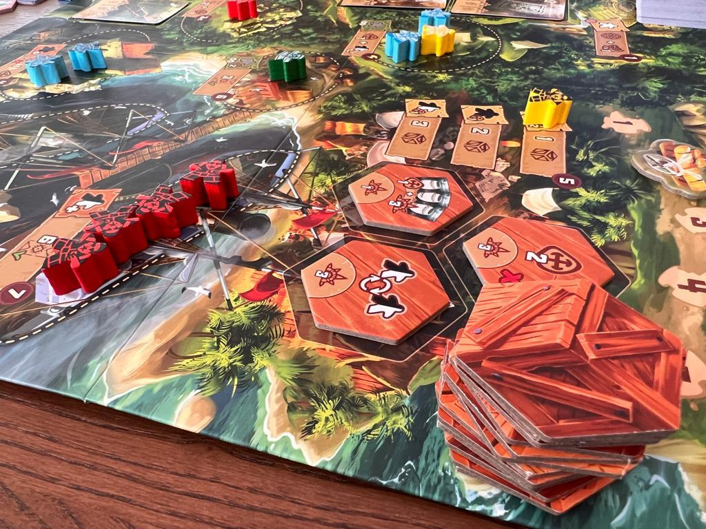
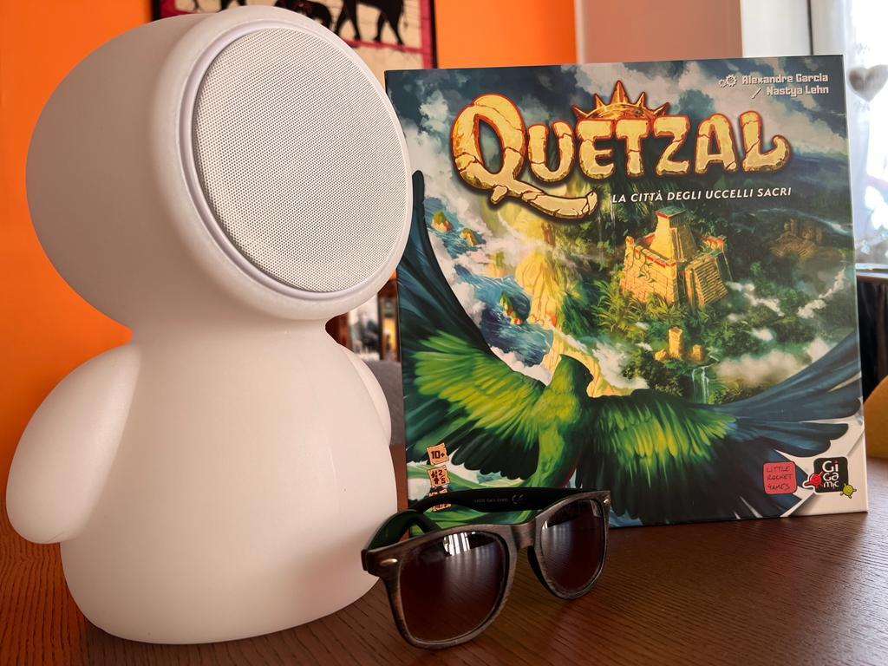

<Setting>

  Siete alla guida di un gruppo di avventurieri e archeologi che hanno viaggiato
  su un biplano fino alle rovine di una civiltà perduta.&nbsp;
   
  Atterrate a Quetzal, la città degli uccelli sacri.&nbsp;
   
  Per tutta l’isola sono sparsi degli artefatti (armi, tavolette, vasi, statue e
  persino mummie): il vostro compito è raccoglierli e consegnarli al porto per
  spedirli al museo più vicino, oppure venderli al mercato nero in cambio di
  denaro.
   

</Setting>

<Rules>

  All’inizio di ogni round i giocatori lanceranno i propri meeple come se
  fossero dei dadi: se cadranno sul lato nero saranno avventurieri, se invece su
  quello bianco degli archeologi.In caso cadano sul fianco o in piedi potranno
  valere sia come avventurieri che come archeologi; ogni meeple in piedi farà
  anche ottenere una moneta al proprietario. Il caposquadra (il meeple più
  grande) sarà sempre un jolly che potrà quindi valere a ogni turno sia come
  avventuriero o come archeologo. Una volta piazzati, i meeple non possono più
  essere rimossi dalla loro posizione sul tabellone.
   
   A turno, i giocatori posizionano i meeple sulle aree, che possono essere
  di diverso tipo:
  <ul>
    <li>      Esclusive: pagando un costo, possono essere occupate da un solo meeple;</li>
    <li>      A offerta: il giocatore che vi posizionerà più meeple si aggiudica la ricompensa;</li>
    <li>      Libere: non hanno limiti ma di solito danno bonus inferiori.</li>
  </ul>
      Piazzati tutti i meeple di tutti i giocatori, si passa alla risoluzione
      delle aree in ordine numerico crescente: potranno essere collezionati gli
      artefatti che verranno successivamente spediti o venduti. A ogni artefatto
      corrispondono dei punti e dei bonus; serie di artefatti dello stesso tipo
      danno diritto a più punti.
  Alla fine del quinto round il giocatore con più punti è dichiarato il
  vincitore.

</Rules>

<Feedback>

  La presentazione del gioco appena intavolato può spaventare: ci sono tanti
  simboli, carte e aree. Ma le regole da spiegare sono pochissime e i simboli
  diventano subito leggibili . Questa caratteristica lo rende un titolo perfetto
  anche per i non-giocatori che si affacciano a un gioco che non è davvero un
  entry-level, ma che con poche meccaniche offre una buona profondità
  strategica.  
  Il gioco scala benissimo anche in 2 giocatori grazie alla presenza di un automa,
  un terzo giocatore fittizio dotato di un mazzo di carte che a ogni turno indicano
  dove piazzare i suoi meeple nelle varie aree di gioco.  
  L'automa non fa punti ma "ruba" alcune zone esclusive ai giocatori, oppure
  costringe a investire più meeple nelle aree ad asta libera. Inoltre,
  soprattutto nel tempio grande, l'automa ha uno schema ben preciso con cui
  recupera gli artefatti, dando priorità alle carte migliori. Questo renderà
  l’automa una presenza al tavolo quasi in carne ed ossa.
   
  Ma è in più giocatori che il gioco dà il meglio di sé: se è vero che con
  l'aumentare del numero di giocatori diminuisce il numero di meeple di ciascuna
  squadra, è anche vero che il piazzamento diventa sempre più “stretto” e poter
  essere il primo giocatore a piazzare i suoi lavoratori può fare davvero la
  differenza.  
  Un paio di consigli per le prime partite: non sottovalutare le monete, in quanto
  garantiscono l’accesso a numerose zone del tabellone, prima tra tutte quella del
  tempio grande che è una vera fucina di artefatti; organizzare bene le spedizioni,
  perché raccogliere artefatti e innescare lecombo fa fare più punti, ma le navi
  per le spedizioni sono poche e dispendiose e volte spedire meno ma fin dai primi
  turni può fare la differenza a fine partita.  
  Ultima considerazione: un difetto (se può essere chiamato così) è dato dal
  numero dei round che sono solo 5. Calcolando che al primo round si parte tutti
  senza artefatti, i momenti per spedire e collezionare punti si contano sulle
  dita di una mano. Questo può essere un problema soprattutto per i neofiti:
  quando hanno compreso il flusso di gioco e il funzionamento delle aste,
  l'aereo avrà raggiunto il quinto round e si dovranno tirare le somme.
  Verosimilmente, in questi casi sarà necessario intavolare subito una seconda
  partita .

</Feedback>

