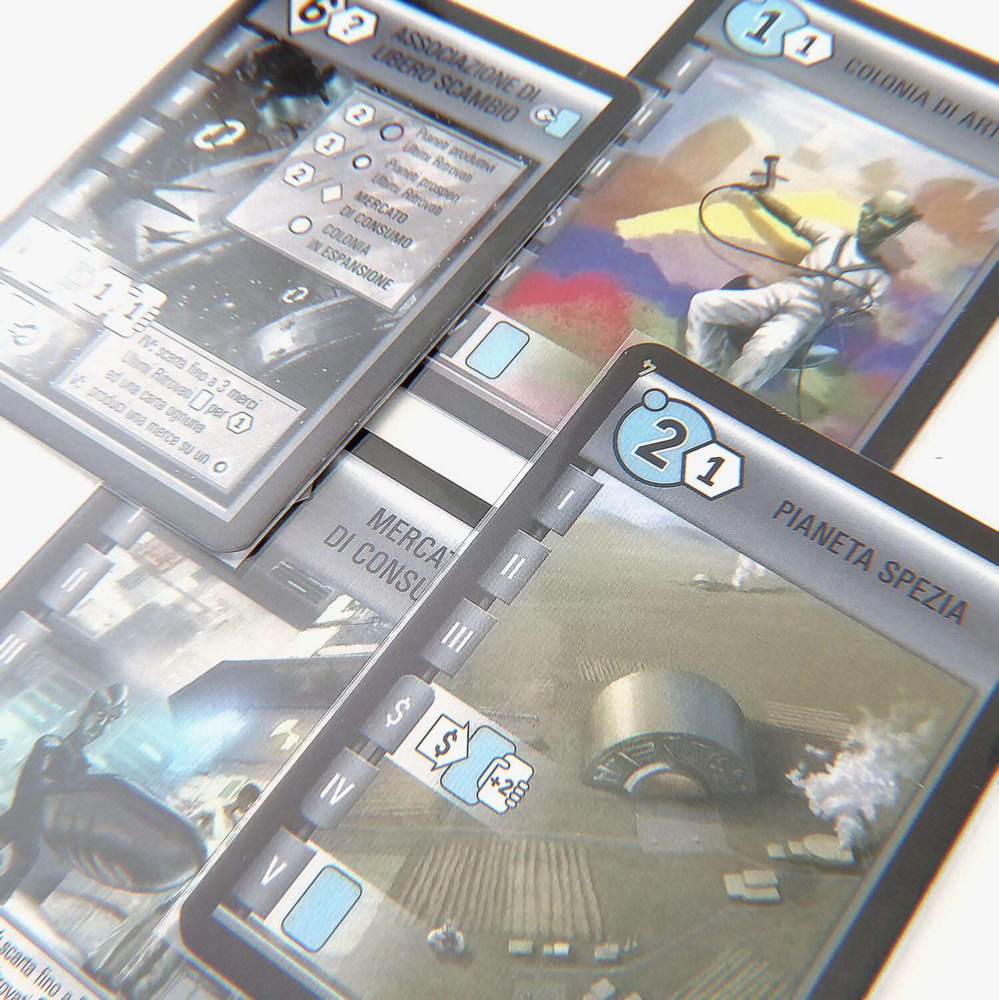
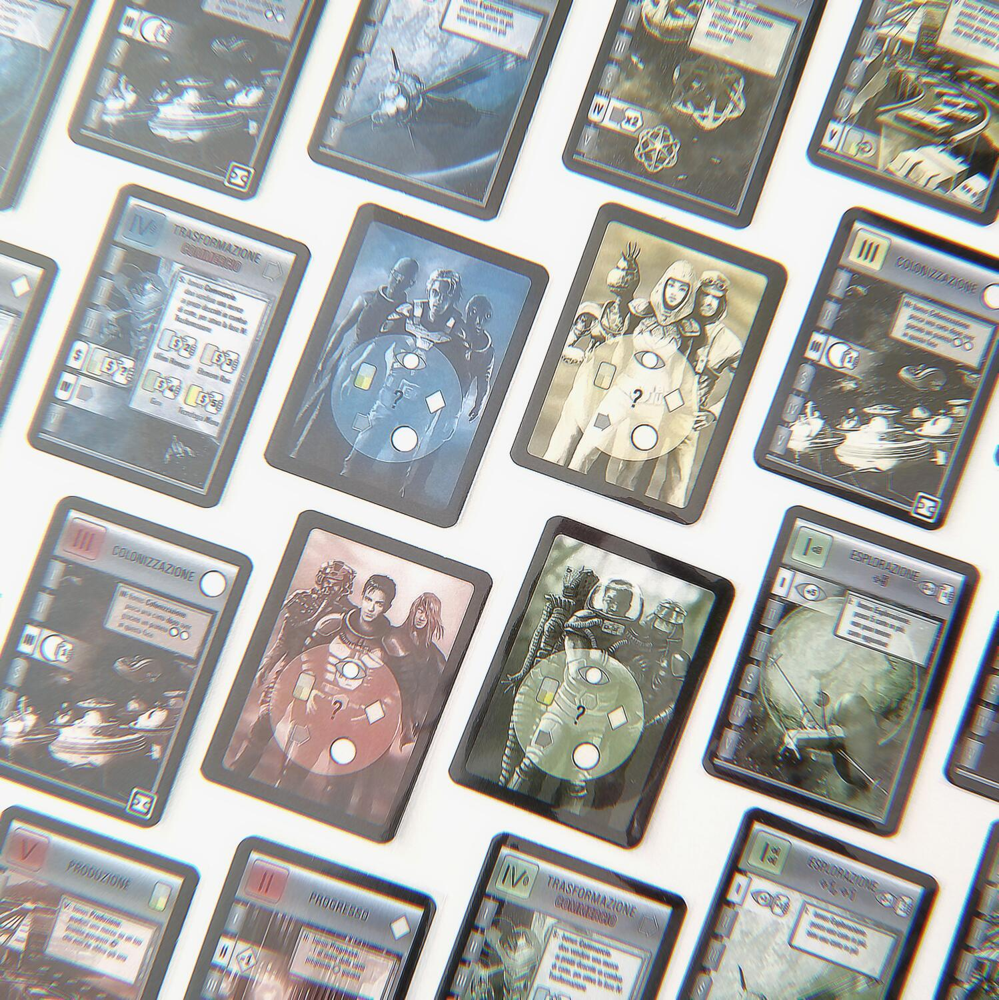
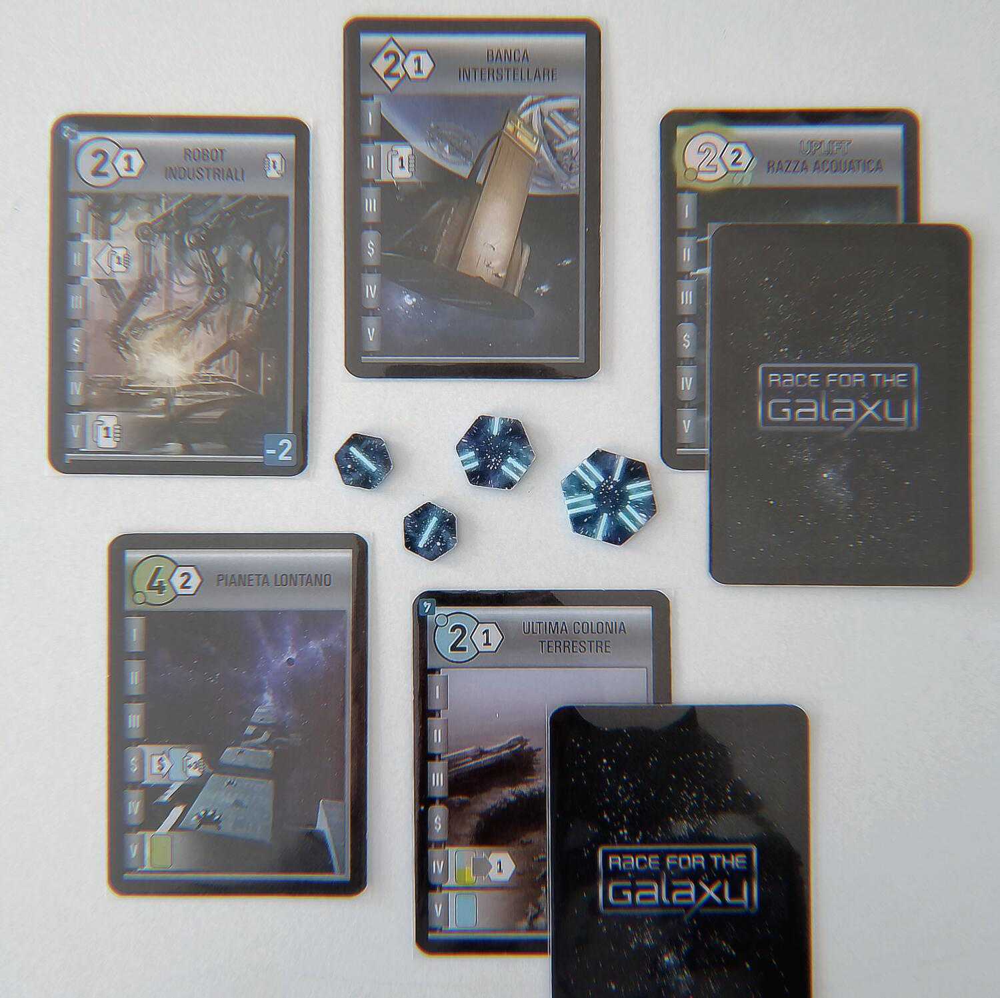

<Setting>

  In <em>Race for the Galaxy</em> assumerete il ruolo di{" "}
  <strong>coloni spaziali</strong> impegnati nella costruzione del vostro
  florido impero. Sarete impegnati in una corsa testa-a-testa alla volta di{" "}
  <strong>pianeti sconosciuti e materiali misteriosi</strong>, al ritmo di{" "}
  <strong>invenzioni tecnologiche</strong> sempre più elaborate: il tutto
  racchiuso in un mazzo di carte.
   

</Setting>

<Rules>

  Separate il mazzo principale dai pianeti iniziali e assegnatene 1 ad ogni
  giocatore, secondo le disposizioni descritte sul regolamento. Pescate poi 6
  carte, di cui ne conserverete 4 (la prima partita prevede delle mani iniziali
  precostruite sulla base del pianeta iniziale assegnatovi). Ciascuno di voi
  prenderà poi il mazzetto azione del colore che preferisce, che è uguale per
  ogni giocatore. Ponete quindi 12 punti vittoria per numero di giocatori al
  centro del tavolo, accanto al mazzo principale.
   
  Non serve altro: la partita può cominciare!
   
  In <em>Race for the Galaxy</em> i giocatori svolgono dei turni simultanei
  caratterizzati da un numero e un tipo variabili di azioni. Le azioni possibili
  sono 5 e verranno svolte in quest’ordine:
   
  <ul>
    <li>      <strong>Esplorazione</strong>: Guarda le prime 2 carte del mazzo, pescane 1 e scarta l’altra;</li>
    <li>      <strong>Progresso</strong>: Gioca 1 carta Progresso dalla mano, scartando un numero di carte pari al suo costo;</li>
    <li>      <strong>Colonizzazione</strong>: Gioca 1 carta Pianeta dalla mano, scartando un numero di carte pari al suo costo;</li>
    <li>      <strong>Trasformazione</strong>: Attiva i poteri di Trasformazione sulle tue carte, scartando le merci prodotte dai pianeti per ottenere dei bonus (di solito punti vittoria o carte da pescare);</li>
    <li>      <strong>Produzione</strong>: Produci le merci sui tuoi Pianeti Produttivi vuoti (assegna cioè a ciascun pianeta una carta coperta dalla cima del mazzo, come fosse un token).</li>
  </ul>
      Come accennato, non tutte queste azioni verranno svolte sempre. Infatti,
      all’inizio di ogni turno i giocatori scelgono e giocano simultaneamente 1
      carta azione dalla propria mano, che determinerà quali azioni si
      verificheranno in quel turno: tutti svolgono le azioni scelte da tutti
      (azioni scelte più volte non si cumulano), ma chi ha scelto l’azione
      ottiene anche il relativo vantaggio o bonus di sorta quando dovrà
      svolgerla.
       
      L’obiettivo del gioco è accumulare i punti vittoria che si trovano sui
      segnalini (che è possibile ottenere dal centro del tavolo) e sulle carte.
      La partita termina quando, alla fine di un turno, uno o più giocatori
      contano 12 carte nella loro area di gioco, oppure tutti i segnalini dei
      punti vittoria sono stati reclamati. Si contano dunque i punti e chi ne ha
      totalizzato la somma maggiore vince la partita!

</Rules>

<Feedback>

  Come si è potuto notare, il più vistoso pregio di <em>Race for the Galaxy</em>{" "}
  è la sua <strong>“densità”</strong>. 
  Già dal set-up si può apprezzare quel sapore un po’ old school dei giochi che richiedevano
  una mescolata per essere allestiti, senza le decine di segnalini, tracciati, tessere,
  rondelle e plance di ogni forma e colore a cui ci hanno abituati i titoloni degli
  ultimi anni. <em>Race for the Galaxy</em> <strong>    contiene tutte le sue meccaniche e i suoi meccanismi in un mazzo di carte</strong> – c’è da dire – molto fitto e vario.
   
  Il sistema delle carte che fanno sia da motore che da combustibile (metafora, secondo
  me, più che azzeccata, visto che parliamo sostanzialmente di un gioco di engine
  building) è una vera sorpresa e una piccola meraviglia, anche a più di 15 anni
  dalla sua prima edizione. È una di quelle cose che “su carta” – perdonate la freddura
  – non potrebbero mai funzionare, eppure in qualche modo Race for the Galaxy ci
  riesce perfettamente. Il pensiero si concentra sulla propria mano e sulle carte
  a terra, senza occhiate che vanno fino all’altro capo del tavolo per controllare
  la posizione del segnalino sul tracciato, donando a questo titolo un’<strong>    ergonomia</strong> che non teme rivali.
   
  Anche la meccanica della scelta delle azioni (così fortunata da essere stata “assorbita”
  da <em>Ares Expedition</em>, spin-off del celebre <em>Terraforming Mars</em>) si
  dimostra una brillante <strong>soluzione di tattica</strong>, che fa evolvere quello
  che sarebbe potuto essere l’ennesimo gestionale multisolitario in una guerra fredda
  in cui la capacità di prevedere le mosse avversarie diventa la chiave di volta
  della partita.
   
  Certo, la spada di Damocle di tutti i giochi di carte, come ben sappiamo, è la{" "}
  <strong>dipendenza dalla fortuna</strong>. Alla domanda “<em>    Race for the Galaxy</em> non rischia di diventare un gioco a chi pesca le carte migliori?” posso però
  rispondere che, sebbene questa ipotesi possa trovare dei riscontri nelle primissime
  partite, la sovrabbondanza di carte e la costanza con cui esse vengono pescate
  consente di concentrarsi su quelle che più si allineano alla propria strategia,
  utilizzando le altre come risorse per metterle in gioco. Va però specificato che
  sarà importante saper adattare e modificare i propri piani in corso d’opera, laddove
  la situazione lo richiederà: in questo senso, <strong>    l’esperienza fa quasi tutto il lavoro</strong>. 
  Ma allora perché un 7? – vi chiederete.
   
  La verità è che, per quanto strabiliante, <em>Race for the Galaxy</em>{" "}
  <strong>accusa il peso dei suoi anni</strong>, oltre a quello di una
  produzione pigra che non ha saputo svecchiarlo. Oltre a delle illustrazioni da
  copertine sci-fi anni ’70 – che possono anche incontrare i gusti dei
  nostalgici – il vero problema è il <strong>comparto grafico piatto</strong>,
  quasi da prototipo, e che condensa (questa volta in senso negativo) una{" "}
  <strong>simbologia immensa, astrusa e anche un po’ incomprensibile</strong>.
  Considerando che il gioco è stato rimaneggiato per una seconda edizione, mi
  sembrava un difetto davvero evitabile.
   E l’altra perplessità, naturalmente, risiede nel fattore alea: per quanto
  ci si impegni, esiste la possibilità (neanche troppo remota) che una mano sfortunata
  possa ritardare un giocatore di quella manciata di turni che gli avrebbero permesso
  di sostenere il testa-a-testa con gli avversari. Per fortuna se n’è accorto anche
  il suo autore, Thomas Lehmann, che nella sua altra e più recente fatica <em>    Res Arcana</em> è riuscito ad inserire degli elementi poco ingombranti che riescono a intiepidire
  la casualità, pur rimanendo fedele al feeling del suo acclamato pupillo.
   
  Ultima grinza è una longevità affidata alla varietà di carte che però, alla fine
  dei conti, rispondono sempre alle cinque azioni principali. Per fortuna esistono
  delle <strong>espansioni </strong>che implementano anche nuove meccaniche, ma che
  però non sono comprese nella scatola base e quindi non possono influenzarne il
  giudizio.
   
  Ma in conclusione, <em>Race for the Galaxy</em> è un gioco a cui non si può dire
  di no. Con un allestimento senza sforzo si riesce ad accedere ad <strong>    un’esperienza profonda e coinvolgente</strong> che richiama al tavolo e di cui, in fondo, <strong>    non ci si può stancare</strong>.

</Feedback>

