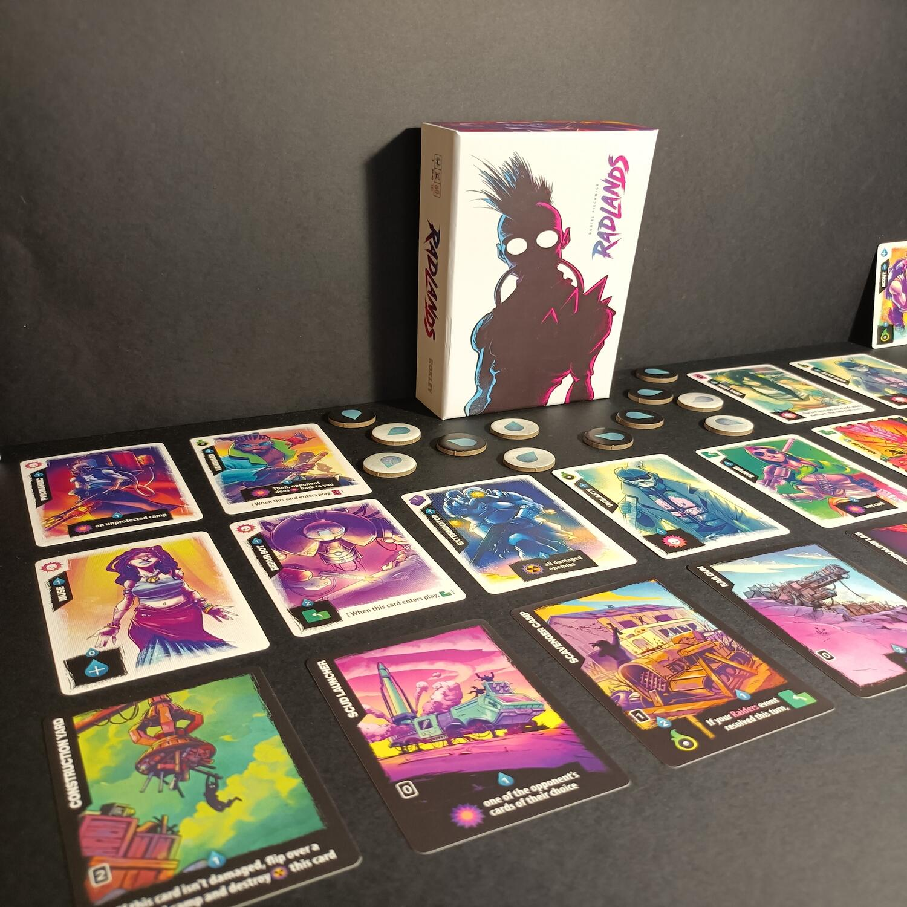
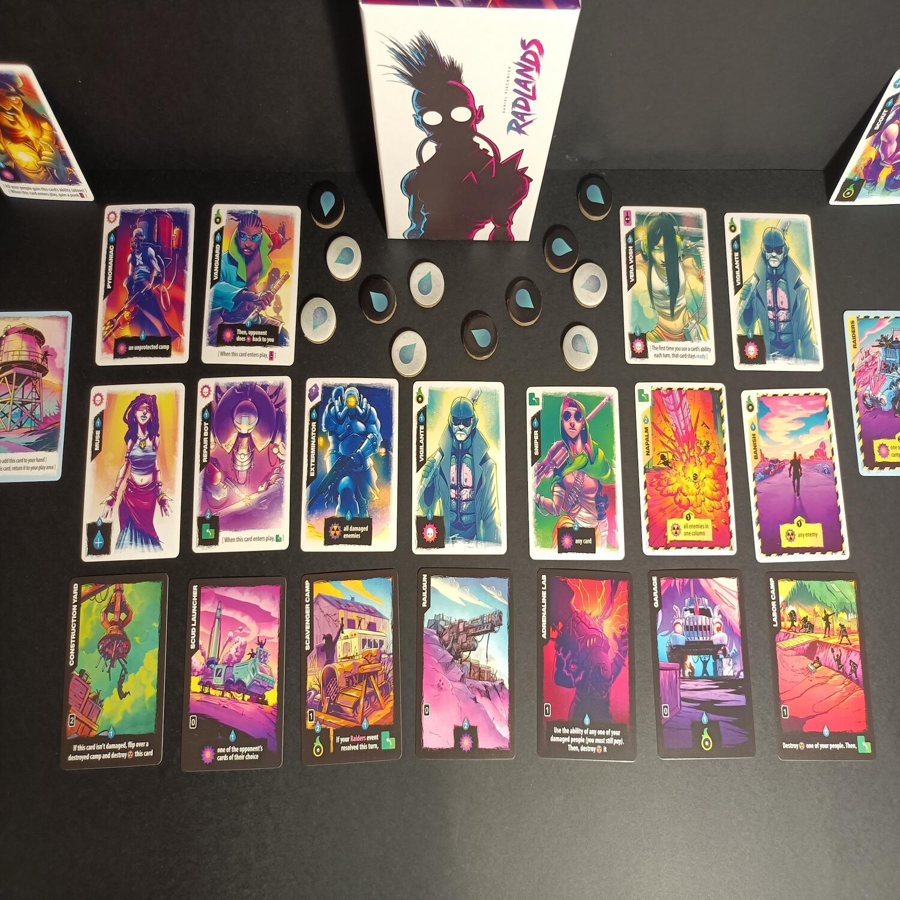

<Setting>

  La terra è ormai devastata dalle guerre e dal cambiamento climatico. In una
  landa post-apocalittica, l’unica risorsa ancora importante è l’acqua. La
  civiltà è sull’orlo del baratro, pazzia e disperazione dominano l’umanità.
  L’ultima roccaforte che vi è rimasta è il decadente rifugio che vi siete
  costruiti. Ma non siete soli in questa terra. Dovrete difendere la vostra
  casa, e annientare i nemici e i loro campi per poter sopravvivere. Siete in{" "}
  <strong>Radlands</strong> ora e non avete via di scampo.

</Setting>

<Rules>

  Le regole di Radlands sono semplici: distruggi le basi avversarie e proteggi i
  tuoi rifugi!
   
  Ad inizio partita, ogni giocatore sceglierà tre campi, con abilità annesse, da
  dover proteggere. Ogni turno è composto da 3 fasi: Eventi, Rifornimento,
  Azioni. All’inizio di ogni turno, i giocatori pescheranno una carta e
  successivamente faranno avanzare di uno spazio gli eventi presenti nella coda.
  A questo punto si otterranno le preziose scorte d’acqua, tre per la
  precisione, che vi permetteranno di effettuare le azioni durante la fase
  successiva.
   
  Il fulcro del gioco sta proprio in questa fase. Utilizzando le poche risorse a
  vostra disposizione, potrete reclutare persone, attivare abilità e effettuare
  azioni.  
  Un concetto fondamentale da tenere presente in Radlands è quello di <em>    campo di gioco</em>. È possibile immaginarlo come una griglia 4x4, in cui sono presenti i tre
  accampamenti, con due spazi vuoti di fronte a loro, e la coda degli eventi, costituita
  appunto da tre spazi. Quando giocherete un personaggio, potrete scegliere in quale
  colonna collocarlo, eventualmente scambiando la posizione di uno già presente su
  quella colonna, e ovviamente non potrete posizionarlo in uno spazio già occupato.
  Quindi, usate i personaggi per difendere gli accampamenti, ma badate bene a chi
  giocate. Questa regola ovviamente vale anche per gli eventi, ma nel caso in cui
  venga giocato un evento con un timer di uno spazio già occupato, semplicemente
  questo verrà posizionato nello spazio libero più indietro del tracciato.
   
  Grazie all’acqua potrete giocare eventi e personaggi. Questi ultimi avranno utilissime
  abilità che vi permetteranno di portare a casa la vittoria. È importante ricordare
  che un personaggio appena giocato o ferito (ogni personaggio ha due punti vita)
  non può usare le sue abilità. Ogni carta, inoltre, presenta un azione Riciclo.
  Se scartata, attiverà un’abilità immediata a costo zero. Da ultimo, ma non meno
  importante, potrete spendere acqua per avviare un Raid, per colpire direttamente
  gli accampamenti avversari, conservare acqua dal Silo, per poterla usare nei turni
  successivi, o pescare utilissime carte dal mazzo.
   
  La partita termina quando uno dei due giocatori sarà riuscito a spazzare via tutti
  gli accampamenti dell'avversario.

</Rules>

<Feedback>

  Radlands è stata una scoperta fantastica: un insieme di regole semplice e
  veloci da imparare ma che creano un titolo esplosivo e sempre divertente da
  giocare. Con la sua durata di appena venti minuti, una partita tira l’altra. E
  badate bene, non sarà affatto semplice vincere. Ogni partita sarà davvero sul
  filo del rasoio e dovrete spremere bene le vostre meningi per usare le poche
  risorse a vostra disposizione senza perire all’assalto dei nemici. I turni
  sono rapidi, esplosivi e ricchi di suspence. Combinazioni devastanti di carte
  sono sempre dietro l’angolo ma starà a voi trovarle. Inoltre, grazie alla
  grande quantità di accampamenti diversi, la rigiocabilità è davvero altissima.
  La possibilità di riciclare le carte o sfruttarle sul campo di battaglia
  permette di creare strategie sempre diverse, non annoiandovi mai. Ovviamente
  la fortuna è presente. Spesso vi capiterà di pescare la carta sbagliata al
  momento sbagliato. Ma sicuramente questo non è un aspetto che vi darà
  fastidio, perché conclusa una partita ne vorrete iniziare un’altra e poi
  un’altra ancora.  
  Per concludere, Radlands è semplice ed elegante, uno di quei giochi che se ti prende
  non ti stanchi più di intavolarlo. Tantissima rigiocabilità ed esplosività in una
  piccola scatola. Quindi non aspettate l’apocalisse imminente e andatelo a prendere!

</Feedback>

