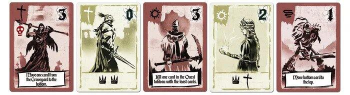
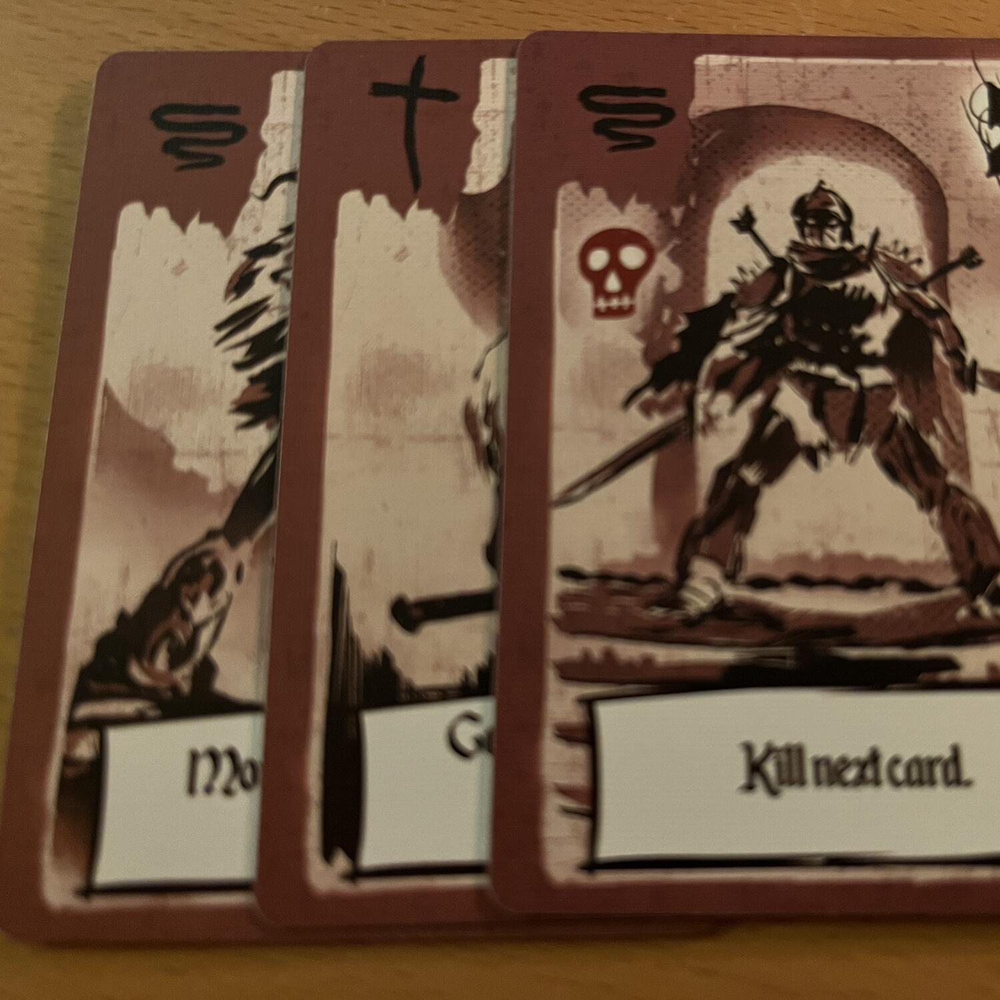
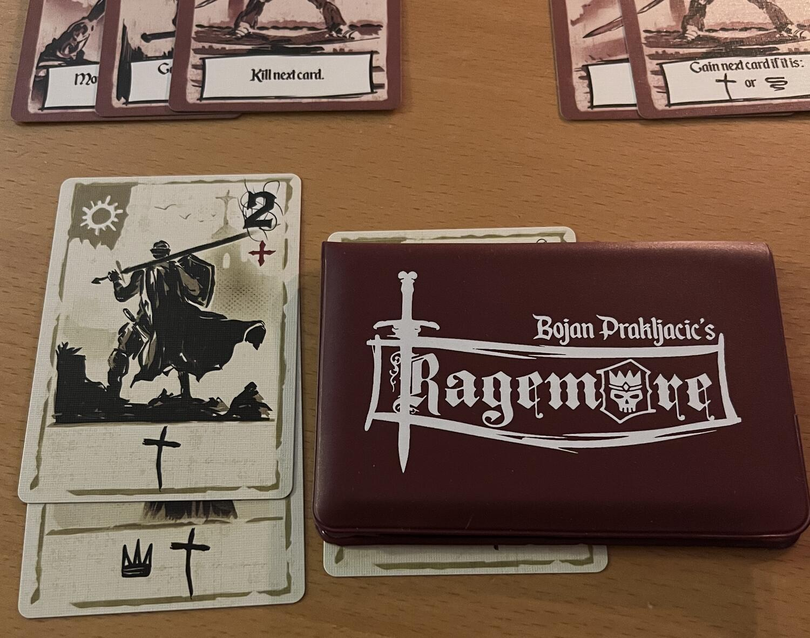

<Setting>

  L’ennesimo nemico, l’ennesima quest, l’ennesima nuova recluta, l’ennesimo
  compagno morto. È questo il destino di un eroe! Affrontare nuove sfide fino ad
  arrivare alla fine. Superarle e dimostrare di essere l’eroe che si merita di
  essere o morire provandoci!

</Setting>

<Rules>

  Ragemore è un gioco di 18 carte a doppia faccia. Ogni faccia rappresenta un
  Eroe o un Nemico; entrambi sono caratterizzati da un simbolo e un valore
  d’attacco, ma solo il nemico è dotato di un potere speciale.  I simboli
  dei Nemici definiscono le <strong>Quest</strong> che andranno superate per
  vincere la partita e il tipo di <strong>Eroi</strong> che si potranno
  reclutare. Gli Effetti rappresentano invece cosa succederà ogni turno agli
  Eroi.
   
  I simboli degli Eroi, dal canto loro, servono a reclutare nuovi compagni e a
  risolvere le quest. In entrambi i casi sarà necessario che i simboli delle
  carte combacino tra di loro.
   
  La partita finirà in uno di questi casi: quando si collegheranno almeno 2 tris
  di simboli dalle quest; quando saranno morti almeno 3 mostri; quando il mazzo
  di carte sarà esaurito.

</Rules>

<Feedback>

  Ragemore è un gioco in grado di stupire. Grazie al fatto di essere un{" "}
  <Link to="/mechanisms/collezione-set">Collezione set</Link> “in disguise”, il
  flusso di gioco risulta familiare e coinvolgente.  
  Non è tuttavia un titolo esente da difetti: l’impatto della fortuna si fa sentire
  e, per quanto le meccaniche permettano delle manovre strategiche, non si può parlare
  davvero di determinismo. La carta sbagliata al momento sbagliato può segnare la
  sconfitta del giocatore in una partita piena di successi.  
  Ad ogni modo, la direzione grafica del gioco e gli elementi narrativi evocati
  dalle carte rendono Ragemore un’esperienza che per un{" "}
  <Link to="/mechanisms/solitario">Solitario</Link> di 20 minuti è{" "}
  <strong>impagabile</strong>!

</Feedback>

