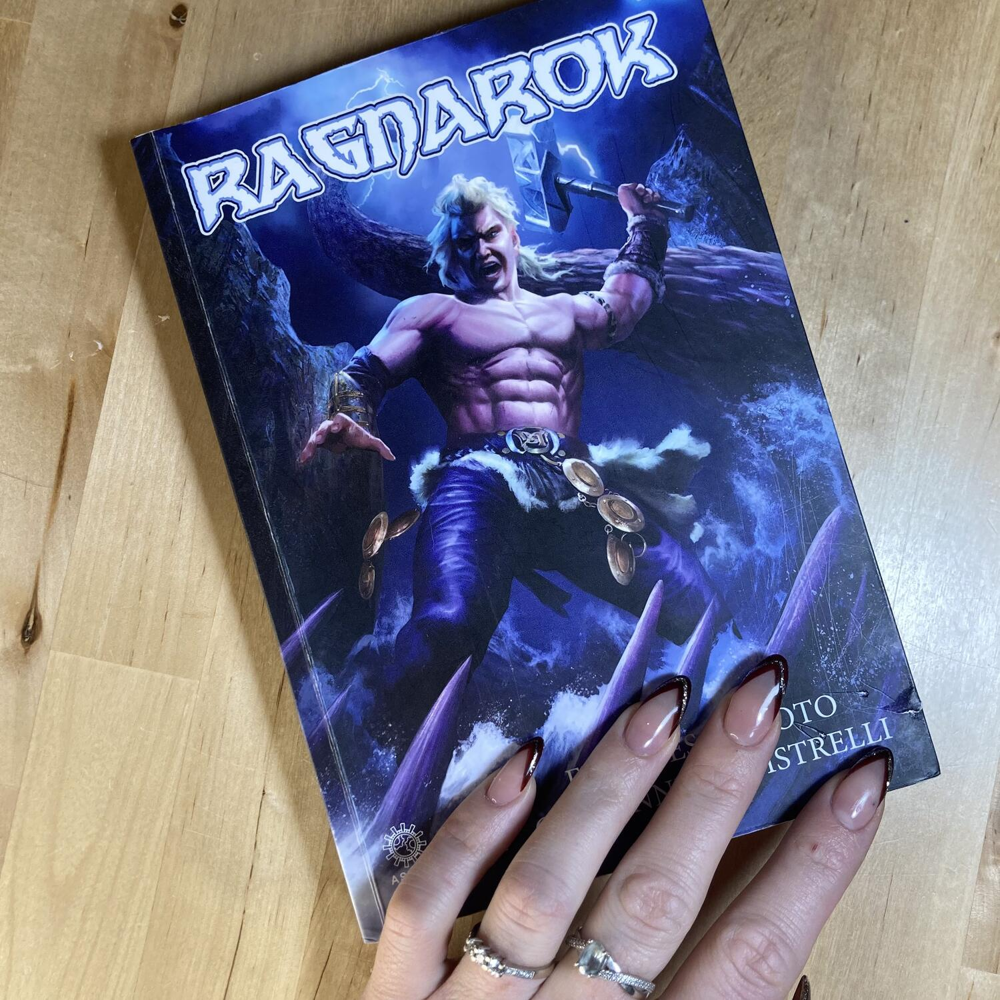
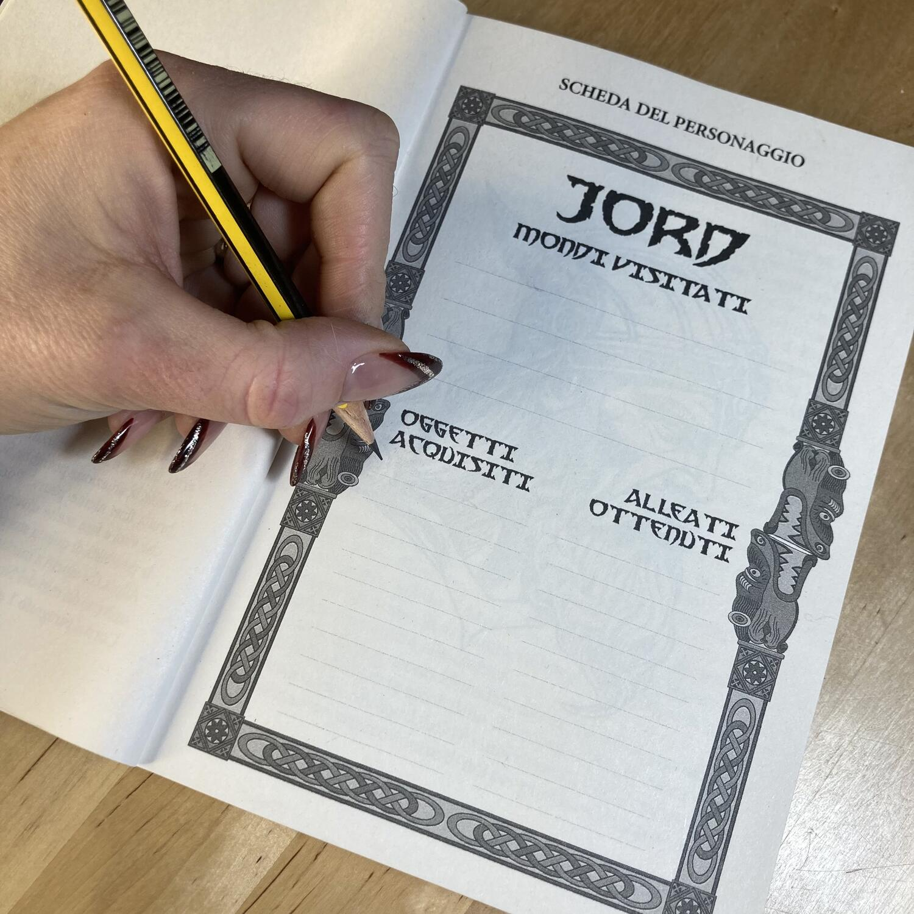
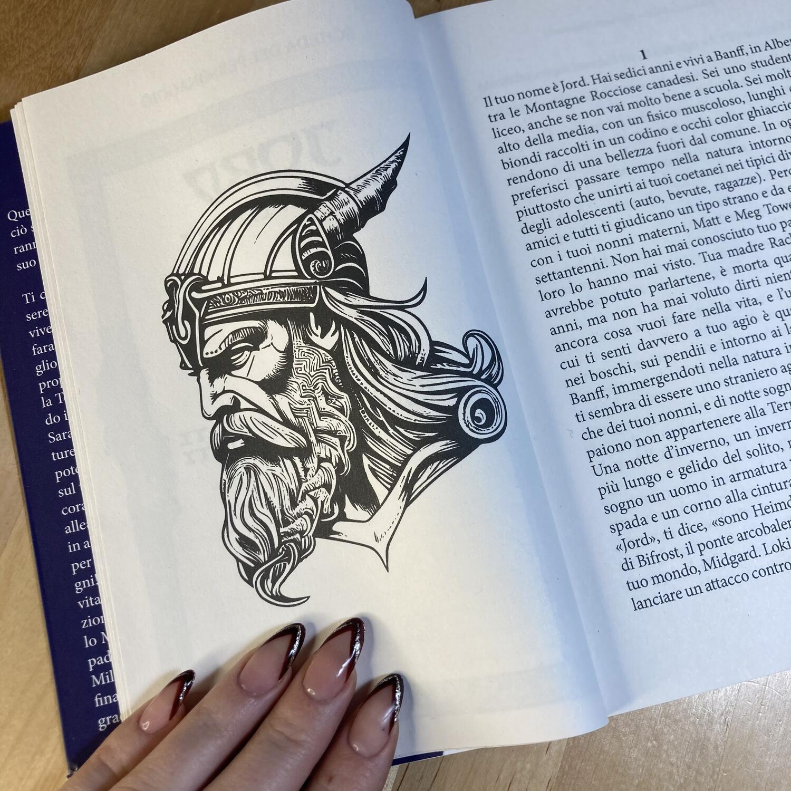

<Setting>

  Ci troviamo a <strong>Banff</strong>, in <strong>Alberta</strong>, un piccolo
  paesino tra le <strong>Montagne Rocciose canadesi</strong>; i giorni si
  susseguono lenti e l’atmosfera tranquilla della città accoglie i turisti che
  giungono curiosi.
   
  Nell’avventura vestiremo i panni di <strong>Jord</strong>, un{" "}
  <strong>giovane ragazzo di sedici anni molto più alto della media</strong>,
  con un fisico <strong>muscoloso</strong>, lunghi{" "}
  <strong>capelli biondi</strong> raccolti in un codino e{" "}
  <strong>occhi color ghiaccio</strong>, che come tutti i suoi coetanei sopporta
  la vita liceale cercando di non farsi sopraffare! Non è uno studente modello e
  per il suo carattere introverso preferisce passare il tempo nella natura
  intorno a Banff, piuttosto che a divertirsi con i compagni. Forse è per questo
  che non ha molti amici e tutti lo giudicano un tipo strano.
   
  <strong>Abita con i nonni materni</strong>, Matt e Meg Tower, e{" "}
  <strong>non ha mai conosciuto il padre</strong>. La madre, Rachel, l'unica che
  avrebbe potuto parlargliene, è morta quando lui aveva sette anni e non ha mai
  voluto dirgli niente… Dopotutto, sarebbe stato complicato spiegare ad un bimbo
  di essere <strong>il figlio di un dio…</strong>

</Setting>

<Rules>

  In Ragnarok vi troverete a vestire i panni del <strong>protagonista</strong>,
  quindi saranno le vostre scelte di <strong>lettore-giocatore</strong> a
  definire l'andamento della storia e a portare Jord verso una direzione
  piuttosto che un’altra!  
  <strong>Fin dall’introduzione si conosce l'obiettivo</strong>, quindi le decisioni
  dovranno esser prese con l'intenzione di raggiungerlo nel miglior modo possibile:
  questo porterà il lettore a saltare tra i paragrafi e a tentare di raggiungere
  l’epilogo sano e salvo!
   
  Questo, a sua volta, vi condurrà a incontrare persone e a ottenere, <strong>    se ne sarete degni</strong>, degli oggetti che vi saranno molto utili nell’avventura e di cui potrete
  tenere traccia nella scheda personaggio all’inizio del libro.

</Rules>

<Feedback>

  Il libro è <strong>scritto molto bene</strong>: la sintassi è semplice e
  diretta, e permette una lettura fluente e leggera, perfetta anche per chi non
  è un lettore abitudinario.
   I riferimenti alla <strong>cultura norrena</strong> e alle sue <strong>    leggende</strong> sono molto presenti e i Nove Mondi vengono introdotti di capitolo in
  capitolo, anche se mai raccontati in profondità. Quindi, se da una parte godremo
  di un <strong>testo snello</strong>, dall’altra è probabile che, soprattutto per
  chi non conosce questi miti, proveremo una sorta di <strong>    fame di informazioni</strong>. 
  Un aspetto che avrei preferito trovare un po’ meno frequentemente è la{" "}
  <strong>scelta obbligata del capitolo successivo</strong> che, pur se
  risulterà utile a chi è nuovo ai libri game, per chi è più navigato nel genere
  potrà sembrare eccessivamente presente. Il protagonista mi ha suscitato{" "}
  <strong>sensazioni contrastanti</strong>, perché se da un lato è introdotto in
  maniera pressoché perfetta e la sua storia è raccontata bene, dall’altro avrei
  preferito una crescita spirituale più lenta, così come un apprendimento delle
  abilità in battaglia più progressivo, non dovuto semplicemente alla conoscenza
  datagli da Mjolnir o alla forza innata derivata dall’eredità paterna. Questo
  aspetto ha reso{" "}
  <strong>    un po’ scontate, a volte poco plausibili, le vittorie del protagonista</strong>
  , soprattutto in considerazione del fatto che la durata dell’arco narrativo è di
  circa una settimana!  
  Tirando le somme, Ragnarok è <strong>promosso</strong>. Lo consiglierei
  tuttavia <strong>a chi ancora non si è approcciato a questo genere</strong>{" "}
  poiché, nonostante ci sia la possibilità di perire in battaglia o non riuscire
  a dimostrarsi degno agli occhi di Thor, mi sembra strutturato in modo tale da
  non deludere il lettore o comunque da non lasciargli l’amaro in bocca per la
  sconfitta.

</Feedback>

