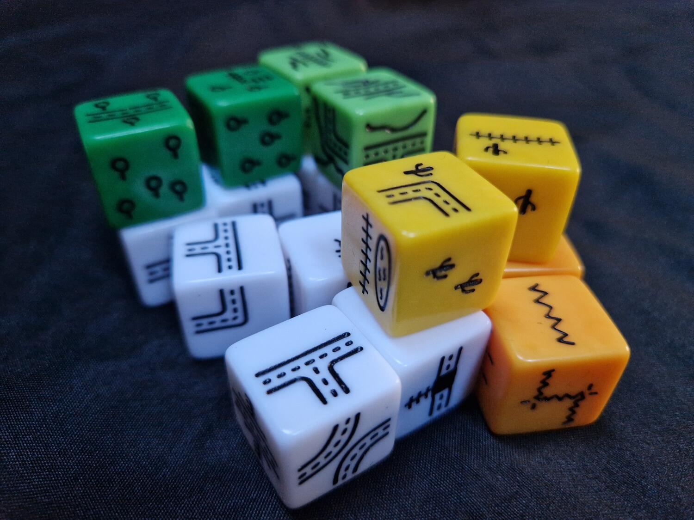
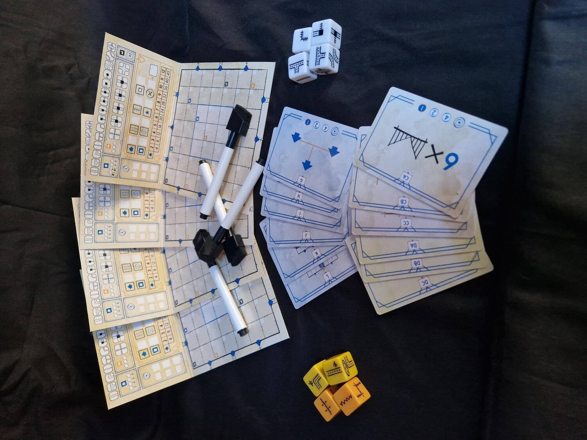

<Setting>

  La rete dei trasporti è una componente fondamentale della società. Viene
  utilizzata per la mobilizzazione di persone e merci, per recarsi in vacanza o
  sul posto di lavoro, per consegnare beni di prima necessità e… per i giochi da
  tavolo! La sua importanza non è da sottovalutare e, per sfruttarla al meglio,
  occorre una corretta pianificazione e distribuzione sul territorio. Se il
  vostro sogno è quello di organizzare la rete stradale o ferroviaria nazionale,
  dovrete prima farvi le ossa su “Le Strade d’Inchiostro Challenge”!

</Setting>

<Rules>

  Lo scopo della serie di giochi “Le Strade d’Inchiostro” è in generale
  quello di collegare tra loro quante più Uscite possibili disegnando dei
  percorsi.
   
  A ogni giocatore vengono assegnati un pennarello e una scheda: rispetto alle
  schede delle varianti precedenti del gioco, su quelle di questa nuova versione
  Challenge si noterà la presenza di alcune caselle con degli edifici che
  consentono di ottenere più punti, di aumentare il numero di usi dei percorsi
  speciali o di “duplicare” un determinato dado; a seguire, si pescano
  casualmente tre carte obiettivo comuni; infine, vengono posizionati quattro
  dadi bianchi al centro del tavolo. Durante ogni round vengono lanciati i
  quattro dadi che determinano i percorsi da disegnare. Tutti i giocatori
  dovranno disegnare simultaneamente i percorsi rappresentati sui dadi
  rispettando alcune regole:
   
  <ul>
    <li>devono essere connessi a un percorso dello stesso tipo;</li>
    <li>ogni percorso rappresentato dovrà essere disegnato una sola volta in quel turno;</li>
     <li>strade e ferrovie non possono essere collegate tra loro.</li>
  </ul>
  Si possono collegare ferrovie e strade tramite le Stazioni; inoltre, si
  possono disegnare dei percorsi speciali.
   
  Al termine dei sette round che compongono la partita viene calcolato il
  punteggio, come nelle precedenti versioni (Blu e Rossa), considerando il
  numero di uscite collegate tra loro, la strada e la ferrovia più lunga, ma
  rimuovendo punti per eventuali percorsi incompleti. Inoltre, in questa
  nuova edizione Challenge (nelle due versioni Gialla e Verde), i giocatori
  faranno punti anche in base agli obiettivi comuni definiti ad inizio
  partita e in base al numero di stazioni disegnate in apposite caselle
  della scheda.

</Rules>

<Feedback>

  Le Strade d’Inchiostro è una serie di giochi che si presta anche a un numero
  elevato di giocatori (sebbene questa versione Challenge lo abbassi da 6 a 4)
  senza tempi di gioco lunghi; è possibile spiegarlo in breve ed è facile da
  imparare. Le dimensioni contenute delle scatole e i componenti minimali lo
  rendono il gioco perfetto da portare in vacanza o a casa di amici; l’ampio
  numero di espansioni (2 diverse in ogni scatola base) ne aumenta non solo la
  variabilità, ma anche la rigiocabilità.
   
  Nonostante in alcuni casi il lancio dei dadi possa avvantaggiare alcuni
  giocatori, i sette round permettono ugualmente a ognuno di disegnare i
  percorsi che ritiene più congeniali per la propria rete. La strategia diventa
  quindi una componente fondamentale: in alcuni casi costruire un unico e lungo
  percorso potrebbe premiare meno rispetto alla creazione di più percorsi brevi,
  soprattutto se si giocano più espansioni contemporaneamente, che introducono
  nuovi modi per aumentare i punti di fine partita, aggiungendo elementi da
  disegnare sulla propria plancia di gioco, che dovranno essere quanto più
  raggruppati possibile per massimizzare il punteggio, togliendo di conseguenza
  spazio a strade e ferrovie.
   
  L’edizione Challenge e i nuovi obiettivi comuni rinnovano Le Strade
  d’Inchiostro con un’atmosfera di tensione capace di rendere emozionante ogni
  singolo turno. Infatti, il primo giocatore a completare un obiettivo sarà
  anche il giocatore ad ottenere più punti dallo stesso.

</Feedback>
