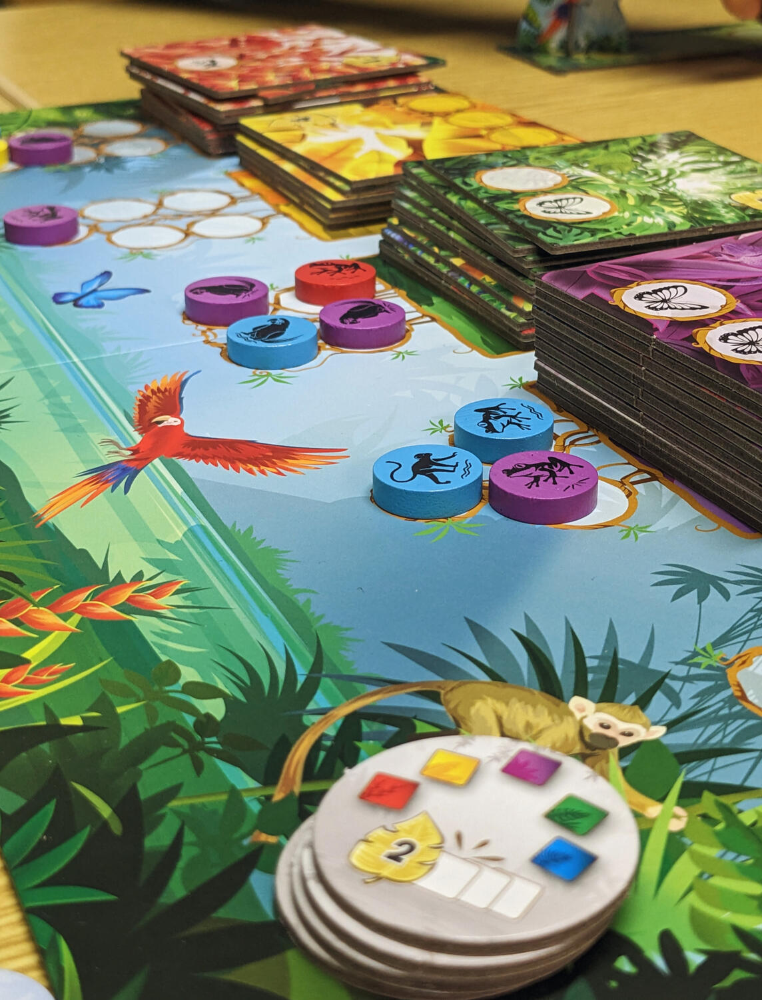
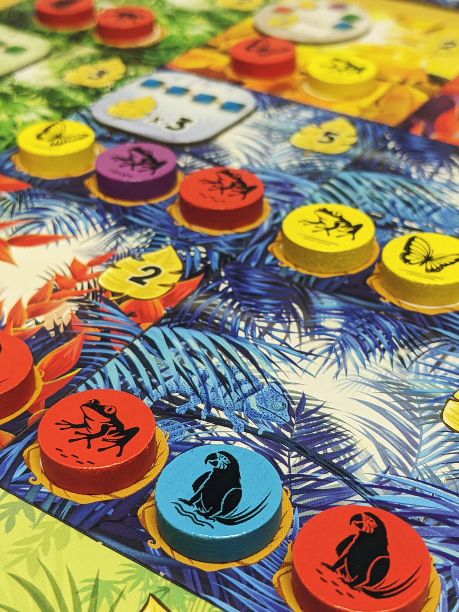
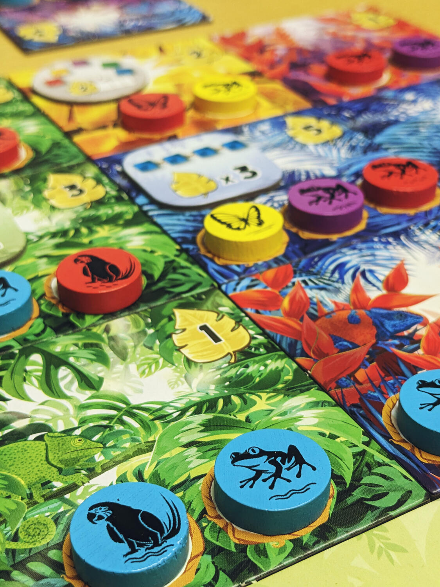

<Setting>

  La vita nella giungla certamente non è facile, soprattutto quando molte specie
  sono a rischio di estinzione a causa della deforestazione. In Rainforest
  dovrai cercare di ricreare il più vario e fiorente ecosistema, in modo da
  proteggere le specie endemiche e ripopolare la maggior parte di aree possibili
  con animali e piante. Chi riuscirà a bilanciare meglio questi due elementi e
  raccoglierà la maggior parte dei punti avrà creato la giungla vincente!
   

</Setting>

<Rules>

  Le regole di Rainforest sono molto semplici. Durante il tuo turno dovrai
  semplicemente prendere una tessera con piante di un determinato colore (in
  base alla tua strategia) e raccogliere i segnalini animale corrispondenti.
  Puoi prendere più di un animale, purché tutti i segnalini siano accomunati
  dallo stesso colore e/o specie. Quando una tua tessera sarà interamente
  occupata da tutti gli animali che richiede potrai considerarla definitivamente
  parte del tuo ecosistema: ti garantirà così dei punti alla fine del gioco. Nel
  corso della partita potrai anche completare obiettivi che ti regaleranno altri
  punti.
   
  Il primo giocatore che completa una griglia 3x3 di tessere innescherà la fine
  del gioco. Il vincitore sarà la persona che avrà collezionato più punti.
   

</Rules>

<Feedback>

  Con un double drafting in qualche modo simile a quello di{" "}
  <Link to="/reviews/cascadia">Cascadia</Link>, Rainforest risulta un gioco
  molto semplice e piacevole, pur portando un certo grado di novità nel genere e
  non risultando ridondante o "già visto". L’ambientazione non traspare in modo
  evidente, rendendo il gioco leggermente più astratto di quello che ci si
  sarebbe aspettati, ma le meravigliose illustrazioni e i componenti colorati
  aiutano l’immersione.
   
  In definitiva, un titolo leggero ma interessante, con un end game trigger che
  lo rende simile ad un racing game, e grazie al quale rimane un certo grado di
  tensione, specialmente nella seconda metà della partita. Decisamente adatto a
  tutti, sia a giocatori esigenti che occasionali!
   

</Feedback>

