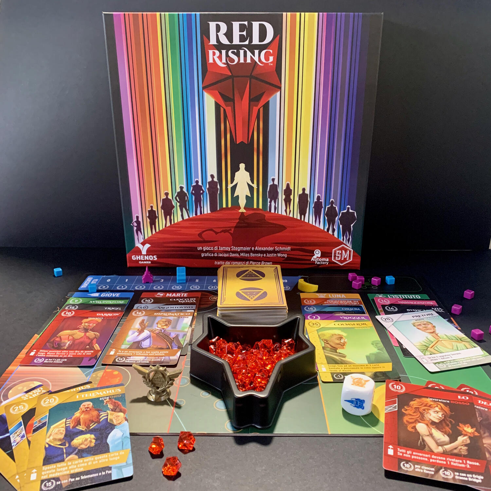
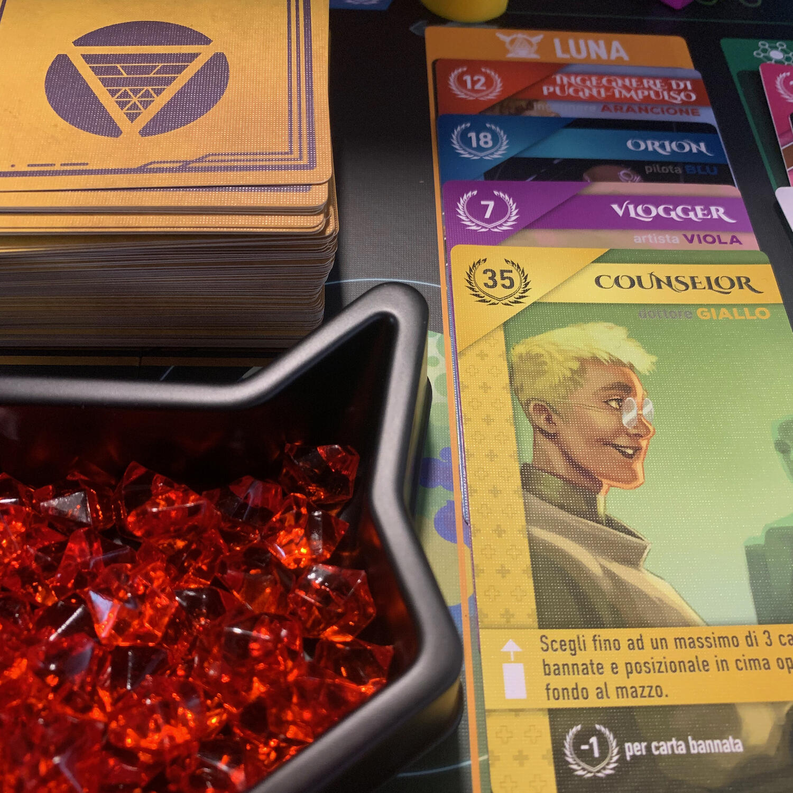

<Setting>

  Darrow ha sedici anni, vive su Marte ed è uno dei Rossi. La casta più bassa,
  minatori condannati a scavare nelle profondità del pianeta a temperature
  intollerabili, rischiando ogni giorno la propria vita. Ma Darrow sa di farlo
  per rendere abitabile la superficie di Marte, per dare una terra alle nuove
  generazioni. E a ripagarlo dei sacrifici c'è l'amore per Eo, bellissima e
  idealista. Finché un giorno i due innamorati sono sorpresi a baciarsi in un
  luogo dove non avrebbero dovuto, sono processati e condannati da un giudice
  appartenente alla casta degli Oro, la classe dominante. E mentre Eo riceve le
  frustate di punizione, la sua voce si scioglie in un canto dolcissimo, un
  canto proibito di rivolta e speranza, lo stesso canto che era costato la vita
  al padre di Darrow. E ora costerà la vita a Eo. Abbraccerai la rivoluzione dei
  Rossi tentando di cambiare la società per sempre oppure preferirai mantenere
  la dittatura aurea?

</Setting>

<Rules>

  In Red rising ogni giocatore rappresenta una casa, una fazione asimmetrica,
  con lo scopo principe di portarla al predominio sull'intero sistema solare,
  correndo a far più proseliti possibili. Non ha importanza se questi siano dei
  meri Rossi o dei potenti Oro, o persone appartenenti a una delle altre 12
  caste, l'importante è che questi personaggi, queste carte, riescano a creare
  delle potenti sinergie tra di loro. Turno dopo turno, si giocheranno
  personaggi dalla propria mano su di un luogo (Giove, Marte, Luna, l'istituto),
  applicando l'effetto della carta in questione; e si andrà a recuperare
  un'ulteriore carta dalla plancia comune di gioco, da uno dei tre luoghi non
  scelti (o dal mazzo di carte coperte) ottenendo un secondo benefit:
  raccogliere helium-3, aggiungere influenza all'istituto o migliorare la flotta
  spaziale. Se si pensa che la propria mano sia già perfetta, si può giocare una
  carta dal mazzo delle carte coperte senza considerarne l'effetto. Nel momento
  in cui un determinato numero di risorse viene raccolto, la partita termina e
  si scoprirà, solo allora, chi avrà raggiunto la vittoria, chi sarà a governare
  il sistema solare.

</Rules>

<Feedback>

  Tutto qui. Facile no? Giochi una carta, peschi una carta, passi. Esatto, tutto
  qui. Dove sta la difficoltà allora? Ogni carta è unica, ci sono 112 personaggi
  diversi, ognuno con delle abilità particolari, con delle necessità
  particolari, con una storia particolare... e fare andare tutta la tua mano in
  sinergia non è affatto semplice. Ad ogni turno bisogna affrontare la decisione
  di chi tenere con sé e chi mandare alla mercé degli altri, ma abbandonare i
  propri affetti, a volte, non è per niente semplice. Giocare una carta
  significa, probabilmente, perderla per sempre. Cosa fare se una carta ti dà
  molti punti ma, al contempo, ha un effetto che potrebbe svoltarti la partita?
  Si rischia? Red rising è un gioco che ti obbliga a far far pace ai tuoi
  neuroni, a bilanciare l'entusiasmo e la razionalità, a calcolare il rischio
  del lasciare il sicuro per andare verso un ipotetico futuro migliore. Red
  rising è un gioco "easy to learn, but hard to master", nel senso che giocarlo,
  di per sé, è veramente facile, ma giocarlo bene è tutt'altra storia.

</Feedback>

