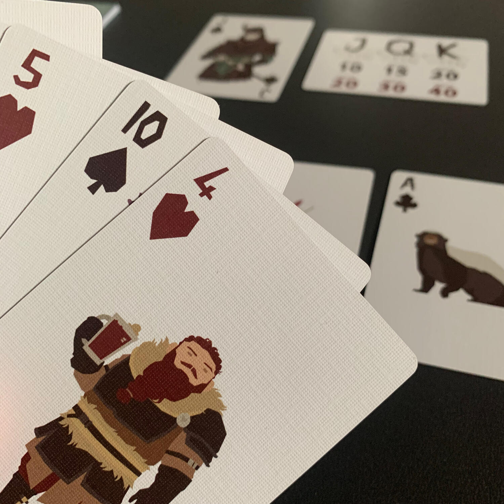
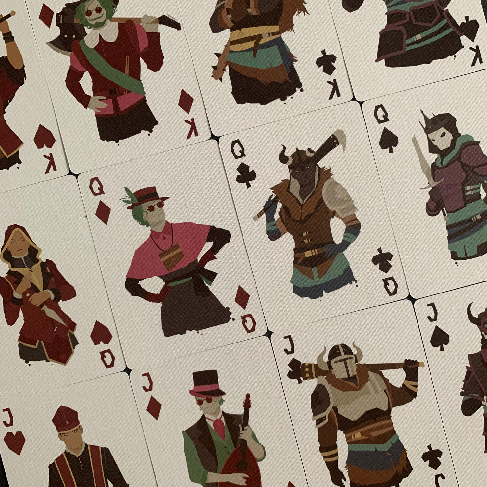
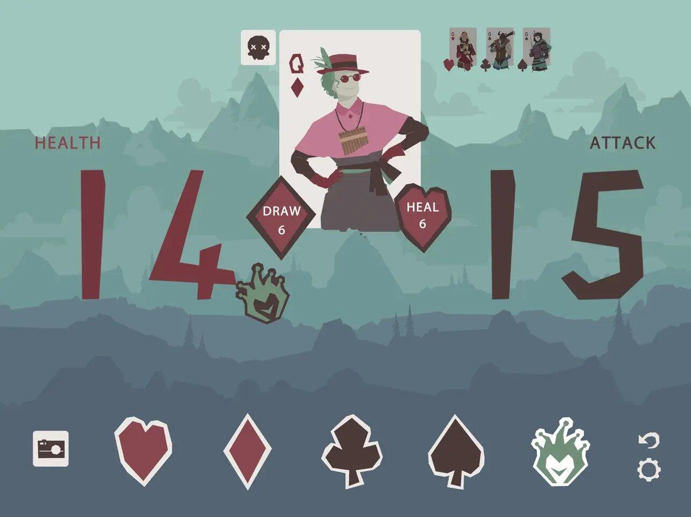

<Setting>

  Prendi parte alla rivolta, imbraccia le armi e sconfiggi il potente. Assedia
  il castello, taglia le teste dei monarchi e ritrova la libertà.
   E tutto questo con un mazzo di <strong>carte da poker</strong>.

</Setting>

<Rules>

  <em>    Le regole che seguono sono da intendersi per una partita in solitario;
    Regicide si può giocare fino a 4 giocatori con qualche modifica nella
    preparazione e nella gestione del turno.</em>   
   
  Per prima cosa dobbiamo costruire il castello contro il quale combatteremo. Per
  farlo, bisognerà posizionare i 4 Fanti (J) mescolati sopra le 4 Regine (Q) mescolate
  sopra i 4 Re (K) mescolati. Estraiamo i Jolly dal mazzo, riveliamo il primo membro
  della famiglia reale (sarà sicuramente un Fante), peschiamo 8 carte dal nostro
  mazzo e siamo pronti per cominciare.
   
  Durante il turno, giocheremo una carta dalla nostra mano con l'intento di <strong>    uccidere il nobile di turno</strong>.  
  Ogni reale ha una certa quantità di punti vita: un Fante ne ha 20, una Regina
  30, un Re 40.  
  Dopo l'attacco, il nobile può restare vivo o morire. Nel primo caso si continuerà
  a combattere, altrimenti si procederà scartando tutto quanto giocato e si affronterà
  il nobile successivo. Se il reale muore restando esattamente a 0 punti vita, invece
  che nel cimitero, assieme alle carte utilizzate per ucciderlo, verrà posto in cima
  al mazzo di pesca, entrando presto a fare parte del vostro esercito.
   
  Ogni turno in cui il reale non sarà stato ucciso, questi ci contrattacherà con
  un certo numero di danni (J=10, Q=15, K=20), obbligandoci a scartare tutte le carte
  che vogliamo dalla mano a patto che la somma di queste sia almeno pari al numero
  di danni inferti.
   
  Come si infliggono i danni? Ogni carta è definita da un numero e da un seme. Il
  numero rappresenta la forza, il seme il suo potere speciale:  
  <ul>
    <li>      un 5 di <strong>picche riduce la forza d'attacco</strong> del nemico di 5
      punti;</li>
    <li>      un 5 di <strong>fiori raddoppia il proprio danno</strong>, infliggendo 10
      danni;</li>
    <li>      un 5 di <strong>quadri fa pescare</strong> 5 carte;</li>
    <li>      un 5 di <strong>cuori fa spostare 5 carte dal cimitero</strong> al fondo
      del nostro mazzo.</li>
  </ul>
  Va tenuto a mente, tuttavia, che il seme del reale che si sta combattendo viene
  annullato; quindi un 5 di fiori contro il Fante di fiori farà 5 danni e non 10.
   
  In alcuni casi è possibile giocare più di una carta durante il proprio turno per
  aumentare la nostra forza! Ad esempio, è possibile affiancare una carta qualsiasi
  con un Asso, aumentandone la forza di 1 e donando ad essa anche il potere dell'Asso
  stesso; oppure si possono giocare più 2, più 3, più 4 o più 5 ottenendo un attacco
  pari alla somma delle forze ma con tutti i poteri speciali abilitati (senza che
  la forza base superi il 10).
   
  Se ci troviamo in un momento critico e non riusciamo a parare un attacco, possiamo
  sempre utilizzare uno dei due Jolly per scartare la nostra intera mano e ripescarla!
   
  Se si riesce a <strong>sconfiggere l'ultimo Re</strong>, si vince. Altrimenti,
  si perde.

</Rules>

<Feedback>

  Quello che mi ha sbalordito di questo titolo è il fatto che gli autori sono
  stati capaci di dare nuova vita ad un <strong>mazzo da poker</strong> vecchia
  scuola, creando un gioco sfidante, punitivo e accattivante al punto da indurvi
  a fare una partita dietro l'altra.  
  Vista la portabilità del mazzo, lo porto sempre con me per non perdere occasione
  di farlo provare a chiunque sia minimamente interessato ai giochi da tavolo, per
  incuriosire con un gioco innovativo che sfrutta un mezzo a tutti ben noto.
   
  Se vi spaventa lo squilibrio di fortuna che aleggia tra voi e i reali, potete tranquilizzarvi.
  Nelle prime partite ci si trova spesso con carte dello stesso seme del nobile in
  mano (delle quali non si può utilizzare il potere speciale), oppure con carte non
  abbastanza grosse per parare gli ingenti danni che ci verranno inflitti dal nemico…
  ma è solamente una questione di tempo. Con il passare delle partite si impara a{" "}
  <strong>leggere il gioco</strong>, a capire quale sarà probabilmente il prossimo
  reale a entrare in campo, e farete in modo di avere le carte corrette per ogni
  situazione. In altre parole, le prime partite le finirete morti male prima di arrivare
  a vedere i Re, ma partita dopo partita sarete voi a sedervi sul trono!
   
  Se vi spaventa tenere a mente i danni fatti, la <strong>    risoluzione dei poteri</strong> e i casi limite nel potere usare una carta in combo con un'altra… non
  temete! Potete utilizzare <strong>l'applicazione</strong> Regicide disponibile
  sui classici store, che vi offrirà un'esperienza di gioco molto diretta, senza
  dover ricorrere a segnalini o a obbligarvi a ricalcolare più e più volte quanta
  vita è rimasta al dannato Re.  
  Volete provarlo? Cercate un mazzo in casa e divertitevi a costo zero… oppure
  supportate questa giovane azienda comprando la loro versione che, oltre ad
  avere una grafica strepitosa, permetterà loro di crescere e di creare nuovi
  giochi.

</Feedback>

