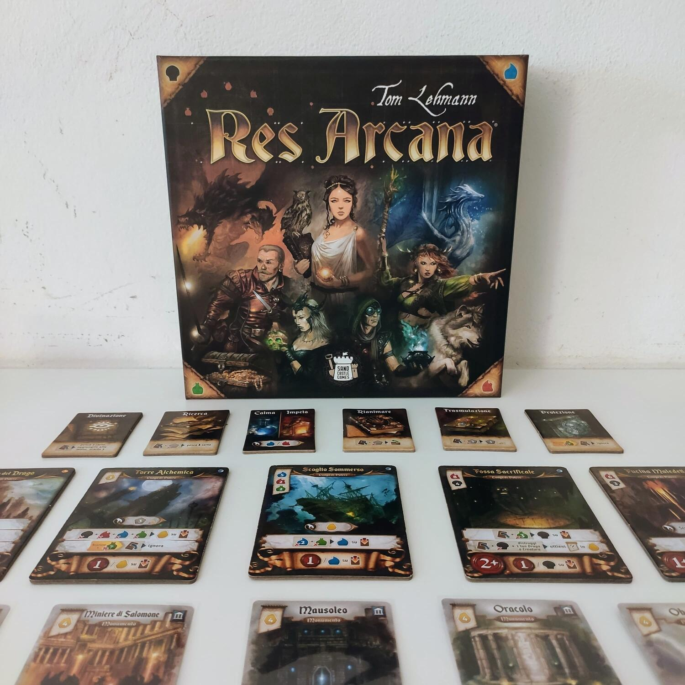
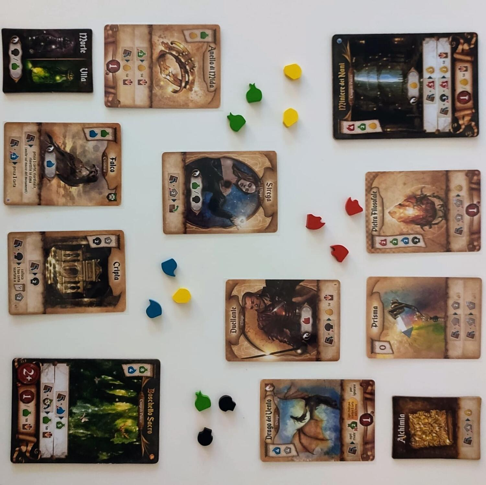
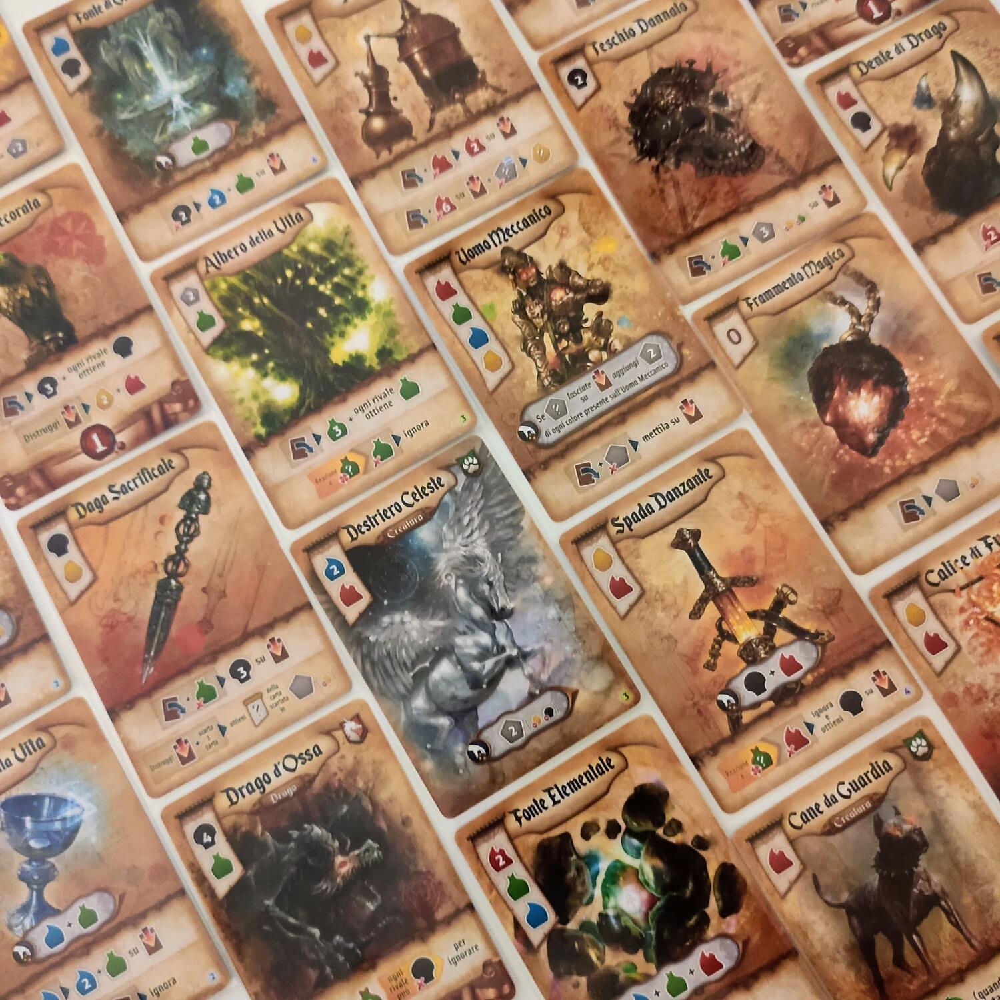

<Setting>

  Nelle vesti di potenti maghi, i giocatori manipolano{" "}
  <strong>essenze alchemiche</strong> per ottenere la supremazia sugli altri,
  costruendo potenti artefatti e conquistando mistici santuari. In questa nuova
  sfida, dalla mente di Thomas Lehmann, la tensione si taglia a fette.
   

</Setting>

<Rules>

  Ogni giocatore riceve, tramite un draft, 1 carta mago (che sarà il suo
  personaggio per il resto della partita) e 8 carte artefatto (che costituiranno
  il suo mazzetto personale). Al centro del tavolo trovano posto 5 luoghi di
  potere, il mazzo dei monumenti, numerosi oggetti magici e i pozzetti con le
  essenze di 5 tipi: Impeto, Calma, Vita, Morte e Oro.
   
  Una partita a <em>Res Arcana</em> si compone di round strutturati in turni
  individuali. Durante il suo turno, il giocatore ha a disposizione una singola
  azione, che generalmente riguarda la{" "}
  <strong>manipolazione delle essenze</strong>. Queste ultime rappresentano la
  risorsa principale del gioco: dovranno essere accumulate (di solito tramite i
  poteri delle carte) per poi essere spese in combinazioni differenti, con
  l'obiettivo <strong>costruire gli artefatti</strong> dalla propria mano,{" "}
  <strong>reclamare i luoghi di potere</strong>,{" "}
  <strong>acquistare i monumenti</strong> o <strong>attivare effetti</strong>.
  Tutti questi componenti dovranno essere combinati in maniera ottimale,
  sfruttando le <strong>sinergie </strong>di effetti che possono venirsi a
  creare, per dare vita ad un efficiente motore di risorse.
   
  Ogni round continua finché tutti i giocatori non hanno passato la mano. A quel
  punto, vengono ripristinate tutte le carte esauste, vengono raccolte le dovute
  essenze indicate sui propri componenti in gioco, e si sceglie un nuovo oggetto
  magico dalla riserva centrale.
   
  L'obiettivo del gioco è semplicemente quello di fare più punti alla fine della
  partita, situazione che verrà innescata quando, al momento di passare la mano,
  un giocatore avrà accumulato 10 o più punti. Quando il round in corso si sarà
  concluso, il giocatore con il totale di punti più alto sarà incoronato
  vincitore!

</Rules>

<Feedback>

  Fin dal suo lancio sul mercato, <em>Res Arcana</em> è stato messo a confronto
  con due altri famosi giochi, spesso anche figurando come una sorta di
  "incrocio" tra di essi. I titoli in questione sono:{" "}
  <Link to="/reviews/race-for-the-galaxy/">Race for the Galaxy</Link>, per
  l'elemento di engine building e l'aspetto "racing", di corsa testa-a-testa,
  nonché per l'autore, che è lo stesso; e{" "}
  <Link to="/reviews/seasons/">Seasons</Link>, per l'ambientazione della
  competizione magica, per le risorse elementali colorate e per l'idea della
  costruzione degli artefatti. Mi è sembrato produttivo, pertanto, provare a
  giudicare <em>Res Arcana</em> confrontandolo con i suoi due "genitori"
  spirituali.
   
  Rispetto a <em>Race for the Galaxy</em>, che aveva una sovrabbondanza di carte
  che svolgevano una pluralità di compiti potenziali, la nuova fatica di Lehmann
  sceglie bene i suoi materiali, assegnando a ciascuno di essi una funzione.
  Risolve così (almeno in buona parte) il problema principale di RftG, che era
  l'assoluta dipendenza dal mazzo di carte e dalla casualità delle carte
  pescate: gli oggetti magici diventano dei preziosi strumenti in grado di
  sostenere i punti deboli del proprio arsenale, venendo in aiuto del giocatore
  all'occorrenza.
   
  Completamente cambiato è il rapporto con le carte, che sono poche e
  determinate all'inizio della partita, occludendo così la possibilità di grandi
  ribaltamenti di sorte. La scelta delle varie parti che andranno a comporre il
  proprio motore è più che essenziale, e sebbene le capacità strategiche (come
  anche gli occasionali, ma definitivi tatticismi) possano stravolgere gli esiti
  di una partita,{" "}
  <strong>    giocarsi male il draft significa partire con un duro svantaggio</strong>
  . 
  Immutato è invece il ritmo di gioco, che è scandito dalle mosse dei
  contendenti come da un pendolo affilato, obbligando ad impiegare i propri
  sforzi non solo nella direzione corretta, ma anche al momento giusto. Dei
  calcoli approssimativi porteranno quasi sicuramente a sprechi di tempo e
  risorse, e i giocatori meno avveduti potrebbero ritrovarsi in penuria di
  essenze o - peggio - a vedersi sottratto il luogo di potere tanto agognato
  proprio un turno prima di poterlo reclamare.
   
  Parlando invece di <em>Seasons</em>, <em>Res Arcana</em> sembra configurarsi
  come la sua naturale e più <strong>deterministica evoluzione</strong>. Dove in{" "}
  <em>Seasons </em>il flusso era regolato dal lancio dei dadi,{" "}
  <strong>    <em>Res Arcana</em></strong>
  <strong> ammette pochissima alea</strong>, avvicinandosi molto di più ad un classico
  eurogame. Migliore è anche l'aspetto di engine building, che in <em>    Seasons</em> era appena accennato, nonché l'ergonomia dei componenti e il sistema di punteggio:
  al farming forsennato (e spesso tedioso) di punti e combo ovvie e quasi obbligate,{" "}
  <em>Res Arcana</em> risponde con un'orchestra di sinergie tutte da scoprire e un
  calcolo di punti piuttosto stretto.
   
  Non è tutto Oro quel che luccica. Infatti, sebbene <em>Res Arcana</em> riesca a
  prendere il meglio dai due mondi, deve comunque fare i conti con i suoi limiti
  naturali. Un draft sfortunato, anche risultante da una selezione di carte poco
  bilanciata (e qui i giocatori non possono farci nulla), può facilmente portate
  a partite poco eccitanti, trascinate, o a situazioni frustranti per alcuni dei
  contendenti che si vedrebbero le gambe segate già dai primi turni.
   
  Ma a parte questo problema, <em>Res Arcana</em> ha tutte le carte (pun intended)
  in regola per diventare un nuovo classico, un must nelle collezioni di tutti i
  giocatori che cercano un'esperienza complessa ma contenuta - nel tempo, come nei
  materiali e nel prezzo. Il gioco prevede anche l'integrazione con due espansioni
  (<em>Lux et Tenebrae</em> e <em>Perlae Imperii</em>, già disponibili) che apportano
  piccole aggiunte e un po' di rigiocabilità ad un titolo che rischia di consumarsi
  in fretta.

</Feedback>

