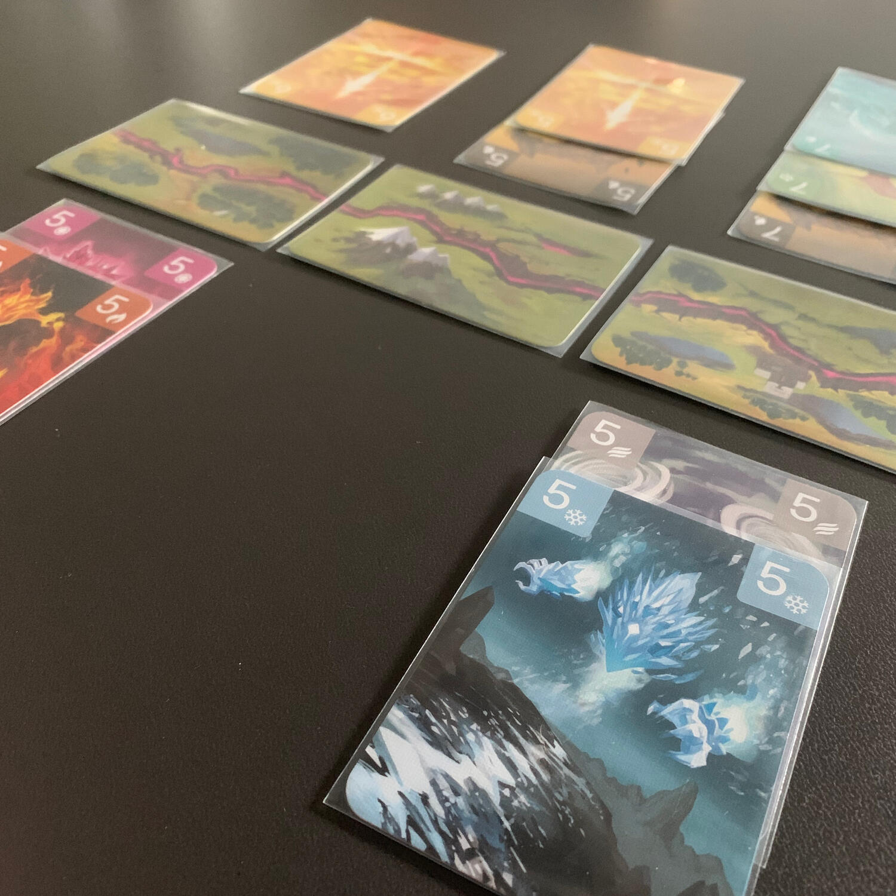
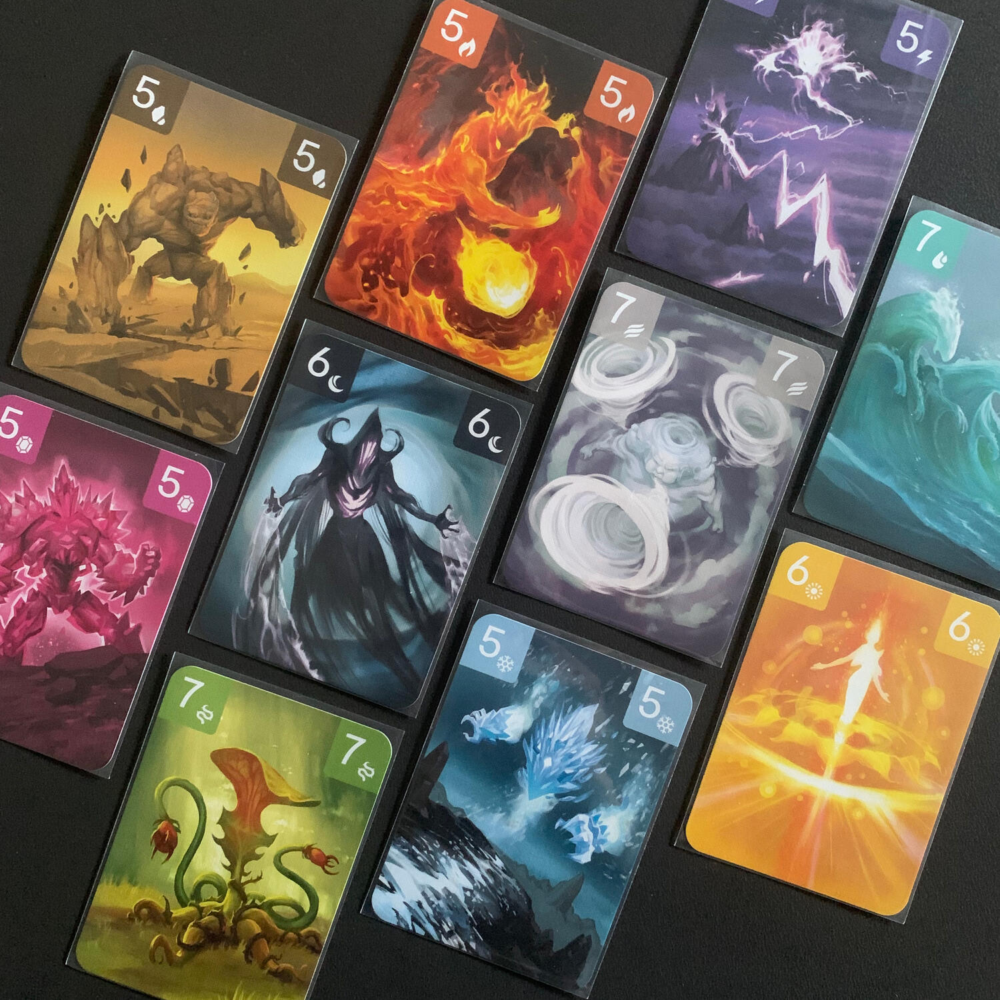

<Setting>

  I Rift hanno cambiato il nostro mondo. Interi villaggi vennero distrutti nel momento in cui la Riftforce emerse dalle
  profondità della terra. Quello che una volta era senza vita, improvvisamente, iniziò a muoversi con una propria
  coscienza. Le fiamme lasciarono i loro falò e le onde si riversarono al di fuori dei fiumi. Iniziarono ad apparire
  anche primordiali creature originate dall’aura solare e dal bagliore lunare.
   
  Gli Evocatori, individui dotati di capacità superiori, si fecero avanti per formare delle Gilde. Il loro obiettivo
  era, ed è tutt’ora, quello di ottenere il controllo della Riftforce e, di conseguenza, anche degli Elementali, in modo
  da poter acquisire maggiore conoscenza sulla loro esistenza. Durante la competizione per la Riftforce, le Gilde hanno
  stretto delle alleanze temporanee tra loro, in modo da combinare le abilità uniche degli Elementali e riuscire a
  difendere l’accesso al Rift.
   
  Scegli le tue Gilde, combina i loro poteri e lanciati in battaglia. Ottieni Riftforce dai Territori sotto il tuo
  controllo e dagli Elementali che riuscirai a distruggere, finché non ne avrai accumulata abbastanza da ottenere un
  potere incommensurabile.

</Setting>

<Rules>

  All'inizio della partita si scelgono <strong>4 Gilde</strong> con le quali affrontare l’avversario per la conquista
  della Rift. Ogni Gilda è caratterizzata da un potere unico che la differenzia dalle altre e che, soprattutto, la fa
  andare più o meno d'accordo (<strong>combo </strong>
  anyone?) con le altre che sceglierai di prendere sotto la tua ala.
   
  Ogni Gilda è composta da 1 Evocatore e 9 Elementali, tutti dello stesso colore: il primo si limita a definire il potere
  che quegli Elementali avranno qualora attivati, mentre gli altri saranno la carne da macello con la quale tentare di conquistare
  la Rift.
   
  Questa Rift non è altro che <strong>5 carte Territorio</strong> dove i vostri Elementali dovranno cercare di avere la meglio
  sugli avversari. In un Territorio possono esserci infiniti Elementali, giocati ordinatamenti una accanto all'altro, dal
  più vicino alla Rift al più lontano.
   
  Il turno di gioco è molto veloce e consiste nella scelta di una delle tre azioni disponibili:
  <ul>
    <li>      <strong>Schierare gli Elementali</strong>: giocare dalla propria mano fino a 3 Elementali che hanno in comune o la
      forza (il numero) o il colore (la gilda) tutti su di un solo Territorio oppure su (fino a) 3 territori adiacenti
      l'uno all'altro.</li>
    <li>      <strong>Attivare gli Elementali</strong>: dopo aver scartato un Elementale, si decide se utilizzarlo per la forza
      o per il colore. A quel punto si attivano fino a 3 Elementali che hanno quella caratteristica. Questi
      attaccheranno nel modo che la propria Gilda ordina e, per ogni Elementale nemico abbattuto, si guadagnerà una
      Riftforce.</li>
    <li>      <strong>Dominio e pesca</strong>: Per ogni Territorio in cui si è gli unici ad aver schierato degli Elementali, si
      guadagna una Riftforce e, successivamente, si pesca fino ad avere 7 carte in mano (il massimo). Questa azione si
      può svolgere solamente se non si ha la mano piena.</li>
  </ul>
  Il primo giocatore ad arrivare a <strong>12 Riftforce</strong> sarà il vincitore.

</Rules>

<Feedback>

  Cosa si può volere di più? Un <strong>1vs1 adrenalinico</strong>, semplice da spiegare ma per niente banale.&nbsp;
   
  Già dall'inizio, nel momento della scelta delle Gilde, bisognerà cercare di capire lo stile di gioco che si vorrà
  adottare: puntare alla <strong>forza bruta</strong>, preferire un mazzo più propenso al <strong>movimento</strong>{" "}
  oppure cercare di bilanciare queste due caratteristiche.
   
  La partita sarà un continuo adattarsi alla pesca: a seconda di cosa vi arriverà in mano dovrete capire se ha più senso
  investire quelle carte <strong>posizionandole</strong> a ridosso della Rift o <strong>sacrificarle</strong> per
  scatenare i vostri Elementali contro quelli dell'avversario.&nbsp;
   
  Un filler che vi spingerà a fare una partita dopo l'altra, vi invoglierà a provare tutte le Gilde, vi incuriosirà a
  tal punto da volerle mescolare tra loro per il solo gusto di dimostrare di essere i più forti della Rift!

</Feedback>

