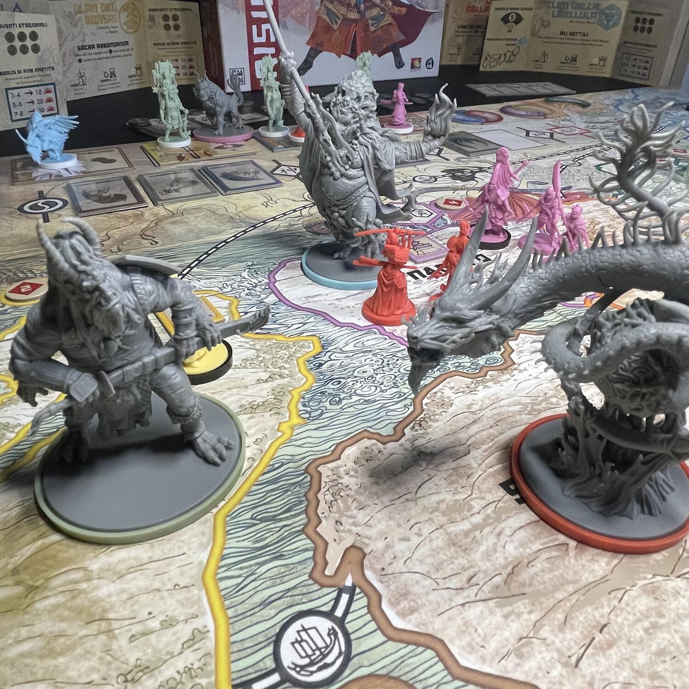

<Setting>

  Ammesso che il cosiddetto “Giappone feudale” sia mai esistito, il mondo di
  Rising Sun vi porterà tra i suoi presunti protagonisti, storici e mitologici:
  tra Daimyo, Bushi, Shinto, Oni e altre mostruosità concorrerete per diventare
  il nuovo Shogun del Nippon, in una spietata lotta a suon di alleanze e
  tradimenti, calcolo e furbizia, prudenza e lungimiranza. Tuffatevi in questo
  sofisticatissimo gioco al massacro, che vi costringerà a ragionare in modi
  obliqui e surrettizi, e vi farà respirare tutta l'atmosfera esotica dei giochi
  di potere nipponici. Da giocare rigorosamente con lettori de “L'arte della
  guerra” di Sun Tzu e appassionati di “Shogun” di James Clavell (e certo non
  guasterà al tavolo qualche ammiratore de “L'ultimo Samurai”). Ma attenti: solo
  i più raffinati conoscitori dell'arte della guerra potranno vincere.

</Setting>

<Rules>

  Ogni giocatore prende la scheda del <strong>Clan</strong> scelto, l'ammontare
  di monete iniziale ad esso associato e colloca il proprio{" "}
  <strong>Daimyō</strong> e un <strong>Bushi</strong> nella relativa provincia
  di partenza. Si selezionano poi un mazzo di <strong>Carte Stagione</strong> e
  4 <strong>Kami</strong> (= divinità). Ogni giocatore colloca il primo
  segnalino della sua fazione sul tracciato segnapunti e il secondo sul{" "}
  <strong>Tracciato dell'Onore</strong>, che dirimerà tutti i pareggi. Infine,
  ognuno collocherà il proprio segnalino alleanza (a forma di una delle due metà
  del simbolo del tao) nelle vicinanze del tabellone di gioco.
   
  Il gioco dura tre round, organizzati nelle seguenti fasi:
   
  <ul>
    <li>      <strong>Cerimonia del Tè</strong>: un momento diplomatico dal quale
      possono emergere alleanze a coppie, della durata massima di un round.</li>
    <li>      <strong>Fase dei Mandati</strong> (= tessere azione): il primo giocatore
      pesca 4 Mandati e ne sceglie uno da giocare, rimettendo gli altri in cima
      alla pila. Il primo giocatore a svolgere l'azione non sarà chi ha giocato
      il Mandato (ad eccezione dell'azione Addestramento), ma il primo alla sua
      sinistra e si procederà in senso orario. Chi gioca il mandato e il suo
      eventuale alleato godranno di alcuni vantaggi, diversi a seconda di
      ciascuna azione. I 5 Mandati, presenti ciascuno in doppia copia, sono{" "}
      <strong>Reclutamento</strong> (nuove miniature in ciascun territorio con
      fortezza o invio di Shinto a venerare), <strong>Schieramento</strong>{" "}
      (movimento e collocazione di nuove <em>Roccaforti</em>),{" "}
      <strong>Raccolto</strong> (ricompense da ciascun territorio di cui si ha
      il controllo), <strong>Addestramento</strong> (acquisto di Carte Stagione)
      e <strong>Tradimento</strong> (rimpiazzo di due miniature avversarie con
      due delle proprie di identica tipologia, al prezzo della rottura di
      eventuali alleanze e della perdita di onore). Durante la Fase dei Mandati
      si svolgeranno fino a tre turni dei Kami, svolti da sinistra a destra,
      durante i quali chi detiene la maggioranza di <strong>Shinto</strong>{" "}
      presso ciascuna divinità ne otterrà il relativo vantaggio.</li>
    <li>      <strong>Combattimento</strong>: seguendo un ordine casuale predeterminato,
      si combatte in tutte le regioni in guerra. Si confronta la forza totale di
      ogni fazione presente in una regione e, laddove siano presenti avversari,
      si procede a un'asta al buio: si puntano segretamente quante monete si
      vogliono sui quattro settori della plancia combattimento privata e, quando
      tutti i giocatori coinvolti nello scontro avranno puntato, si procederà
      confrontando ciascun settore, da sinistra a destra, facendo aggiudicare i
      relativi effetti a chi vi avrà puntato più monete. Con <em>Seppuku</em> si
      fanno suicidare tutti i propri guerrieri, in cambio di onore e punti
      vittoria; con <em>Prendere Ostaggi</em> si potrà rimuovere una miniatura
      avversaria, sottraendo punti forza al totale; con{" "}
      <em>Ingaggiare Ronin</em> si potranno aggiungere gli eventuali segnalini
      ronin alla propria forza totale; quindi avviene il <em>Combattimento</em>,
      ovvero il calcolo del punteggio di forza totale: chi vince uccide tutte le
      miniature avversarie, ottiene il segnalino della provincia in guerra e
      redistribuisce nel modo più equo possibile le monete che ha speso tra i
      giocatori sconfitti; infine, con <em>Poeti Imperiali</em> si guadagna un
      punto vittoria per ogni miniatura uccisa in quello scontro.</li>
    <li>      <strong>Fine round</strong>: si scartano le Monete e i Segnalini Ronin, si
      riceve un nuovo ammontare di monete, si mantengono le Carte Stagione
      acquistate e le miniature sulla plancia, si restituiscono gli ostaggi agli
      avversari in cambio di monete, si rompono le alleanze rimaste attive.</li>
  </ul>
  Alla fine dell'ultimo round, si procede con la stagione <strong>    Inverno</strong> che corrisponde al calcolo dei punti vittoria: si considerano nel conteggio
  i punti raccolti sul tracciato nel corso della partita, le Carte Stagione che assegnano
  ulteriori punti a fine partita, i Segnalini Provincia, con valore crescente in
  base alla stagione in cui sono state conquistate, e i Set di Province diverse.
  Vince, ovviamente, chi ha più punti.

</Rules>

<Feedback>

  Rising Sun è un titolo poderoso, che non lesina certo sui materiali sfarzosi e
  che propone delle meccaniche arditamente complesse allo scopo di immergervi in
  un'esperienza di gioco totalizzante e grandiosamente ambientata. Vi sembrerà
  davvero di partecipare al sofisticato e spietato gioco al massacro dei
  generalissimi del Medioevo giapponese, tra grandi signori e monasteri, con
  qualche mostro ambulante qua e là. Nella trilogia dei <em>dudes on a map</em>{" "}
  dello stesso autore è certamente il più riuscito: dopo averli giocati tutti,{" "}
  <strong>Blood Rage</strong> sembrerà un primo esperimento forse un po'
  difettoso, mentre <Link to="/reviews/ankh/">Ankh</Link> avrà il sapore di un
  sequel, non proprio all'altezza del predecessore. Rising Sun spicca su tutti,
  soprattutto se lo si gioca rispettando la volontà dell'autore, che nel manuale
  suggerisce un approccio diplomatico e interlocutorio non limitato alla
  Cerimonia del Tè ma esteso anche ad altri momenti, attraverso ripetuti
  tentativi di corruzione degli altri giocatori, minacce più o meno velate,
  promesse da marinaio, per un'esperienza di gioco fortemente connotata secondo
  gli stilemi dell'arte della guerra: un suggerimento, questo, evidentemente più
  adatto se calato nello spirito del gioco piuttosto che codificato nel
  regolamento. Il combattimento è certamente il momento ispirato in modo più
  aderente alle sottili, manipolatorie ed elusive dinamiche dell'arte della
  guerra, e al netto di tutte le polemiche che lo hanno visto protagonista, può
  dirsi palesemente ispirato alla celebre affermazione di Sun Tzu: “I guerrieri
  vittoriosi prima vincono e poi vanno in guerra, mentre i guerrieri sconfitti
  prima vanno in guerra e poi cercano di vincere”.

</Feedback>

