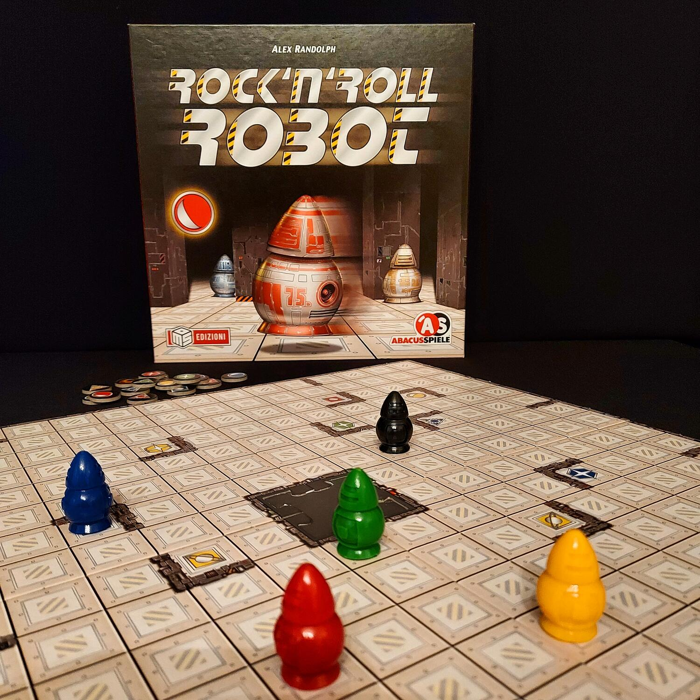
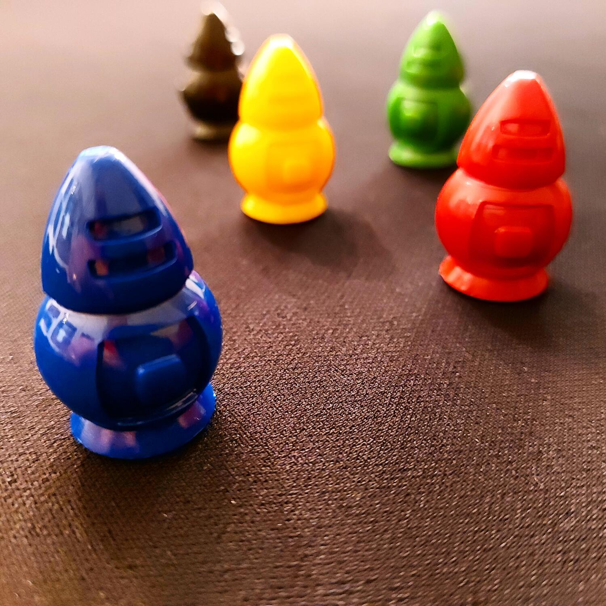

<Setting>

  Attenzione! Attenzione! Il computer centrale è andato in tilt e i robot non riescono più a raggiungere da soli il
  proprio obiettivo. Aiutali a pianificare il loro percorso utilizzando meno mosse possibili. Potete muovere tutti i
  robot e farli rimbalzare contro gli ostacoli … chi riuscirà a trovare il percorso più breve prima degli avversari?
   
  Cerchi un gioco che si impari in 2 minuti, ma che ti farà scervellare?
   
  Cerchi un gioco che non ponga limiti al numero di giocatori, se non quello delle persone che riescono a stare intorno
  ad un tavolo?
   
  Cerchi un gioco dalla longevità infinita, che ad ogni partita ti darà la sensazione di padroneggiarlo meglio?
   
  Cerchi un gioco in cui non ci siano turni, nel quale devi essere semplicemente il più veloce a trovare la migliore
  soluzione?
   
  Tutto questo e molto altro lo trovi in Rock 'n' Roll Robot, un gioco ideato nel 1999 da Alex Randolph ma che non fa di
  certo sentire la sua età.

</Setting>

<Rules>

  Dopo aver assemblato il tabellone, posiziona i 4 segnalini colorati dei robot in quattro caselle libere qualsiasi, con
  sopra i relativi robot. Nonostante il regolamento preveda che il Robot Nero faccia parte delle varianti di gioco, io
  consiglio di inserirlo fin da subito, in quanto il più delle volte rappresenta un valido supporto per i giocatori.
  Infine, prendete i gettoni obiettivo, mescolateli e siete pronti a partire!
   
  <em>    La cosa fondamentale da tenere a mente è che nessun giocatore possiede un robot in particolare, ma ciascun giocatore
    sarà libero di muovere qualsiasi robot.</em>   
  Per iniziare la partita devi solo sapere che i robot possono muoversi in qualsiasi direzione orizzontale o verticale
  procedendo fino a quando non incontrano un ostacolo. Si considerano ostacoli i muri, la tessera centrale, i bordi del
  tabellone e tutti gli altri robot.
   
  Il gioco si svolge in una serie di fasi:
  <ul>
    <li>      <strong>Fase Obiettivo:</strong> Ad inizio round un giocatore pesca un gettone obiettivo, che corrisponderà ad uno
      dei simboli stampati sulla plancia, lo scopo del gioco è far giungere il robot di quel colore su quel simbolo nel
      minor numero di mosse possibile. Per far arrivare un robot sulla casella obiettivo potete muovere anche gli altri
      robot.</li>
    <li>      <strong>Fase Pianificazione:</strong> Questa fase si svolge esclusivamente nella testa dei giocatori: tutti
      pensano contemporaneamente a come raggiungere la casella obiettivo senza spostare i robot sul tabellone. Quando un
      giocatore pensa di aver individuato il percorso più breve per raggiungere la casella obiettivo si è pronti per
      passare alla fase successiva.</li>
    <li>      <strong>Fase Dichiarazione:</strong> Il giocatore dichiara ad alta voce quante mosse servono al robot per
      raggiungere la casella obiettivo, da quel momento tutti i giocatori hanno circa 1 minuto di tempo per fare una o
      più dichiarazioni, non necessariamente più basse di quelle già fatte: nel caso in cui infatti il primo giocatore
      ad aver fatto la propria dichiarazione non fosse in grado di dimostrare il proprio percorso, la parola passerà a
      chi ha fatto la dichiarazione successivamente.</li>
    <li>      <strong>Face Verifica:</strong> Quando il tempo per le dichiarazioni si esaurisce, il giocatore che per primo ha
      dichiarato il minor numero di mosse inizia a spostare il robot sul tabellone per verificare se è in grado di
      raggiungere la casella obiettivo come dichiarato. Se il giocatore riesce a portare il robot sulla casella
      obiettivo utilizzando un numero di mosse pari o minori a quelle dichiarate ottiene il gettone obiettivo, in caso
      contrario spetterà agli altri giocatori verificare le soluzioni dichiarate in precedenza.</li>
  </ul>

</Rules>

<Feedback>

  Rock 'n' Roll Robot potrebbe tranquillamente essere definito un party game “spacca cervelli”.
   
  Non farti ingannare dal regolamento molto semplice e dal fatto che la meccanica del gioco si apprende veramente in 2
  minuti: per padroneggiare il gioco servirà fare almeno qualche partita, ma ritengo che questo non sia un limite quanto
  piuttosto un pregio. Infatti, con il trascorrere delle partite aumenterà l'abilità al tavolo nello scovare le
  soluzioni più veloci ed aumenterà la gratificazione che si ricaverà dall'esperienza di gioco.
   
  Al tavolo possono veramente partecipare molti giocatori, a condizione che tutti riescano a vedere il tabellone;
  inoltre, data la mancanza di turni di gioco, maggiore sarà il numero dei giocatori più veloci diventeranno le vostre
  partite, in quanto saranno più giocatori a poter individuare per primi il percorso più veloce.
   
  Ad ogni turno la tensione al tavolo sarà palpabile nel silenzio più assoluto che sarà rotto soltanto dal grido del
  giocatore che dichiarerà il proprio numero di mosse, a quel punto la tensione salirà ulteriormente perché rimarrà ben
  poco tempo per cercare di scovare una soluzione migliore.
   
  Il gioco rappresenta certamente una sfida con gli altri giocatori, ma forse prima di tutto sarà una sfida con voi
  stessi nel cercare di migliorarsi di partita in partita.
   
  La rigiocabilità è praticamente infinita: basti pensare che le sole combinazioni del tabellone sono superiori alle
  1.500 ma la disposizione casuale dei robot ad inizio partita rende di fatto ogni esperienza di gioco diversa da
  un'altra, pur restando fissa la mappa.
   
  I materiali sono buoni, il cartoncino delle plance e delle tessere obiettivo è molto spesso, e i robottini sono molto
  eleganti e piacevoli da manovrare
   
  Insomma, un gioco che non può davvero mancare nella vostra collezione e dal divertimento assicurato!

</Feedback>

