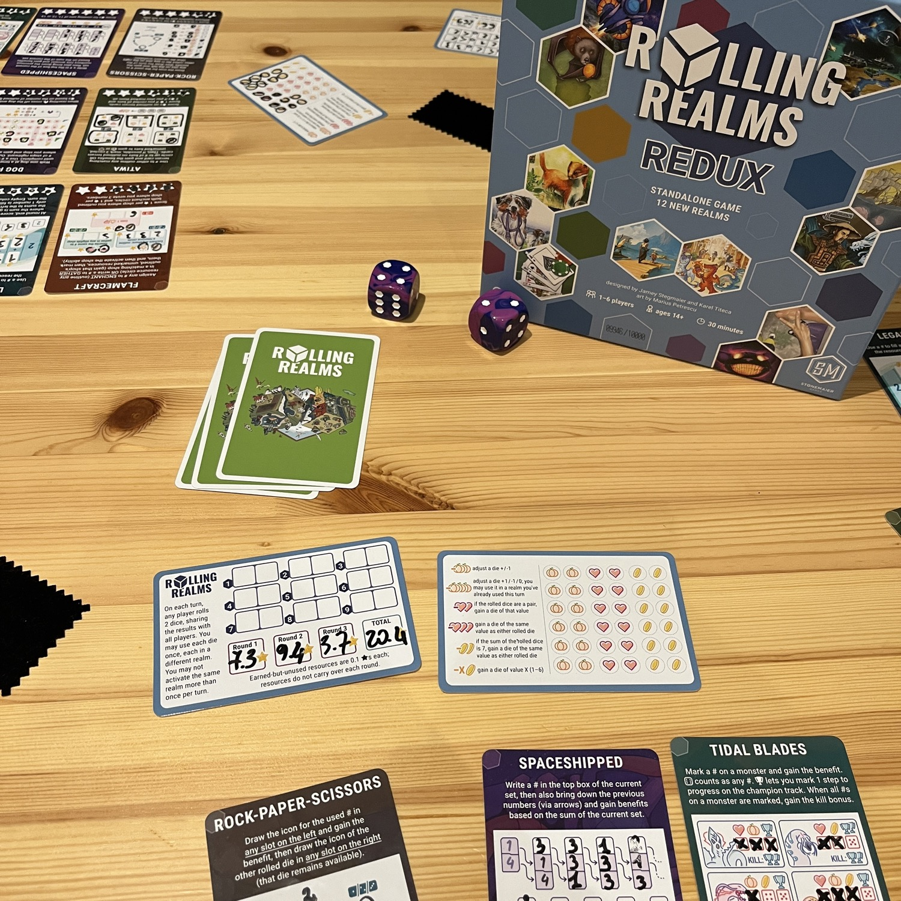
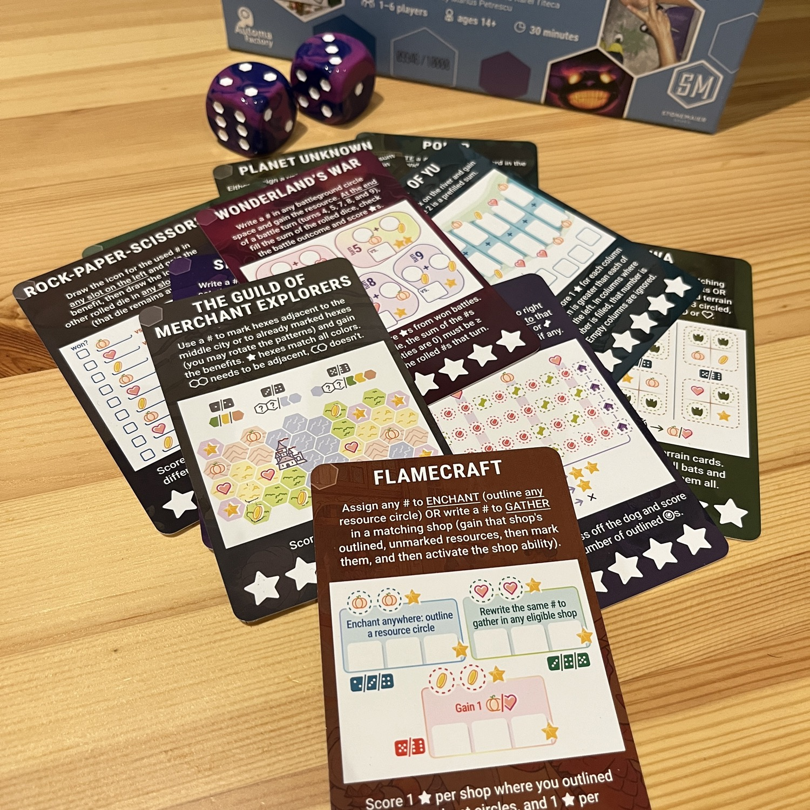
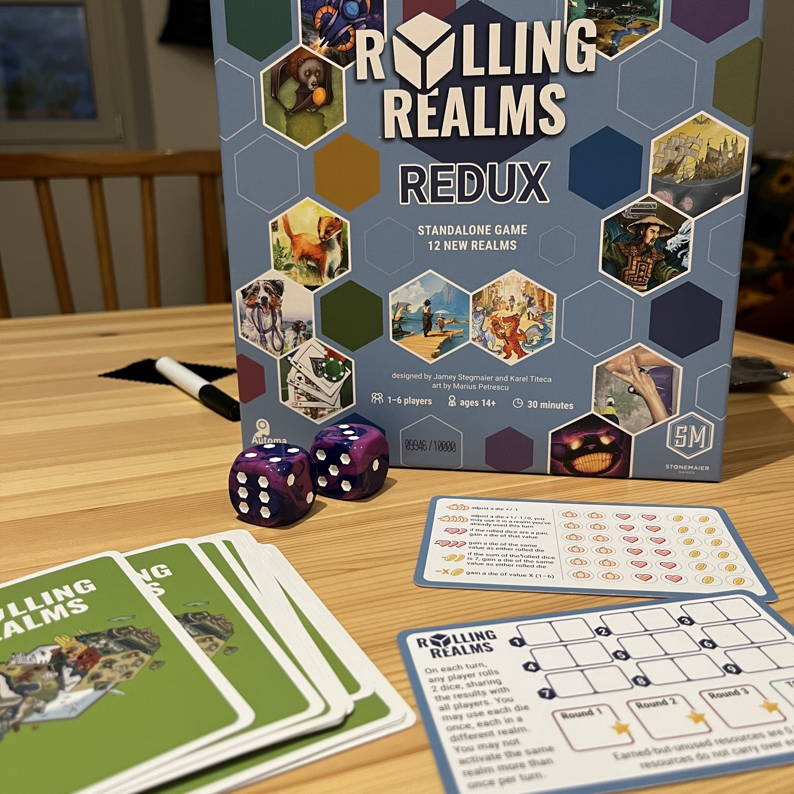

<Setting>

Un gioco da tavolo altro non è che un mondo. Un mondo con le sue regole e la sua storia. E se esistesse un gioco in grado di incapsulare questi mondi e regalarci una rivisitazione dei tuoi giochi preferiti in chiave <Link to="/mechanisms/roll-and-write">Roll and write</Link>?  
Beh, <strong> eccoci qua!</strong>

</Setting>

<Rules>

 In Rolling realms i giocatori dovranno gestire turno dopo turno i vari
 risultati dei dadi, come ogni altro roll and write. La partita dura
 esattamente tre Round, durante i quali i giocatori dovranno gestire{" "}
 <strong>tre Reami</strong>, uguali per ognuno, ad ogni Round. A loro volta, i
 Round sono divisi in nove turni, durante i quali, un giocatore prima lancerà
 entrambi i dadi, e successivamente tutti i giocatori,{" "}
 <strong>contemporaneamente</strong>, dovranno gestirli e segnare i risultati
 sui Reami. Ogni Reame, ovviamente, avrà regole di posizionamento differenti e
 vi permetterà di ottenere punti vittoria, in questo caso{" "}
 <strong>stelline</strong>, in maniera diversa. Oltre a ciò saranno presenti
 anche delle risorse: zucche, cuori e monete. Queste vi permetteranno di{" "}
 <strong>modificare i risultati</strong> dei dadi a vostro piacimento,{" "}
 <strong>crearne di nuovi</strong> e chi ne ha più ne metta. L'unica regola
 importante da tenere in considerazione è che, in un turno non si potranno
 posizionare due o più risultati dei dadi sullo stesso Regno. Questa regola può
 essere infranta soltanto utilizzando <strong>tre zucche</strong>. Una volta
 che i dadi sono stati lanciati per nove volte, il Round termina, si contano le
 stelle accumulate e si sommano eventuali risorse non utilizzate, che valgono{" "}
 <strong>0,1 punti</strong> ciascuna. A questo punto si cancellano tutte le
 risorse, si scartano le tre carte Regno appena utilizzate e se ne prendono tre
 nuove. Ovviamente al termine del terzo Round il giocatore con più punti
 vittoria vince la partita.  
Il tutto condito con una variante in solitario chiamata RRR che simula un torneo contro dei bot suddiviso in leghe di difficoltà crescente ognuna con durata di 5 “settimane".

</Rules>

<Feedback>

Rolling Realms redux è di fatto una versione aggiornata e big box di <Link to="/reviews/rolling-realms/"> Rolling Realms </Link>. Più reami, più divertimento! La modalità RRR è tra l’altro incredibilmente interessante, anche se alle volte, e sembrerà un po’ stupido, può sembrare decisamente troppo robotica!  
Unico lato negativo, per quello che di fatto è l’evoluzione di un sistema interessantissimo è che i nuovi reami forse sono troppo complicati. Piano, non troppo complicati, ma con abbastanza regole da rendere le carte forse troppo “piene". Questo aiuta il gioco a, inevitabilmente rallentare e ad essere più complicato. A fine partita vi chiederete spesso, per quanto indubbiamente divertiti, perchè il gioco sembra durato di più dell’esperienza.

</Feedback>

