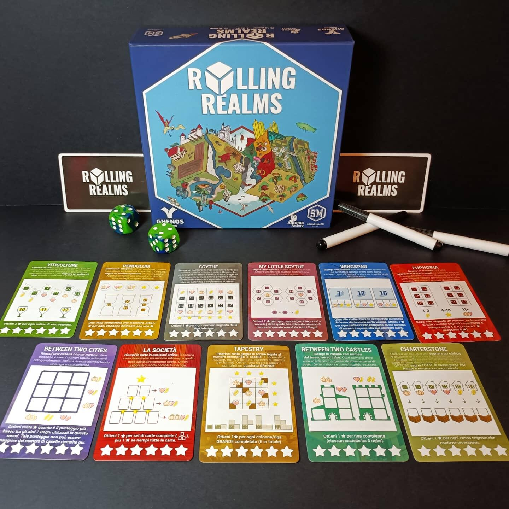
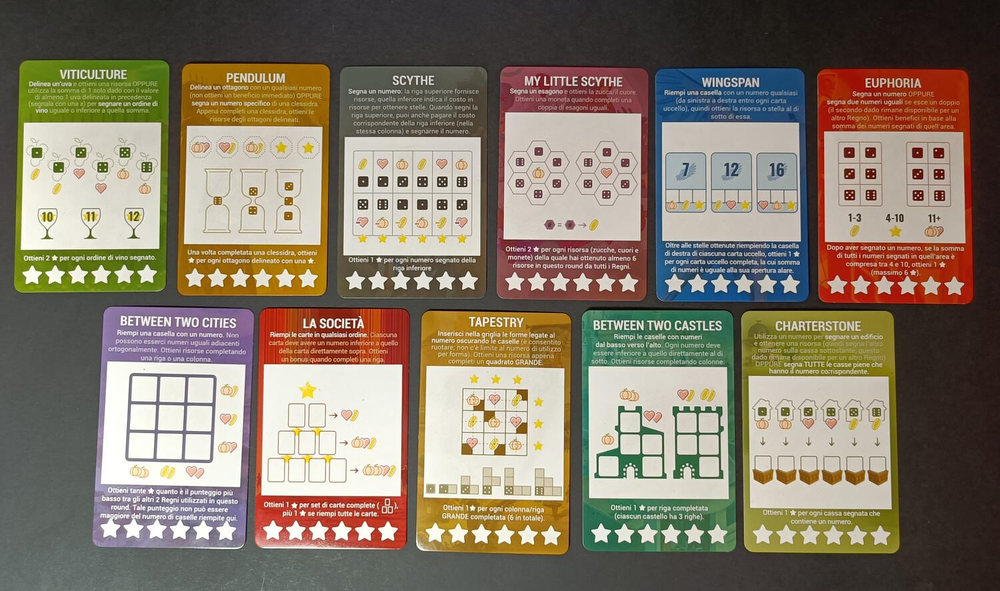

<Setting>

  Vari Reami, in questo caso i vari giochi creati di Jamey Stegmaier si uniscono
  in un fantastico gioco roll and write. <strong>Durante la pandemia</strong>,
  lo stesso Jamey ha creato questo titolo, inizialmente print and play, per
  poter giocare con tantissimi giocatori anche <strong>a distanza</strong>.
  Grazie al fantastico successo, è arrivato anche in forma fisica sui nostri
  tavoli grazie alla Ghenos Games.

</Setting>

<Rules>

  In Rolling realms i giocatori dovranno gestire turno dopo turno i vari
  risultati dei dadi, come ogni altro roll and write. La partita dura
  esattamente tre Round, durante i quali i giocatori dovranno gestire{" "}
  <strong>tre Reami</strong>, uguali per ognuno, ad ogni Round. A loro volta, i
  Round sono divisi in nove turni, durante i quali, un giocatore prima lancerà
  entrambi i dadi, e successivamente tutti i giocatori,{" "}
  <strong>contemporaneamente</strong>, dovranno gestirli e segnare i risultati
  sui Reami. Ogni Reame, ovviamente, avrà regole di posizionamento differenti e
  vi permetterà di ottenere punti vittoria, in questo caso{" "}
  <strong>stelline</strong>, in maniera diversa. Oltre a ciò saranno presenti
  anche delle risorse: zucche, cuori e monete. Queste vi permetteranno di{" "}
  <strong>modificare i risultati</strong> dei dadi a vostro piacimento,{" "}
  <strong>crearne di nuovi</strong> e chi ne ha più ne metta. L'unica regola
  importante da tenere in considerazione è che, in un turno non si potranno
  posizionare due o più risultati dei dadi sullo stesso Regno. Questa regola può
  essere infranta soltanto utilizzando <strong>tre zucche</strong>. Una volta
  che i dadi sono stati lanciati per nove volte, il Round termina, si contano le
  stelle accumulate e si sommano eventuali risorse non utilizzate, che valgono{" "}
  <strong>0,1 punti</strong> ciascuna. A questo punto si cancellano tutte le
  risorse, si scartano le tre carte Regno appena utilizzate e se ne prendono tre
  nuove. Ovviamente al termine del terzo Round il giocatore con più punti
  vittoria vince la partita.

</Rules>

<Feedback>

  Rolling Realms si presenta come un classico roll and write come tanti altri a
  prima vista, ma che nasconde numerose chicche che mi hanno fatto davvero
  apprezzare questo gioco. Iniziamo dalla premessa,{" "}
  <strong>adoro la Stonemaier games</strong>, e quindi ho quasi tutti i loro
  giochi. Ritrovare le piccole meccaniche che hanno reso famosi titoli che ho
  giocato e rigiocato, mi ha fatto apprezzare ancora di più questo titolo. Un
  altro punto a suo favore è la semplicità e l'immediatezza delle regole. Sarà
  comunque <strong>difficile padroneggiarlo</strong> nelle prime partite, a
  causa delle numerose risorse, le centinaia di modifiche che si possono fare ai
  dadi e le molteplici strade che si possono prendere. Pur avendo però tutta
  questa complessità di base ho trovato <strong>più leggero e lineare</strong>{" "}
  il gameplay in confronto ad altri roll and write complessi. Oltre a ciò, ho
  davvero apprezzato i materiali: i colori accesi e la scelta di utilizzare{" "}
  <strong>carte plastificate e pennarelli</strong> al posto del classico
  malloppo di fogli. Il regolamento è ben scritto, e grazie alle spiegazioni
  dettagliate di ogni carta Regno risulta ancora più semplice la comprensione.
  Qualche difetto è comunque presente, ma che non considererei comunque difetto
  poiché sono componenti intrinseche in questa tipologia di gioco:{" "}
  <strong>l'interazione praticamente assente e l'alea</strong>. In conclusione,
  Rolling Realms si aggiudica un ottimo podio nella classifica dei miei roll and
  write preferiti, un titolo che ho consigliato e continuo a consigliare ai
  giocatori che vogliono approcciarsi al genere e cercano una sfida un pò più
  impegnativa.

</Feedback>

