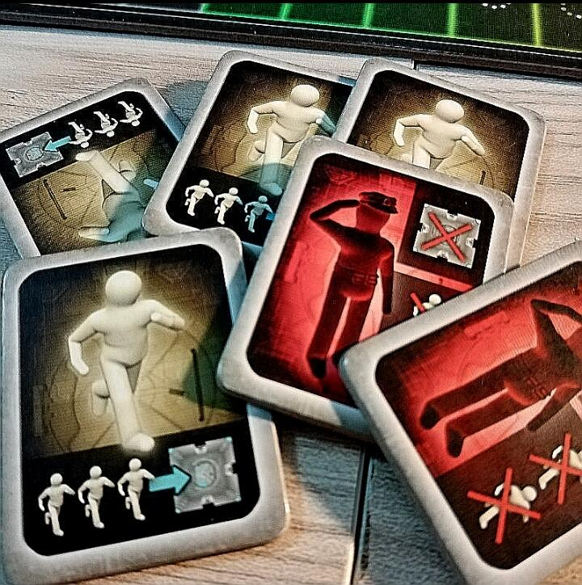

<Setting>

  Ambientato in un futuro distopico, oltre i limiti del buon gusto e dell’immaginario collettivo, un reality show
  televisivo nominato ROOM 25 rappresenta la massima forma di intrattenimento.
   
  Gli ospiti più o meno volontari di questo futuristico e sadico show vengono rinchiusi all’interno di una struttura
  composta da 25 stanze apparentemente tutte uguali tra loro.
   
  Il loro obiettivo? Sopravvivere e collaborare per scovare la stanza 25 e riuscire così a fuggire.
   
  Alle volte le guardie si camuffano tra i prigionieri per impedire loro di scappare con ogni mezzo a disposizione…
  morte compresa!
   
  Gli ambienti che compongono questo dedalo di stanze sono agghiaccianti, ogni stanza è dotata di effetti speciali e
  inaspettati.
   
  I mal capitati concorrenti di questo programma dai tratti distorti si troveranno a dover affrontare stanze omicide,
  porte che si chiudono non appena entrati sigillando così la via di fuga, stanze buie, marchingegni assassini e tanto
  altro… Insomma, in questo luogo tutto è pensato per “divertire” lo spettatore e fare, invece, rabbrividire il
  concorrente.
   
  Poiché il pubblico a casa si annoia con facilità, sono state introdotte diverse varianti di gioco, dalla modalità
  competitiva a quella puramente collaborativa, passando per quella col traditore-guardia e la divisione in fazioni.
   
  Sarete tra quelli fortunati che riusciranno a sopravvivere e a scappare da questo luogo infernale di tortura e
  sadismo, oppure rappresenterete i tristi e sfortunati concorrenti che ci lasceranno le penne al fine di soddisfare la
  necessità di contenuti multimediali ad alta concentrazione di cattiveria e bluff?
   
  Che gli Hunger Games abbiano inizio!

</Setting>

<Rules>

  Room 25 si svolge in un complesso di 25 stanze, per cui l’area di gioco è impostata in una griglia 5x5 di tessere
  stanza, all’inizio della partita coperte. L’unica tessera scoperta sarà la stanza di partenza al centro di questo
  complesso.
   
  A seconda della diversa modalità di gioco, la partita si compone di 8 o 10 turni, ognuno dei quali si articola in 3
  diverse fasi.
   
  La prima fase è quella di PROGRAMMAZIONE AZIONI: ogni giocatore grazie ai segnalini azione del suo personaggio (uguali
  per tutti) sceglie 1 o 2 azioni e colloca i relativi segnalini coperti di fronte a sé sulla sua plancia personaggio.
  Le AZIONI possibili sono 4: l’azione OSSERVA permette di sbirciare segretamente il contenuto di una stanza adiacente a
  quella in cui si trova il personaggio; l’azione MUOVI permette di spostare il personaggio in una stanza adiacente;
  l’azione SPINGI permette di “calciare” un personaggio al di fuori della propria stanza e in una adiacente; l’azione
  MANOVRA permette di spostare l’intera fila/colonna di stanze che comprende quella in cui ci si trova in una delle
  direzioni possibili ortogonalmente.  
  La seconda fase è quella dell’AZIONE: il primo giocatore rivela la prima azione che ha scelto nella fase precedente e la
  esegue; poi, a turno, ogni giocatore successivo al primo esegue la sua prima azione e così via finché ognuno avrà eseguito
  tutte le azioni programmate. L’ordine di turno viene seguito grazie all’uso della PLANCIA INVERTIBILE del gioco.
   
  La terza ed ultima fase è quella del CONTO ALLA ROVESCIA: quando tutte le azioni sono state eseguite il turno termina e
  ogni giocatore riprende in mano tutte le azioni (utilizzate o meno); poi il primo giocatore diventa l’ultimo e tutti i
  SEGNALINI TURNO slittano avanti di un riquadro in modo che il contatore dei turni diminuisca di 1 il conto totale.
   
  Il gioco procede così fino al verificarsi delle condizioni di vittoria o di sconfitta: i giocatori perdono se non riescono
  a fuggire dal complesso (indipendentemente dalla modalità di gioco), mentre vincono se riescono a trovare la ROOM 25, raggiungerla
  e spostarla prima sul bordo esterno del complesso (ZONA DI USCITA) e, infine, a spostarla fuori dal complesso.

</Rules>

<Feedback>

  Room 25 è un rapido gioco che comprende diverse modalità di scenario e la composizione del complesso di stanze varia a
  seconda delle modalità: questo contribuisce a variare l’esperienza al tavolo, anche se alla lunga sarà chiaro che le
  meccaniche restano sempre le stesse. La concorrenza e l’ansia crescente a mano a mano che si avvicina la fine della
  partita si ripercuotono sui giocatori alla disperata ricerca della STANZA 25; chi la trova per primo non sempre può
  considerarsi salvo: la contro-mossa e il sospetto sono, infatti, sempre dietro l’angolo.
   
  Questo aspetto è molto interessante poiché inevitabilmente costringe i giocatori all’interazione: che siano alleati o
  avversari, la loro interazione sarà anzi il punto cardine del gioco.
   
  Non è affatto un titolo per solisti, anche se a prima apparenza potrebbe sembrare così, se si comincia con la modalità
  Tutti Contro Tutti.
   
  I materiali non sono nulla di eccezionale: le stanze sono in cartoncino abbastanza spesso, ma si imbarcheranno
  difficilmente; le miniature dei personaggi sono dipinte con colori pastello, di cui non c’è da essere particolarmente
  entusiasti. Il gioco non è per niente astruso o difficile: semmai, la sua difficoltà risiede nel cercare di prevedere
  le azioni scelte dagli altri giocatori e reagire di conseguenza, il che a ben vedere è un aspetto positivo!
   
  Sicuramente Room 25 è un titolo adatto anche ai neofiti ed è ottimo per passare una serata in spensieratezza giocando
  da tavolo, ma con un pizzico di bluff, mistero e rivalità.
   
  Non si propone di certo come un gioco impegnato, anche se l’espansione SEASON 2 sembra inserisca alcune piccole novità
  che aiutano a differenziare l’ambientazione, anche implementando due nuovi personaggi e un’abilità unica che rende
  ogni personaggio customizzato rispetto alla sola scatola base, in cui invece la scelta di un personaggio rispetto
  all’altro era puramente estetica.
   
  È un gioco da avere assolutamente? Certamente no. Tuttavia, arricchirà la Kallax di tutti gli appassionati in cerca di
  un semi-collaborativo dal tono investigativo in più.
   
  Siate cattivi durante la partita… spingere un avversario nella stanza della morte rossa risulterà estremamente
  appagante!

</Feedback>
