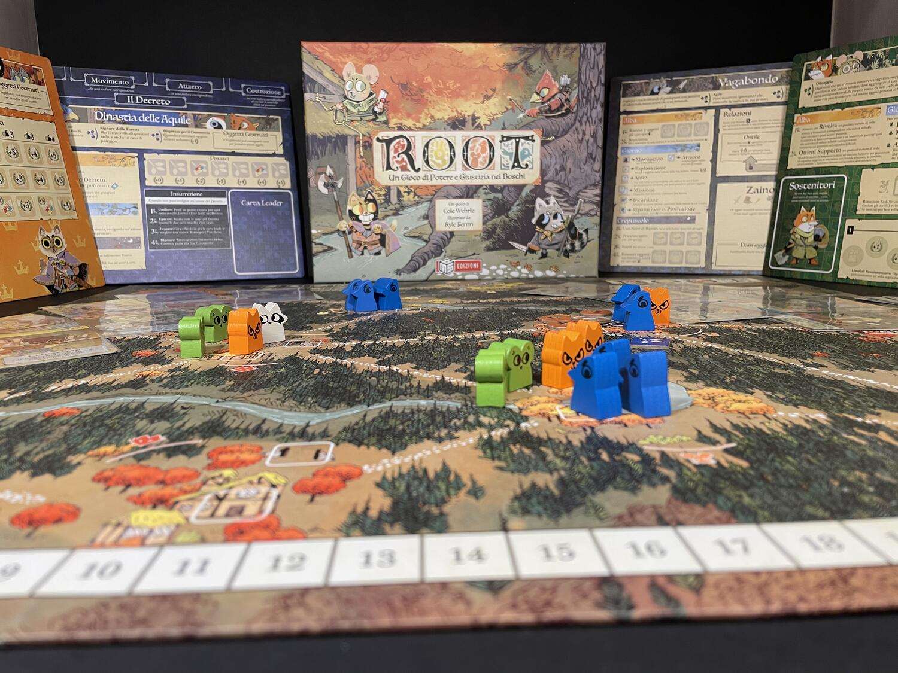

<Setting>

  Un marchesato di gatti autoritari e militarizzati; una dinastia di aquile fissate con l'equilibrismo legislativo;
  un'alleanza di varie creature del bosco oppresse e in procinto di scatenare una rivolta; una setta di religiosissime
  lucertole con tendenze suicide; una compagnia di castori barcaioli, mercatanti e mercenari; una congrega di corvi
  congiurati e dinamitardi; un ducato di talpe guerrafondaie con la mania del controllo; vagabondi e vagabot amici di
  tutti e di nessuno; un plotone di tassi corazzati con la passione per l'antiquariato; un battaglione di topi umorali
  con ambizioni da piromani. Dopo lo scontro, i boschi non saranno più gli stessi…

</Setting>

<Rules>

  Dopo aver assegnato le fazioni e il primo giocatore, vengono distribuite le carte iniziali (3 a testa) e si procede
  alla predisposizione dei componenti: quelli dello scenario e quelli delle singole fazioni in partita, dalle quali
  dipenderà la collocazione sulla mappa dei presidi, degli edifici e delle unità iniziali.
   
  Diciamo subito che Root è un gioco strutturalmente asimmetrico e non ignoriamo l'elefante nella stanza: la spiegazione
  del regolamento, se si tenesse conto di questa peculiarità, richiederebbe molto tempo e scoraggerebbe i più. A dire il
  vero, spiegare in dettaglio il funzionamento di tutte le fazioni non servirebbe a granché in vista della prima
  partita, durante la quale i giocatori saranno più concentrati a capire il funzionamento della fazione che stanno
  giocando, che non a osservare quanto staranno facendo gli altri. Sin da subito, invece, si trarrebbe un utile
  imparando le regole comuni a tutte le fazioni e a interpretare una plancia in generale: ed è proprio ciò che faremo in
  questa sede, in modo evidentemente incompleto, ma in questo senso ci sembra che il regolamento del gioco si presti
  agevolmente a una consultazione a mo' di glossario per tutto quanto si sarà omesso.
   
  Tutte le fazioni sono strutturate alla stessa maniera: ciascuna ha la propria scheda, che prevede uno specifico setup,
  la propria riserva di miniature, carte e/o segnalini. Ogni fazione svolge il proprio turno eseguendo in un certo
  ordine una serie di azioni. Le azioni si susseguono nel corso di tre fasi chiamate per tutti allo stesso modo (
  <strong>Alba</strong>, <strong>Giorno</strong>, <strong>Crepuscolo</strong>), ma la cui connotazione dipende
  evidentemente in modo specifico dalla fazione che si sta giocando. Ad esempio, durante l'Alba la{" "}
  <em>Marchesa de Gattis</em> posiziona un segnalino legna in ogni segheria, la <em>Dinastia delle Aquile</em> svolge
  gli ordini d'emergenza, aggiunge nuove carte al decreto e colloca sulla mappa un nuovo posatoio, l'
  <em>Alleanza dei Boschi</em> svolge la rivolta e ottiene supporto, il <em>Vagabondo</em> riattiva oggetti esauriti e
  si può muovere tramite la scorciatoia, e così via.
   
  Per tutte le fazioni, svolgere certe azioni consentirà di sbloccare nuove opzioni e possibilità sulla scheda della
  fazione stessa, così come la gestione della mano di carte personali e dal mazzo comune incrementerà le possibilità
  strategiche. Vi sono poi azioni comuni a tutte le fazioni, come muoversi sulla mappa, attaccare gli avversari (la
  parte più aleatoria del gioco) o far produrre le carte della propria mano per ottenere effetti immediati o permanenti.
  Anche per ottenere punti vittoria ogni fazione segue modalità che le sono peculiari, e anche in questo caso ci sono
  modalità comuni a tutte le fazioni per ottenere punti: ad esempio, tutti possono fare punti rimuovendo edifici e
  segnalini avversari dalla mappa o costruendo gli oggetti indicati sulle carte, ma solo la Marchesa otterrà punti
  posizionando nuovi edifici sulla mappa.
   
  È evidente che per avere idea di cosa stia accadendo nel gioco durante tutti questi passaggi bisognerebbe conoscere
  nel dettaglio tutte le azioni possibili, non solo quelle comuni: una padronanza che arriverà necessariamente solo col
  tempo. Per chi si avvicina al gioco per la prima volta, perciò, è consigliabile concentrarsi innanzitutto sulla
  corretta esecuzione delle azioni riportate sulla propria scheda: questo basterà a familiarizzare già nel corso del
  primo turno di gioco con le potenzialità della fazione che si sta giocando.
   
  Ogni turno prosegue con i giocatori che eseguono nell'ordine le tre fasi della loro fazione e, quando hanno finito,
  passano al giocatore che segue. Vince il giocatore che raggiunge per primo 30 punti o, in alternativa, realizza la
  condizione di vittoria indicata su una carta Dominio attiva.

</Rules>

<Feedback>

  Root ha raggiunto quella notorietà e quel gradimento di pubblico di cui, immeritatamente, non ha goduto il suo
  predecessore, Vast. Ma oggi, con una certa distanza dalla sua pubblicazione, possiamo forse finalmente smetterla di
  considerare l'uno l'erede spirituale dell'altro, come ha invece sostenuto a lungo il campionario di recensori sparsi
  per la rete. Un'astuta strategia di marketing, in effetti, ha fatto da subito di Root agli occhi di molti giocatori
  una versione più riuscita del suo sfortunato antecedente, lasciando credere ai polli (non a caso unica fazione assente
  da questi popolatissimi boschi) che si trattasse di un gioco adatto anche ai principianti.
   
  Chiamiamo, invece, le cose col loro nome: Vast è fondamentalmente un dungeon crawler pesantemente asimmetrico, dove la
  tattica spadroneggia e il dungeon stesso prende vita, “masterizzando” la partita dei suoi antagonisti; Root è
  chiaramente un soft wargame, altrettanto asimmetrico, ma dalla forte componente strategica. L'unico elemento che
  apparenti in qualche modo questi due titoli, oltre alla casa editrice, è pertanto l'esasperata, ostentata e
  riuscitissima super-asimmetria delle fazioni.
   
  Ciò detto, Root è strepitoso. Richiede, non meno di Vast, una lunga fase di assestamento, fatta di tante partite con
  la stessa fazione, a cui dovranno seguire altrettante partite con tutte le altre fazioni. Perché, come giustamente è
  stato osservato, se non conoscerete le stangate che potranno arrivarvi dagli avversari, guarderete giocare gli altri e
  vi sembrerà di dover lasciare avvenire le cose, senza capire fino in fondo cosa succede o quali siano le vostre reali
  possibilità per prendere in mano la vostra sorte.
   
  Alla lunga, giocarlo senza espansioni renderà le quattro fazioni del base (Marchesa de Gattis, Dinastia delle Aquile,
  Alleanza dei Boschi e Vagabondo) alquanto ripetitive. Anche così, però, dobbiamo riconoscere di essere di fronte a un
  titolo che merita di essere avvicinato e provato anche nel suo formato più essenziale, con la precisazione che la
  compagnia dei giocatori dovrebbe partire dalla medesima competenza del gioco, crescere compatta nella padronanza del
  suo potenziale… ed essere innamorata del suo splendido artwork.

</Feedback>

