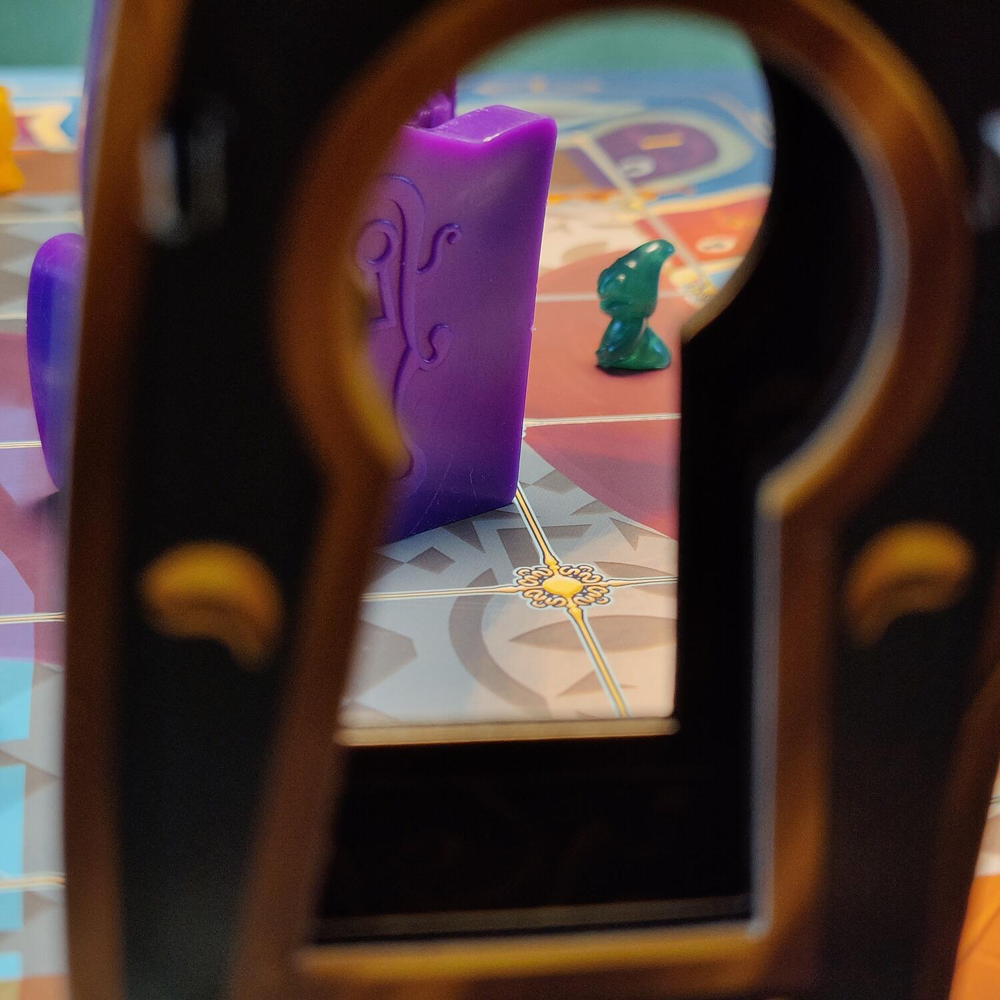
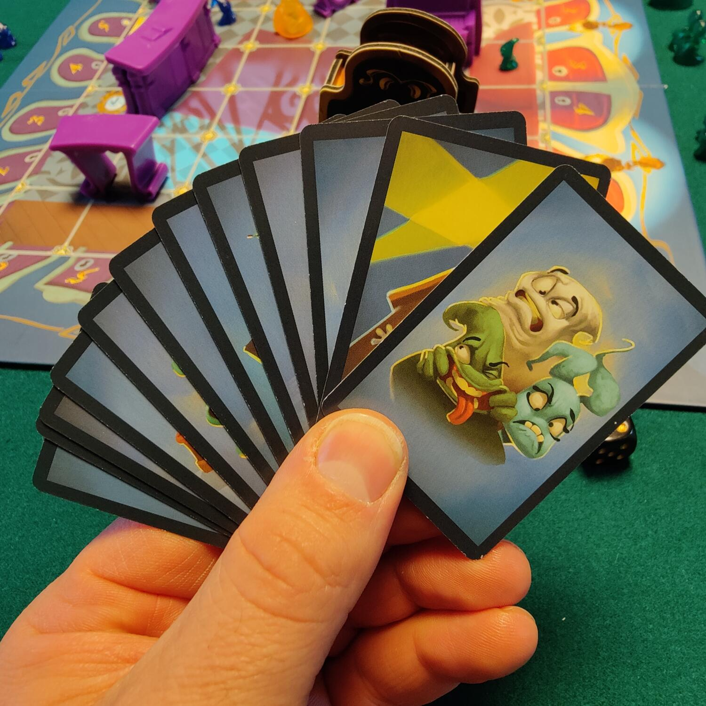

<Setting>

  Avete deciso di fare bisboccia con la vostra combriccola di
  <strong> fantasmi</strong> proprio dentro alla hall di un noto albergo. È stato divertente: avete spostato mobili, rovesciato
  ogni cosa e fatto tanto, tanto rumore. Finché, ovviamente, non avete svegliato tutto l'albergo e messo in allarme gli assonnati
  ospiti.
   
  Ora vi toccherà correre a più non posso per evitare che gli umani vi vedano dalle <strong>serrature</strong> delle loro
  stanze. Per fortuna qualche
  <strong> mobile</strong> può ancora servire come rifugio.
   
  Ma scappare non sarà così semplice: quegli occhiacci degli umani sono dappertutto!

</Setting>

<Rules>

  Durante i <strong>5 round</strong> del gioco dovrete far attraversare la hall dell'albergo al maggior numero di
  fantasmi. Più è grande il fantasma più punti vale:
  <ul>
    <li>      <strong>1 punto</strong> per il fantasma piccolo</li>
    <li>      <strong>3 punti</strong> per il fantasma medio</li>
      <li>      <strong>5 punti </strong>per il fantasma grande</li>
  </ul>
       
      Ogni giocatore sceglierà un lato del tabellone, che sarà il suo punto di <strong>partenza</strong>; il lato
      opposto sarà il suo punto di <strong>arrivo</strong>. Durante ogni turno i giocatori pescano una carta movimento,
      sulla quale troveranno il numero di movimenti che dovranno suddividere tra i propri fantasmi. In alcune carte sono
      rappresentati i mobili, che in quel caso potrete spostare a vostro piacere.
       
      Ogni giocatore sceglierà quali fantasmi far avanzare tenendo conto che:
      <ul>
        <li>          Un fantasma non può <strong>entrare</strong> ed <strong>uscire</strong> dalla hall nello stesso turno</li>
        <li>          I fantasmi non si muovono in <strong>diagonale</strong></li>
      </ul>

       I fantasmi passano attraverso i mobili, ma possono fermarsi anche <strong>sopra</strong> di essi o al loro{" "}
      <strong>interno</strong>
       
      La fase di movimento avviene in <strong>contemporanea</strong> tra tutti i giocatori e, una volta terminata, un
      lancio di dado deciderà quale giocatore guarderà dallo spioncino della porta. Tutti i fantasmi visibili dallo{" "}
      <strong>spioncino</strong> tornano al loro punto di ingresso nella hall.
       
      Terminati i 5 round, si contano i punti in base ai fantasmi scappati, e pensate un po', chi ne ha fatti di più{" "}
      <strong>vince</strong>!

</Rules>

<Feedback>

  <strong>Run, Ghost, Run</strong> è ovviamente un gioco orientato ad un
  pubblico <strong>giovane</strong>, dai 7-8 anni in su, ma siamo sicuri che
  darà moltissime soddisfazioni come filler anche agli <strong>adulti</strong>.
   
  La fase di movimento potrebbe sembrare caotica, svolgendosi in contemporanea,
  ma vi costringerà a pianificare <strong>rapidamente</strong> i movimenti da
  fare. Se avrete modo di spostare un mobile, potrete ripararvi da occhi
  indiscreti, oppure lasciare allo scoperto un fantasma avversario. Lo specchio,
  poi, è un tocco geniale: il suo riflesso è una variabile in più a cui badare!
   
  Una volta provata la versione base, ci sono delle
  <strong> regole aggiuntive</strong> che permettono di complicare il gioco e di
  allungarne la longevità.
   
  Ma la forza di Run, Ghost, Run sta nella
  <strong>semplicità delle regole</strong>, nella
  <strong> rapidità di preparazione</strong> e nel <strong>divertimento </strong>
  che proverete giocandolo!
   
  Uh, ho sentito un rumore, vado a nascondermi…

</Feedback>
