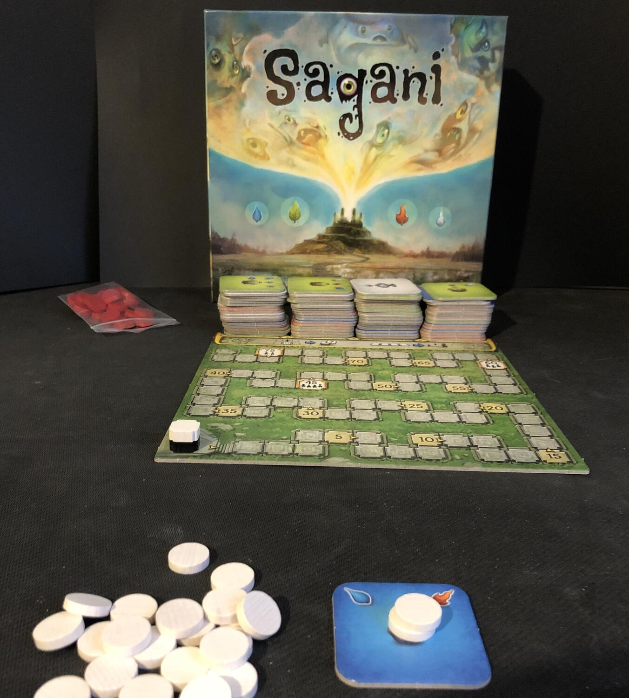
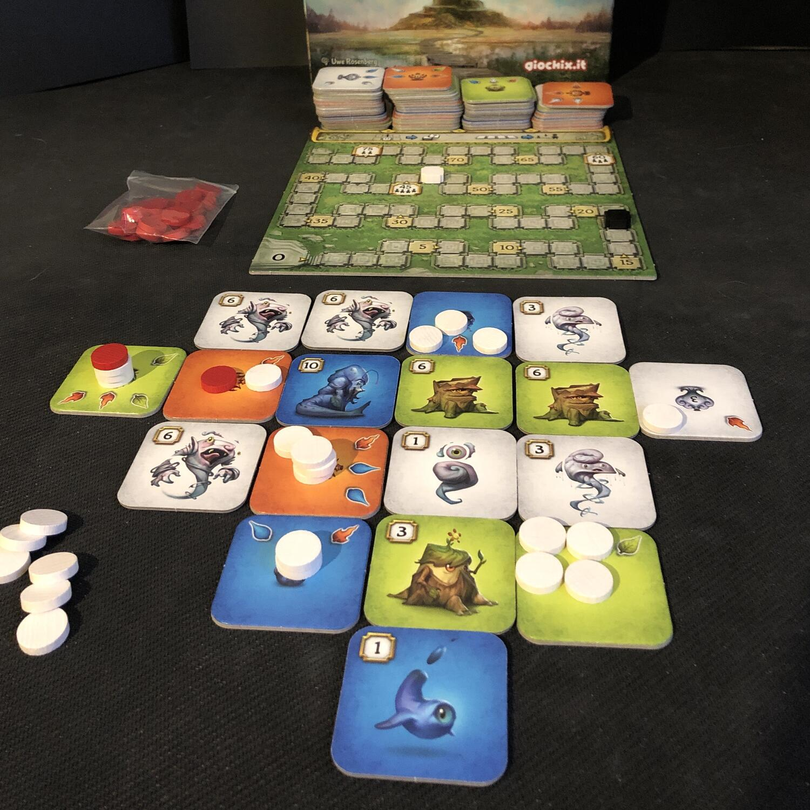

<Setting>

  Secondo Paracelso, esistono degli spiriti elementali contenuti in ampolle che
  solo quando nelle loro vicinanze c'è dell'armonia ne escono. Tutto questo è
  molto bello e ben “armonizzato” con le arte di Siegmon… Peccato che di fatto
  Sagani sia un astratto che più astratto non si può e in termini di gioco si
  poteva tranquillamente parlare di patate!

</Setting>

<Rules>

  I giocatori da 1 a 4 in Sagani dovranno ottenere più punti possibili facenso
  si che gli spiriti in loro possesso escano dalle loro ampolle perchè in
  Armonia. Ogni tessera di Sagani avrà infatti due lati, uno raffigurante uno
  spirito associato ad un punteggio, l'altro un'ampolla con un numero variabile
  di frecce 1,2,3,4 che indicano le direzioni in cui ci dovrà essere un certo
  elementale per creare armonia. Perchè ebbene sì, Sagani è praticamente un
  puzzle che vedrà i giocatori a turno pescare dalla riserva generale tessere e
  incastrarle nel modo corretto, stando attenti a non incorrere in malus.

</Rules>

<Feedback>

  Sagani è un gioco particolare. Astrattismo e terribilmente tattico vi porterà
  a ragionare su ogni vostra singola mossa. Infatti partita dopo partita vi
  troverete a lamentarvi sempre più di una tessera scarognata, ma con
  l'esperienza imparerete come comporre in maniera sempre più performante il
  vostro puzzle. In proprio questo creare puzzle sagani eccelle per quanto
  alcune partite, soprattutto in solitario possano allungarsi senza senso, e non
  c'è niente di più soddisfacente nel vedere gli elementali liberarsi dalle
  proprie ampolle grazie alla vostra raffinata strategia!

</Feedback>

