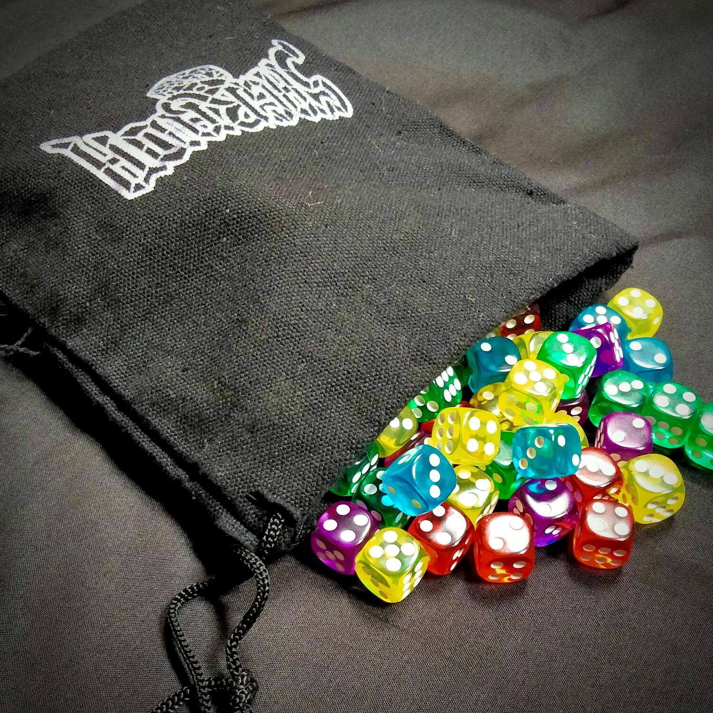
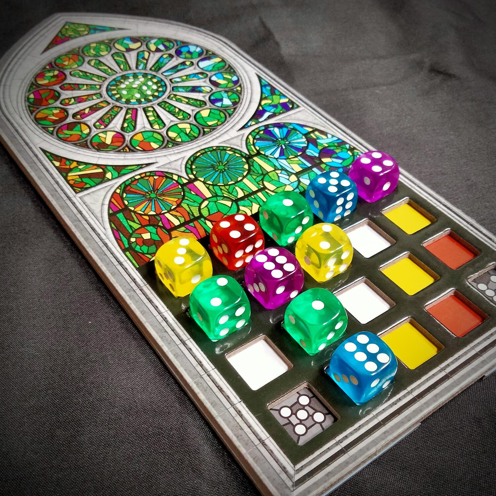
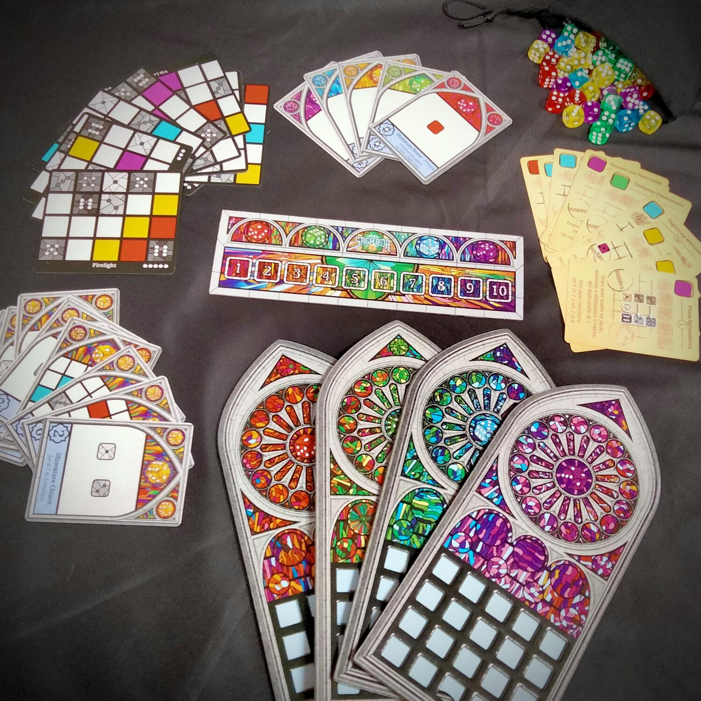

<Setting>

  I lavori di costruzione della Sagrada Familia sono iniziati nel 1882 e il
  suo progetto era così ambizioso che ancora oggi la cattedrale non è completa. Spetterà
  a voi, abili artigiani, la realizzazione delle maestose vetrate: sarà richiesta
  un’attenta pianificazione e l’utilizzo di speciali utensili per posizionare i
  frammenti di vetro all’interno del telaio e comporre una vetrata degna della
  Sagrada Familia!

</Setting>

<Rules>

  Lo scopo di Sagrada è quello di realizzare la miglior vetrata, posizionando
  dadi all’interno di una griglia per ottenere punti e portare a termine
  obiettivi privati e pubblici.
   
  A inizio partita, i giocatori scelgono lo schema da realizzare in 10 round.
   
  In ogni round, a seconda del numero di giocatori, vengono pescati da un
  sacchetto un certo numero di dadi. Una volta tirati, con un draft, ogni
  giocatore sceglierà i dadi da utilizzare per la costruzione della propria
  vetrata. I dadi, oltre a dover rispettare i vincoli di valore e colore imposti
  dallo schema, non possono essere adiacenti a dadi dello stesso colore o a dadi dello
  stesso valore. Ed è a questo punto che gli artigiani più abili sapranno
  utilizzare le carte Utensile per modificare il valore di un dado, cambiare la
  sua posizione o il colore a loro vantaggio. Le carte Utensile sono disponibili
  per tutti i giocatori al centro del tavolo e sono un ottimo modo per “limare”
  l’aleatorietà del gioco.
   
  Al termine dell’ultimo turno, si procede al calcolo del punteggio
  considerando anche eventuali errori commessi nello schema e chi ha realizzato
  più punti è il vincitore!

</Rules>

<Feedback>

  Sagrada è un titolo con numerose componenti e meccaniche per nulla banali.
   
  Durante il draft, la scelta del dado è dettata dal proprio schema,
  dall’obiettivo privato e, ovviamente, dalla strategia di ogni singolo. Attenzione,
  non saranno rari i casi in cui vi verrà sottratto proprio il dado che soddisfa il
  vincolo o che vi permette di completare un obiettivo, lasciandovi, dunque, con
  il fiato sospeso, nella speranza di riuscire a vedere nuovamente (e a prendere!) quel maledetto dado.
  Sagrada riempie e colora il tavolo da gioco, ma non è privo di pecche:
  <ul>
    <li>      scarsa scalabilità dovuta al numero di dadi che resta sempre lo stesso a prescindere dal numero di giocatori;&nbsp;&nbsp;</li>
      <li>      gli obiettivi privati che premiano il lancio fortunato dei dadi di un determinato colore.&nbsp;&nbsp;</li>
  </ul>
      Entrambe le note negative sono state sistemate con il set Sagrada:
      espansione 5° e 6° giocatore, introducendo nuovi obiettivi privati e la
      preparazione del pool di dadi a inizio partita in base al numero di giocatori.
       
      Il gioco in sé è piacevole, soprattutto grazie alla
      sua componentistica: i 90 dadi colorati, le plance dual-layer e i colori
      sgargianti colpiscono chiunque, e la scatola fa la sua bella figura tra i
      giochi in libreria!

</Feedback>

