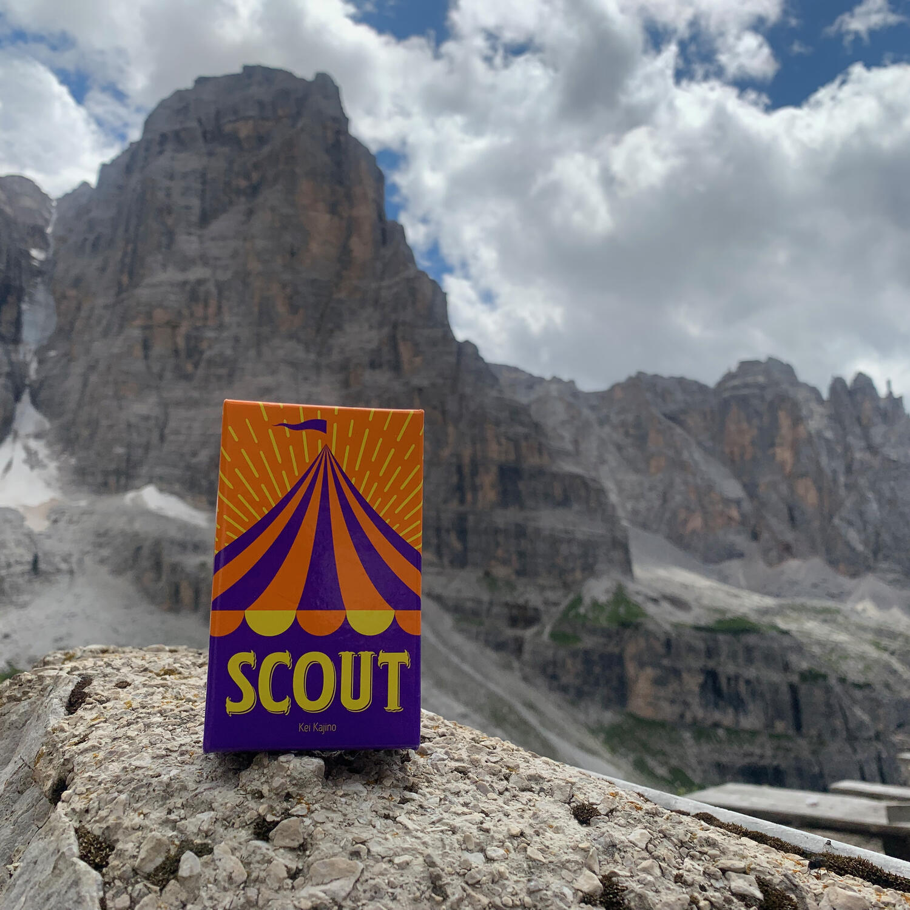
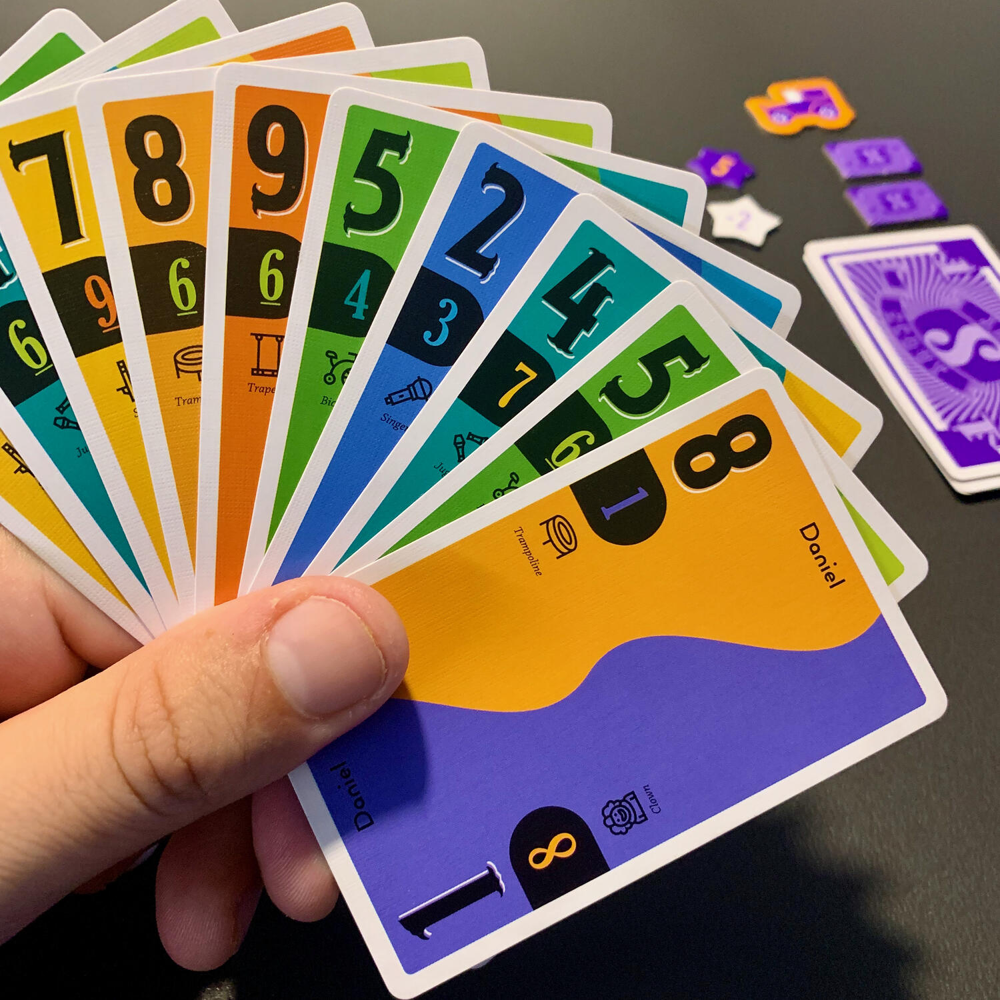

<Setting>

  <em>    Venghino signori, venghino: il circo è arrivato in città. Trapezisti, equilibristi e la donna cannone sono pronti a
    lasciarvi a bocca aperta. Che aspettate? Accorrete a vedere il miglior circo di sempre!</em>   
   
  In città sono arrivati contemporaneamente tanti spettacoli circensi e voi dovrete essere i migliori per accaparrarvi il
  successo: mettete in mostra il vostro show e, se non dovesse bastare, convincete gli artisti delle altre compagnie ad aggiungersi
  a voi.  
  Siate crudeli e avrete fama eterna.

</Setting>

<Rules>

  Ogni <strong>carta</strong> è caratterizzata da <strong>due valori</strong>, a seconda di come la si "legge":
  immaginate una carta francese, ma con due numeri diversi sui due lati corti.  A inizio partita, ogni giocatore
  riceve una decina di carte che non potranno mai essere cambiate di posto, ma si potranno sfogliare e ruotare
  sotto-sopra tutte assieme. Quando tutti i giocatori hanno deciso da che parte tenere le proprie carte,{" "}
  <strong>"dritte" o "capovolte"</strong>, la partita inizia.  
  In ogni turno, un giocatore deve eseguire <strong>una tra queste due azioni</strong>: 
  <ul>
    <li>      <strong>Show</strong>: si sceglie una certa combinazione di carte dalla propria mano e la si posiziona sul tavolo
      solamente se il tavolo è sgombro oppure se queste superano quelle dell'avversario per quantità (tre carte sono più
      di due) o per numero (un set di due 4 è più forte di un set di due 3). Questa combinazione può essere composta da
      carte tutte con lo stesso numero oppure in scala, crescente o decrescente. L'importante è che le carte che
      giocherete siano già presenti nella mano senza doverne modificare l’ordine. A fine azione, si ottengono le carte
      dell'avversario che erano sul tavolo e si trasformano in "carte punti". Se non potete giocare niente, dovrete fare
      Scout.</li>
    <li>      <strong>Scout</strong>: si prende una carta da una delle due estremità dalla combinazione presente sul tavolo e la
      si posiziona dove si vuole all'interno della propria mano, anche capovolgendola. Il giocatore a cui è stata tolta
      la carta ottiene 1 punto vittoria, a compensazione di una combinazione ora indebolita.  </li>
  </ul>
  Una volta per round, un giocatore ha anche la possibilità di eseguire entrambe le azioni consecutivamente: <strong>    scout + show</strong>. 
  Il round termina quando tocca nuovamente al giocatore che aveva già le carte in tavola o se, giocando, si terminano le
  carte in mano.
   
  Ogni giocatore perdente considera ogni carta rimasta nella propria mano come un punto negativo, si contano i punti
  raccolti durante la partita e si trasformano in stelline conta-punti.
   
  Si svolgono tanti round quanti i giocatori al tavolo e chi ha più punti alla fine è il vincitore.

</Rules>

<Feedback>

  Scout è una stata una <strong>bellissima scoperta</strong>. Un gioco talmente poco ingombrante che si può portare
  davvero dappertutto, anche a 3000 metri di altezza o in spiaggia sotto l'ombrellone. L'ambientazione, piatta come le
  carte che lo compongono, non rovina assolutamente l'esperienza di gioco. Le carte sono bellissime, chiare e portano
  del colore nelle nostre grigie giornate.  
  Le regole sono semplici e ci <strong>si può giocare con chiunque</strong>, a patto che siano persone oneste e che non barino
  ordinando le carte nella propria mano.  
  Ho notato che, a seconda del numero di giocatori, si ha un'esperienza molto diversa: in pochi si potrà vincere perché
  il proprio set non viene battuto, mentre in molti si punterà a terminare le carte nella propria mano.
   
  Davvero un piccolo gioiellino.

</Feedback>

