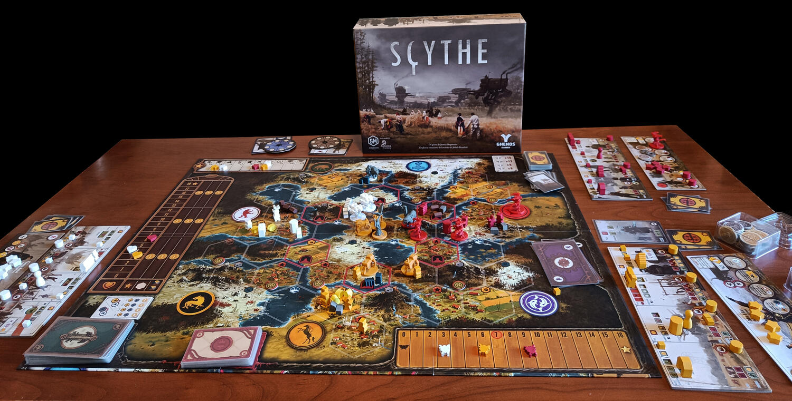
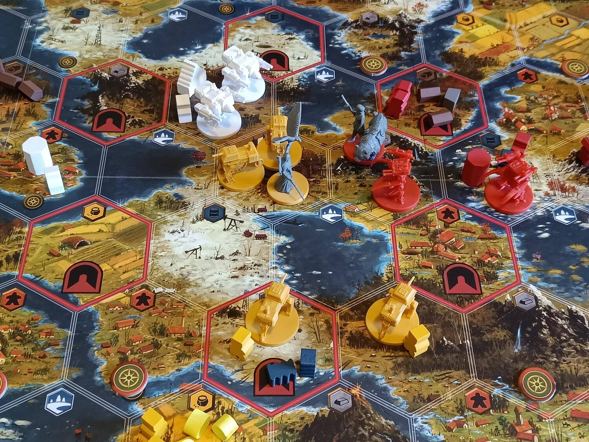
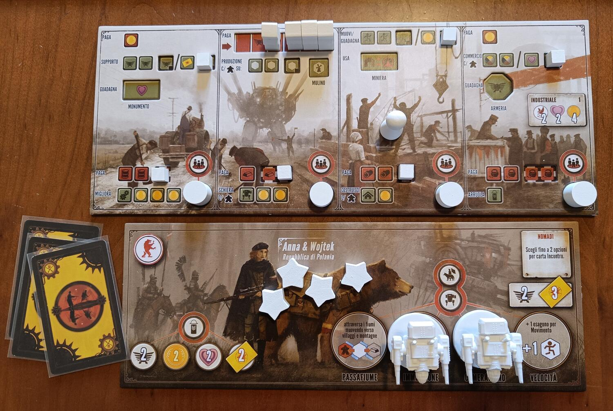

<Setting>

  In una dimensione parallela alla nostra, nel 1920, la Grande Guerra è da poco
  finita, lasciando una terra devastata e da ricostruire. In un territorio
  imprecisato dell’Est Europa, il potere costituito è decaduto, e cinque fazioni
  vagano sperdute, insieme ai loro mech (gigantesche macchine antropomorfe
  alimentate a petrolio), alla ricerca di una terra dove stabilirsi per far
  risorgere dalle ceneri ancora fumanti del conflitto un nuovo impero. Le
  steppe, le montagne e i fiumi si stagliano inesplorati davanti agli occhi dei
  comandanti di ciascuna fazione, che perlustrano l’area alla ricerca del posto
  più ospitale dove iniziare a costruire le proprie strutture. Ma ecco che un
  luccichio compare all’orizzonte! E’ forse la fabbrica abbandonata di cui tanto
  si vocifera, al cui interno si celano ricchezze ed enormi conoscenze?
   
  Una speranza si accende nell’animo: vi è forse un luogo migliore verso il
  quale dirigersi? Perché non cominciare a costruire proprio qui, nei pressi
  della fabbrica? Ma poi una preoccupazione balena nel pensiero: chi altri c’è
  nei dintorni, chi altri sta puntando verso lo stesso obiettivo? La Grande
  Guerra è appena finita, ma dovremo nuovamente prepararci a combattere? Meglio
  darsi da fare e potenziarsi, non c’è tempo da perdere, bisogna far presto!

</Setting>

<Rules>

  Scythe è un gioco di strategia competitivo dove dovrete portare la vostra
  fazione alla gloria e alla prosperità. Per fare ciò, vi sono 10 possibili
  obiettivi da raggiungere: appena un giocatore ne completerà 6 a scelta di
  questi, la partita terminerà, dopodiché si procederà al conteggio della
  ricchezza accumulata per determinare il vincitore.
   
  Lo scopo è espandersi all’interno della mappa, ottenendo risorse con i
  lavoratori, costruendo strutture o schierando i portentosi mech, che potranno
  attaccare gli altri giocatori oppure difendere i territori conquistati. Ogni
  fazione, ciascuna caratterizzata da un’abilità unica, sarà guidata da un
  personaggio principale: questo potrà esplorare la mappa per ottenere bonus e
  soprattutto giungere alla fabbrica posta al centro, assicurandosi le grandi
  tecnologie che si nascondono al suo interno. Ma come poter fare tutto questo?
   
  Durante ogni turno, si potrà scegliere una delle quattro combinazioni di
  azioni disponibili, raggruppate a due a due: una di queste azioni sarà
  basilare e semplice da svolgere, mentre l’altra comporterà degli alti costi a
  fronte però di benefici maggiori. La strategia si baserà quindi
  sull’ottimizzazione delle proprie decisioni tra le numerose opzioni
  disponibili per lo sviluppo della fazione.
   
  Si potrà inoltre invadere con le proprie unità combattenti un territorio
  avversario per dare inizio ad una battaglia e magari conquistare le risorse lì
  accumulate: gli sfidanti decideranno in segreto quanti punti potere spendere
  di quelli accumulati in precedenza, aggiungendo facoltativamente inoltre una
  carta (che avranno un potere variabile da 2 a 5) per ogni propria unità
  coinvolta nell’attacco. Verranno quindi rivelati i punti potere utilizzati, e
  chi ne avrà fatti di più vincerà la battaglia facendo ritirare tutte le unità
  avversarie nella loro base. Chi trionferà perderà però un punto popolarità per
  ogni lavoratore (non combattente) così scacciato.

</Rules>

<Feedback>

  La grande forza di Scythe sta nell’essere riuscito a racchiudere in sé in
  maniera armoniosa diversi elementi tradizionalmente contrapposti, le due anime
  german e american (anche se questa caratteristica potrebbe non essere
  apprezzata dai giocatori “puristi”). I 10 obiettivi possibili permettono di
  percorrere diverse strade per arrivare alla vittoria: costruire più strutture
  o schierare tutti i mech? Puntare sui bonus continui, oppure sull’accumulo di
  risorse? Conquistare territori o rimanere nella vostra piccola area, senza
  provocare i vicini? Non vi è un’opzione migliore delle altre! Tutto dipenderà
  dalla vostra abilità strategica.
   
  A discapito delle apparenze, Scythe non è un wargame, ma un gioco dove regnerà
  continuamente la tensione della guerra, una vera e propria Cold War: infatti,
  sebbene conquistare un territorio potrebbe portare a voi ghiotte ricompense,
  rischierete di perdere popolarità (fondamentale per vincere alla fine della
  partita) e dovrete spendere anche la vostra potenza militare, con la
  possibilità di diventare a vostra volta una facile preda per i vostri (non
  più) amichevoli vicini.
   
  Il regolamento è scritto molto bene, e le numerose regole sono facilmente
  apprendibili, rendendo Scythe un peso medio accessibile a moltissimi
  giocatori. Lo scorrimento del gioco è fluido e, nonostante le diverse scelte
  disponibili e l’ottima profondità, difficilmente si soffrirà di downtime: una
  partita generalmente si attesterà sulle due ore.
   
  Parlando dei materiali, le illustrazioni di Jakub Rozalski sono eccezionali,
  così come la qualità dei componenti, eleganti ed abbondanti (miniature, plance
  dual layer, carte, token in legno, etc). Il gioco prevede inoltre un automa
  ben strutturato, che rende possibile la partita in solitario, anche se il
  titolo rende al meglio da 3-4 giocatori in su.
   
  Scythe è diventato nel corso degli anni uno dei giochi più apprezzati del
  mercato e si sta garantendo un possibile futuro come “classico” della
  categoria. Per noi è un “must have”, uno di quei giochi da avere in casa e da
  proporre costantemente ai propri amici, ̶ ̶f̶i̶n̶o̶ ̶a̶ ̶q̶u̶a̶n̶d̶o̶ ̶n̶o̶n̶ ̶l̶i̶ ̶p̶r̶e̶n̶d̶e̶r̶e̶t̶e̶ ̶p̶e̶r̶
  ̶s̶f̶i̶n̶i̶m̶e̶n̶t̶o̶ ̶e̶ ̶s̶a̶r̶a̶n̶n̶o̶ ̶c̶o̶s̶t̶r̶e̶t̶t̶i̶ ̶a̶d̶ ̶a̶p̶p̶r̶e̶z̶z̶a̶r̶l̶o̶ ̶a̶l̶m̶e̶n̶o̶ ̶q̶u̶a̶n̶t̶o̶ ̶v̶o̶i̶. No dai,
  scherziamo, non considerate quest’ultima frase e andate a assolutamente a
  giocarci se non lo avete mai fatto!

</Feedback>

