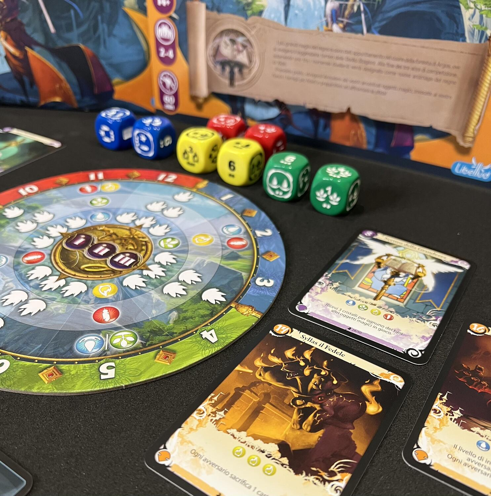
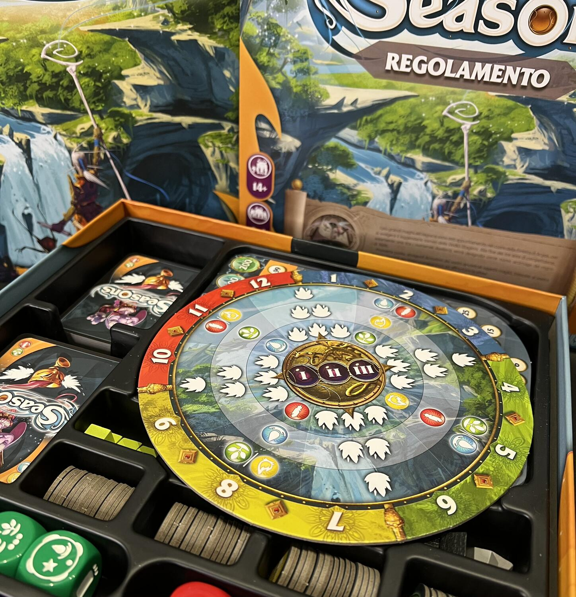

<Setting>

  “I più grandi maghi del regno si sono dati appuntamento nel cuore della
  foresta di Argos, ove si svolgerà il leggendario torneo delle Dodici Stagioni.
  Alla fine dei tre anni di competizione, solamente uno tra i numerosi duellanti
  verrà designato come nuovo arcimago del regno di Xidit.

</Setting>

<Rules>

  Il gioco si svolge in 3 ere, tutte scandite dal passare delle 4 stagioni:
  Inverno (blu), Primavera (verde), Estate (giallo) e Autunno (rosso). Dopo un
  draft iniziale da cui ogni giocatore emerge con una mano di 9 carte,
  contemporaneamente, tutti scelgono le prime 3 carte che formeranno la mano
  iniziale; le restanti 6 (divise in 3 e 3) formeranno la nostra pesca al
  passaggio, rispettivamente, alla seconda e terza era. Scegliete bene, dunque,
  le vostre carte iniziali e quali invece pescare nel corso della partita.
   
  Il turno inizia con un lancio dei dadi (del colore corrispondente alla
  stagione in corso) ed ogni giocatore, a giro, sceglie quale dado tenere per
  sé. Una volta fatto ciò, sempre mantenendo lo stesso giro di turni, il primo
  giocatore svolgerà l'azione del proprio dado: ottenere risorse, cristalli
  (punti vittoria), pescare carte, aumentare il proprio potere di evocazione e/o
  la possibilità di “cristallizzare” le proprie risorse, ovvero trasformarle in
  punti vittoria. Dopo aver svolto l'effetto del dado, il giocatore potrà
  procedere ad evocare carte pagandone il costo in risorse e/o cristalli.
  Attenzione, però, perché per poter giocare carte davanti a sé il giocatore
  dovrà avere un “potere di evocazione” pari o superiore al numero di carte
  giocate.  
  Ogni carta può avere vari effetti: immediati, da attivazione per round, al passaggio
  di stagione/turno/era.
   
  Inoltre, sono suddivise in oggetti magici (sfondo viola) e famigli (sfondo giallo),
  rispettivamente hanno effetto solo su di sé o interagiscono con gli altri giocatori.{" "}
   
  Una volta effettuato il proprio turno, si passa al giocatore successivo. Il
  tempo è scandito dall'ultimo dado rimasto che fa avanzare il segnalino in base
  al numero di “pallini” raffigurati su di esso (1, 2 o 3).

</Rules>

<Feedback>

  Il gioco scorre piacevolmente e devo dire che adoro la fase di draft iniziale,
  anche se non sono un amante di quest'ultima meccanica. L'ambientazione è
  presente e sembra quasi di sentire il passare del tempo e delle stagioni. Ad
  ogni era le possibilità ed il numero di azioni aumentano rendendo la partita
  sempre interessante ed aperta a combinazioni. Inoltre, è presente una forte
  interazione fra i giocatori, sia con la presenza del draft iniziale, sia con
  carte che sottraggono punti ai propri avversari anche un turno dopo l'altro,
  cosa per la quale posso garantirvi che potrete finire per farvi odiare!
   
  In conclusione consiglierei Seasons a chi sta ricercando un titolo strategico,
  possibilmente con varie combinazioni fra carte ed una media/alta interazione
  tra giocatori. La durata, in 4 minimo di 60', non è elevata per un titolo del
  genere.  
  Un lato negativo, per me, potrebbe essere la presenza di paralisi di analisi se
  al tavolo sono presenti giocatori troppo pensierosi o alle prime armi e quindi
  molto concentrati sulle descrizioni degli effetti di ogni carta.  
  Perciò, piccolo consiglio, sceglietelo solo se siete già “ingranati” in questo
  genere!!  
  Per il resto voto 9/10 personalmente, davvero un gran bel titolo!

</Feedback>

