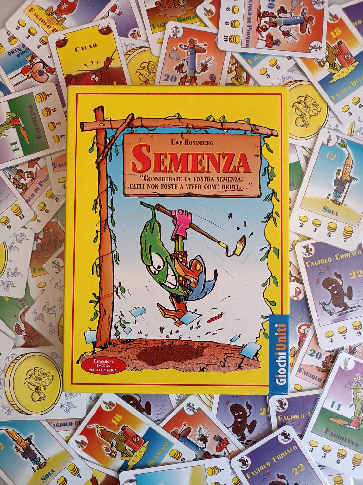
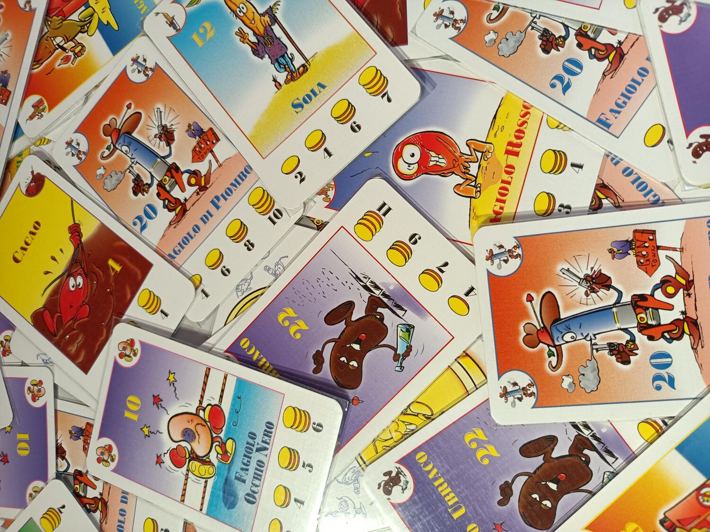
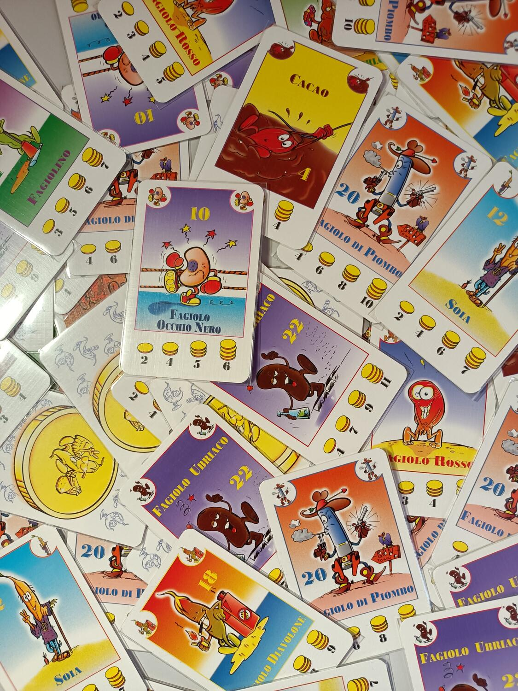

<Setting>

  Coltivare e vendere fagioli non è mai stato così divertente e competitivo!
  Diventa un agricoltore, semina e vendi tanti fagioli diversi al mercato.
  Scambia semi con i tuoi avversari e guadagna più monete possibile! La strada
  per la vittoria non è sempre tutta rose e “fagioli”.

</Setting>

<Rules>

  In Semenza dovremo gestire la nostra mano di carte e scambiare fagioli con i
  nostri avversari per guadagnare più monete possibile dalla loro vendita. La
  prima e fondamentale regola di Semenza è che, durante tutta la partita, non vi
  sarà consentito modificare l’ordine delle vostre carte in mano. Avete sentito
  bene giocatori di scala quaranta e burraco: tenete le vostre mani ben legate,
  perché non potrete metterle in ordine per nessun motivo.  
  Una volta distribuite le carte e i due campi iniziali ad ogni giocatore, la partita
  può avere inizio. Il turno di un giocatore è diviso in quattro fasi ben distinte,
  ma prima di andare a descriverle, bisognerà fare un attimo attenzione alle regole
  della semina e della vendita dei fagioli, che sono il vero e proprio fulcro del
  gioco.  
  Ogni giocatore avrà a disposizione ad inizio partita due campi su cui
  coltivare. Quando dovrete piantare un fagiolo in un campo, se è presente un
  campo con lo stesso tipo di seme, potrete semplicemente impilarlo sui fagioli
  già presenti. Se non c’è lo stesso tipo di seme, e avete un campo libero,
  semplicemente iniziate una nuova fila in quel campo. Ma se i campi sono già
  tutti occupati, sarete costretti a vendere i vostri fagioli. Quando vendete
  fagioli, ottenete tante monete quanto riportato sulla carta; ovviamente,
  fagioli più rari vi faranno guadagnare più monete con meno carte.  
  A inizio turno, il giocatore sarà costretto a piantare il primo fagiolo in ordine
  nella sua mano, seguendo le regole appena spiegate. Una volta fatto, potrà, se
  vorrà, piantare un secondo seme, non di più. A questo punto, inizierà la seconda
  fase: il mercato. Il giocatore semplicemente pesca due carte e le mette scoperte
  sul tavolo. Queste sono due suoi fagioli, che dovrà piantare per forza. Qui però
  entra in gioco la parte più divertente di Semenza: la contrattazione. I giocatori
  potranno infatti scambiare (o donare) carte dalle loro mani con il giocatore di
  turno, scambiandole con le carte del mercato o con le carte in mano (le carte già
  seminate non possono essere scambiate). Questa fase è estremamente importante,
  perché non solo vi permetterà di ottenere i fagioli che volete, ma soprattutto
  di disfarvi di carte fastidiose in mano.  
  Durante la terza fase, semplicemente, i giocatori saranno costretti a seminare
  tutti i fagioli scambiati durante la seconda fase, quindi occhio a quello che
  prendete!  
  Alla quarta fase, il giocatore pesca tre carte e termina il turno.  
  Durante la partita i giocatori potranno in qualsiasi momento vendere i loro
  fagioli, e in caso in cui abbiano abbastanza monete, comprare persino un terzo
  campo in cui coltivare. Una volta che il mazzo è terminato tre volte la
  partita finisce e il giocatore che ha accumulato più carte è il vincitore.

</Rules>

<Feedback>

  Semenza è una delle perle del buon vecchio Rosemberg. Un titolo che, pur con i
  suoi annetti, continua ad essere giocato e intavolato in tantissime case. Ho
  sempre desiderato provarlo nel corso della mia carriera da giocatore da
  tavolo, ma a causa della scarsità di copie sul mercato ho sempre avuto
  difficoltà. Quando sono riuscito ad averlo, ho capito che avrei dovuto
  comprarlo molti anni prima.  
  Un gioco semplicemente fantastico. Divertente, semplice e per tutti i tipi di giocatori.
  Ovviamente non stiamo parlando di un capolavoro, ma fa il suo sporco lavoro. Le
  regole sono immediate e facili da spiegare, comprensibili anche per giocatori novizi.
  La durata è contenuta e una partita scorre veloce, anche grazie alla fase del mercato,
  che limita i tempi morti durante i turni degli altri giocatori. La rigiocabilità
  non è proprio il massimo, ma ho apprezzato moltissimo la versione italiana, che
  nel gioco base presenta già due espansioni: gli incarichi, la versione per due
  giocatori e qualche fagiolino in più. La scalabilità è ottima, anche se preferisco
  intavolarlo sempre con più giocatori possibili, per creare un po’ più di confusione
  e brio al tavolo.  
  Unica pecca del gioco sono probabilmente i materiali: purtroppo, Semenza
  rimane un gioco vecchiotto, e i componenti non reggono il confronto con le
  grafiche e i materiali dei nuovi giochi.  
  Detto questo, Semenza è un gioco che consiglio vivamente, e che difficilmente non
  amerete fin dalle prime partite. Un titolo per ogni tipo di giocatore, ma consigliatissimo
  per novizi o per giocatori che preferiscono una chiacchiera in più rispetto ad
  un mal di testa al tavolo.

</Feedback>

