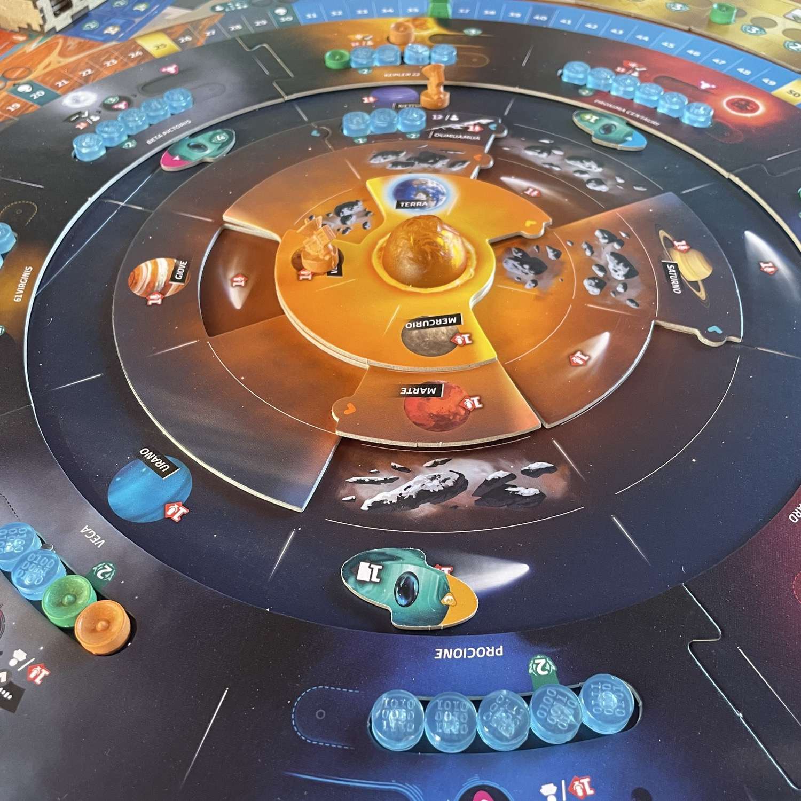
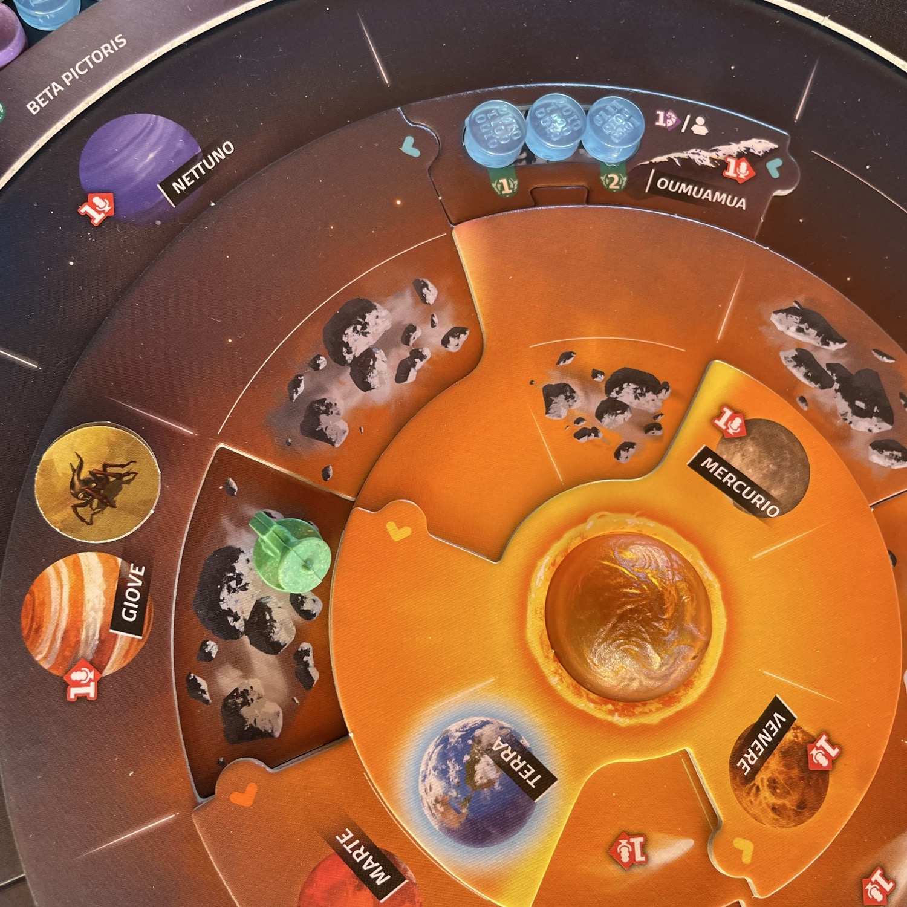
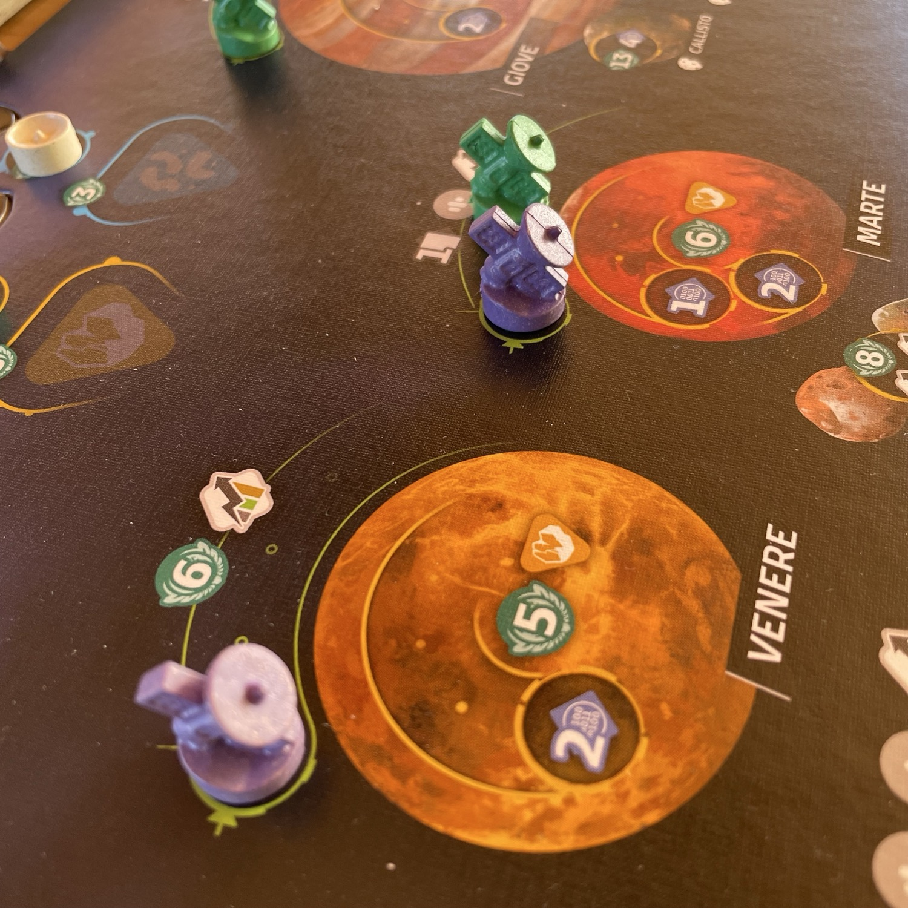

<Setting>

  Per gli amanti dello spazio, senza guerre transgalattiche e combattimenti al cardiopalma alla <Link to="/reviews/twilight-imperium-4a-edizione/">Twilight Imperium</Link>, la ricerca di intelligenza extraterrestre è giunta al termine: registrate segnali dalle stelle vicine, analizzate i dati e inviate le vostre sonde e i vostri moduli di atterraggio a perlustrare il sistema solare alla ricerca di forme di vita al di là della Terra! E se, come me, siete cresciuti guardando Independence Day (quello "bello”, il primo, bello pieno di stereotipi machisti, di alieni brutti e cattivi, e di sangue versato sempre e solo americano… bello, no?), prendetevi gioco di Emmerich mettendo in sottofondo "It's the End of the World" dei R.E.M. e tenetevi forte: lo spazio non è mai stato così popolato! 

</Setting>

<Rules>

  Ogni giocatore riceve un proprio <strong>tabellone giocatore</strong>. Si dispone il <strong>tabellone principale (Sistema Solare)</strong> con i pianeti e i loro satelliti e si collocano casualmente 2 delle 5 specie aliene sui relativi slot, coperte. Si distribuiscono le carte progetto, tecnologie e risorse iniziali (energia, crediti) come da setup. Il gioco si svolge nel corso di 5 round. 
  Durante il proprio turno, il giocatore può effettuare <strong>un’azione principale</strong> a scelta, e poi eventualmente azioni libere gratuite, rispettandone le condizioni. Le principali azioni possibili includono: 
  <ul>
    <li>la <strong>Scansione</strong> di una regione stellare dal tabellone Terra per raccogliere dati</li>
    <li><strong>Analisi dei dati</strong> accumulati per identificare tracce di vita extraterrestre</li>
    <li><strong>Ricerca tecnologica</strong> per sviluppare nuove migliorie che daranno vantaggi procedurali nello svolgimento delle azioni</li>
    <li><strong>Lancio di una sonda</strong>, o messa in orbita, o atterraggio su pianeti o lune per raccogliere campioni</li>
    <li><strong>Giocare una carta progetto</strong> che fornisce effetti speciali, bonus o punti vittoria</li>
  </ul>
      Dopo l’azione principale, il giocatore può eseguire le azioni libere consentite (ad es. spostare sonde pagando energia, acquistare carte, scambiare risorse). 
      Le sonde possono essere <strong>lanciate</strong>, poi spostate in orbita oppure fatte atterrare sui corpi celesti a cui sono state destinate per raccogliere dati, campioni o segnali. I dati raccolti vanno <strong>trasferiti</strong> al computer e poi <strong>analizzati</strong> per contribuire a svelare specie aliene e ottenere punti vittoria. Il tabellone con i pianeti ruotabili rappresenta il moto orbitale del sistema solare e introduce una variabilità strategica sul dove e quando inviare sonde. Il gioco termina alla fine del quinto round. 
      Il conteggio dei punti vittoria include carte progetto giocate, missioni completate, atterraggi e orbite delle sonde, scoperta di specie aliene, tecnologie sviluppate. Il giocatore con <strong>più punti vittoria</strong> vince.

</Rules>

<Feedback>

  Non capita spesso di imbattersi in un titolo gestionale che riesca a essere <strong>profondamente tematico</strong> e al tempo stesso <strong>snello e leggibile</strong> fin dalla prima partita. <em>SETI – Ricerca di Intelligenza Extraterrestre</em> vi sorprenderà proprio per questo: ogni azione sembra avere un senso narrativo chiaro; non si stanno muovendo cubetti a caso, ma si sta<strong> “davvero” cercando vita tra le stelle</strong>. E cerca che ti cerca, a un certo punto questa vita la si scoprirà! 
  Ogni turno contribuite a una piccola storia dell'esplorazione spaziale: scansioni, analisi, lanci di sonde, sponsor pubblicitari e ricerche tecnologiche. Tutto scorre senza tempi morti, con un flusso che resta sempre coerente col tema scientifico senza perdere in termini di eleganza delle meccaniche. A ciò si aggiunge <em>l’ergonomia del tabellone rotante:</em> l’idea di far “orbitare” i pianeti non è solo scenografica, ma introduce decisioni tattiche costanti (al limite dell'imprevedibilità quando si gioca in 4) sul dove e quando inviare le proprie sonde o registrare segnali da determinati settori. Qui non si tratta di ottimizzare una fabbrica, ma di<strong> organizzare una missione spaziale</strong> che cresce di complessità a mano a mano che si svelano nuove forme di vita. <strong>L’ambientazione scientifica viene trattata con enorme rispetto:</strong> c’è un gusto per il dettaglio astrofisico che raramente si trova nei giochi da tavolo e, come in <Link to="/reviews/terraforming-mars/">Terraforming Mars</Link>, si sente la mano di autori che amano la ricerca vera. E, mentre passiamo dalle parti di Marte, dato che i due titoli sono stati messi a confronto, vorrei dire anch’io la mia su quella che in parte reputo <strong>un’indebita analogia</strong>: è vero che entrambi sono (prevalentemente) giochi di gestione carte, ma in <em>Terraforming Mars</em> la costruzione del motore è più solida, elegante e immersiva; in <em>SETI</em> lo stile è più ruvido, perché avendo una carta si pensa a giocarla per un beneficio immediato, piuttosto che incastonarla in un motore armonico e duraturo. Per quanto riguarda la scansione della partita, i 5 turni di SETI non sono affatto sullo stesso piano delle circa 14 generazioni di TM: la varietà delle possibili azioni che si possono svolgere in quest’ultimo non è paragonabile alle ristrettezze che impone SETI. E poi TM è un gioco millesimale: ogni singola azione va sfruttata millimetricamente e un solo megacredito in più o in meno cambia le sorti di un’intera generazione. In SETI, invece, la focalizzazione gestionale di un turno è più sgranata, grossolana, perfino imprevedibile. Senza voler far pesare la mia (palese) predilezione per TM, dirò che la differenza sostanziale tra i due titoli sta nel pubblico: <em>Terraforming Mars</em> è un motore di produzione industriale mascherato da esplorazione planetaria rivolto a menti ingegneristiche e strutturate, mentre <em>SETI</em> è, principalmente, <strong>un gioco di scoperta, scienza e meraviglia</strong> che richiede il suo impegno, intendiamoci, ma con maggiore distensione. Non produci, <em>osservi</em>; non accumuli, <em>interpreti</em>. È un gestionale, sì, ma col cuore di un esploratore: e la scoperta delle specie aliene, soprattutto durante le prime partite (poi un po’ la suspense calerà), cambia il flavour del gioco, introducendo, oltre alla novità, dei momenti di intensa apprensione alla Three Body Problem. Devo ammettere che pochi giochi di gestione risorse mi hanno lasciato un sapore del genere.  
  Forse il <strong>numero di componenti</strong> presenti può intimorire i neofiti alla prima apertura della scatola, ma dopo due turni tutto diventa naturale: personalmente, ho ancora una volta azzerato i tempi di setup e desetup grazie al salvifico intervento del setupper dei <a href='https://thedicetroyers.com/it/shop/seti-ita/?srsltid=AfmBOooZnqB9RYzEUs70M' target="_blank">The Dicetroyers</a>, che consente un’organizzazione chiara, rapida e pulita; ne amo particolarmente l'Alzacinesca (che trasforma la custodia delle carte in portamazzi con alzata) e i tray per i token tech (un incubo organizzativo risolto con eleganza ed efficacia). È raro trovare organizer che sappiano valorizzare così bene la componente scenica di un gestionale: in un gioco come SETI, direi che uno strumento del genere diventa essenziale, per poter disporre di un tavolo che <em>invita a giocare</em> e a essere imbastito con frequenza. 
  Per concludere: SETI – Ricerca di Intelligenza Extraterrestre è uno dei <strong>migliori eurogame tematici degli ultimi anni</strong>, un titolo che unisce la solidità strategica di un gioco per esperti con la capacità evocativa della narrazione. Un’esperienza da provare, soprattutto se siete stanchi di gestire risorse in astratto e volete finalmente <strong>sentirvi esploratori del cosmo</strong>.

</Feedback>

