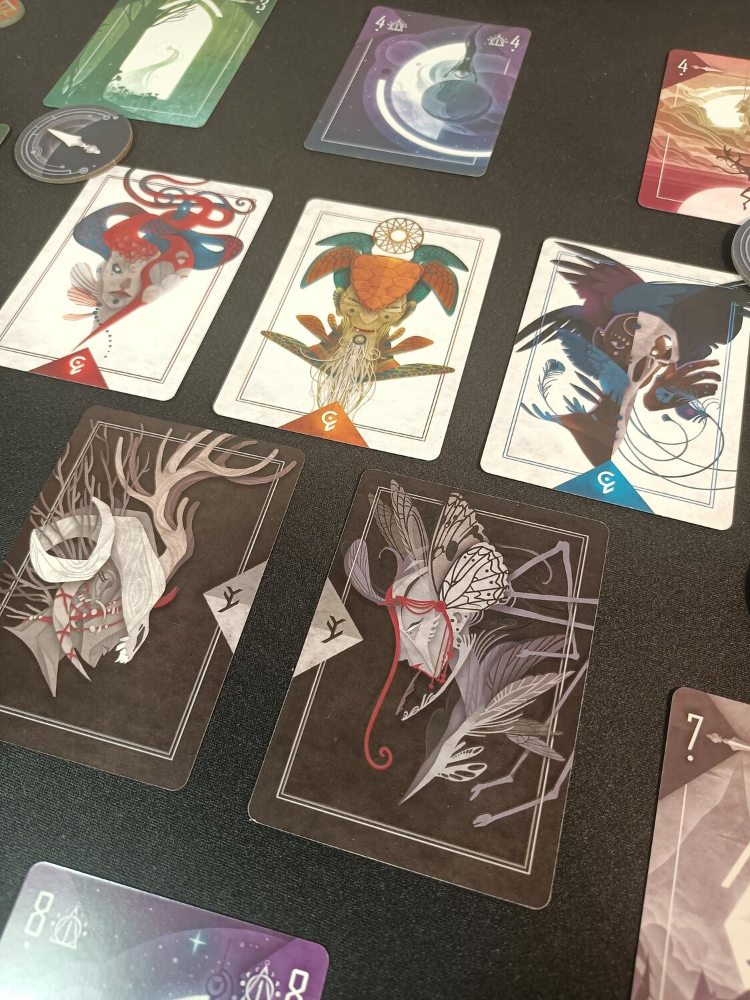
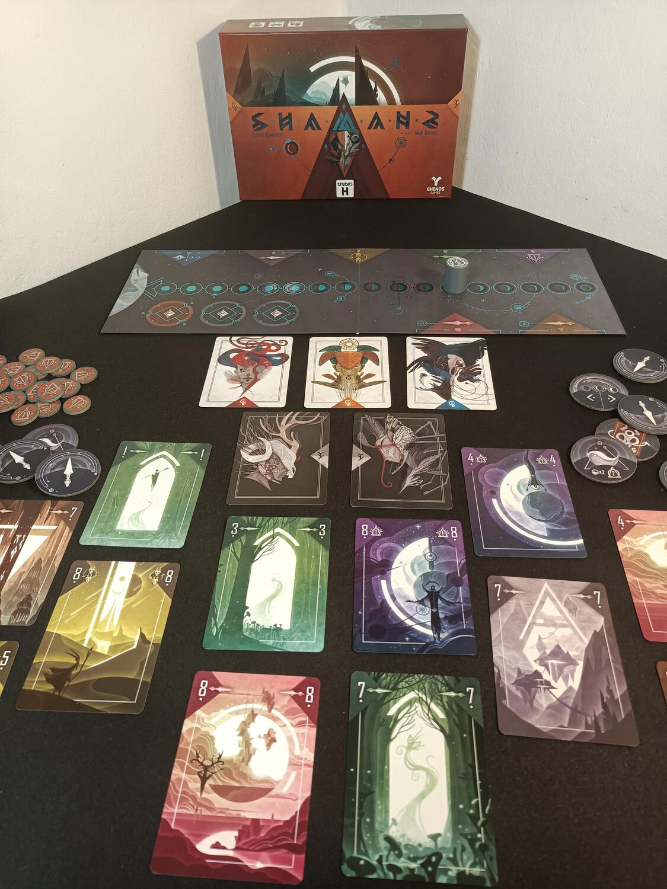

<Setting>

  Il mondo degli spiriti non è più al sicuro. Le ombre si aggirano tra i tuoi
  pari, mentre aspettano l’eclissi lunare per immergere il mondo nell’oscurità.
  Crea alleanze e cerca di completare i rituali nei vari mondi per fermare i
  tuoi avversari. Ma attento a non fidarti di tutti.

</Setting>

<Rules>

  Shamans è un gioco di carte basato sulle prese a mo’ di briscola. All’inizio
  di ogni round ogni giocatore riceverà un ruolo nascosto (ombra o luce). Gli
  sciamani bianchi dovranno cercare di scongiurare l’eclissi lunare oppure
  eliminare le ombre; gli sciamani neri, invece, avranno il compito di
  velocizzare l’arrivo dell’eclissi. All’inizio di ogni turno, la Guida giocherà
  la prima carta: essa stabilirà il mondo in cui gli sciamani procederanno a
  iniziare o continuare un rituale. In senso orario gli altri giocatori potranno
  rispondere con lo stesso “seme” della carta giocata oppure giocare un altro
  seme. Nel secondo caso, la carta viene immediatamente messa nella colonna
  delle carte del mondo a cui appartiene, e il contatore dell’eclissi si
  avvicinerà di un passo. In questo caso c’è la possibilità che si inneschi un
  rituale, come si vedrà successivamente. Si procede in questo modo, fino a
  quando ogni giocatore avrà giocato una carta; a questo punto tutte le carte
  del mondo selezionato dalla Guida andranno posizionate nella colonna del mondo
  di appartenenza. Il giocatore che ha giocato la carta con il numero più basso
  potrà prendere un gettone Artefatto, che gli garantirà un potenziamento. Il
  giocatore che ha giocato la carta con il numero più alto diventerà la nuova
  Guida e, nel caso in cui tutte le carte di quel mondo siano state giocate,
  potrà usufruire del rituale. I rituali permettono di ottenere punti, scambiare
  i ruoli, far retrocedere il segnalino eclissi o addirittura di eliminare un
  altro giocatore. Se il giocatore possiede un pugnale del sacrificio sceglierà
  un altro sciamano che verrà sacrificato. Nel caso in cui fosse uno sciamano
  bianco, tutte le sue carte andranno scartate scoperte, facendo avanzare il
  contatore di tante caselle quante sono le carte; se invece fosse uno sciamano
  nero, le sue carte saranno posizionate nei vari mondi e, nel caso in cui un
  mondo venga completato, il giocatore che ha attivato il rituale di sacrificio
  potrà attivare anche gli altri rituali. La partita termina non appena il
  segnalino eclissi arriva alla fine del tracciato, portando alla vittoria degli
  sciamani dell’ombra, che otterranno così 3 punti vittoria. In caso contrario,
  cioè se gli sciamani della luce hanno eliminato tutte le ombre o hanno
  scongiurato l’eclissi, questi saranno i vincitori e otterranno 2 punti
  vittoria. Al termine di questa fase, il giocatore che ha collezionato almeno 8
  punti vittoria è dichiarato il vincitore. Se tale condizione non dovesse
  verificarsi, si giocherà un altro round, ridistribuendo i ruoli e le carte.

</Rules>

<Feedback>

  Shamans mi ha sorpreso fin dalla prima partita. La sua grafica minimal e
  colorata nasconde un gioco di bluff e di strategia davvero ben congegnato. Le
  regole, pur essendo poco immediate, si imparano davvero in pochi turni,
  permettendo ai giocatori di immaginare e creare strategie sempre diverse ad
  ogni partita. I ruoli nascosti aggiungono un ulteriore gradino di divertimento
  e suspense al tavolo, costringendo i giocatori a bluffare round dopo round per
  guadagnarsi i pochi punti che serviranno per vincere. I metodi per ottenerli
  sono molteplici: non solo vincendo un round, ma anche attraverso rituali o
  segnalini artefatti. Questo permette di avere varie strade da poter
  percorrere, nell'eventualità che si presentino carte davvero scadenti. Va
  anche puntualizzato che se un giocatore viene eliminato non otterrà punti
  vittoria in qualsiasi caso, quindi c’è da aspettarsi tradimenti anche da
  compagni di squadra. La differenza di esperienza si sentirà comunque al
  tavolo, poiché le tempistiche di giocata e le strategie più ottimali saranno
  più accessibili a giocatori navigati, ma la semplicità delle regole permette
  di superare questo scoglio molto velocemente, considerata anche la popolarità
  dei giochi di “prese”. La scalabilità è davvero ottima, anche se il gioco
  cambia parecchio in base al numero di giocatori. In tre, gli sciamani bianchi
  potranno giocare un partita anche senza collaborare troppo. La situazione è
  completamente diversa in cinque giocatori, poiché se la luce non collaborerà
  fin da subito, lascerà carta bianca all’ombra. Per concludere, Shamans è un
  titolo che sento di consigliare a tutti: un ottimo gioco di carte astratto con
  ruoli nascosti, con una durata contenuta e regole semplici. Che volete di più?

</Feedback>
