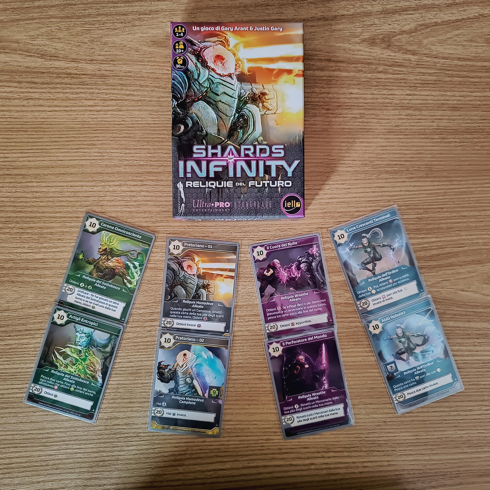
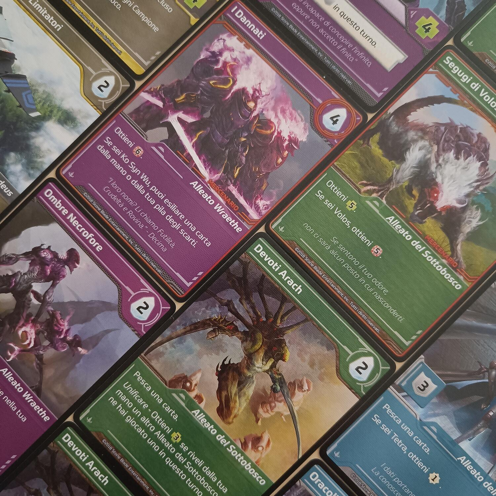

<OriginalReviewLink slug="shards-of-infinity" />

<Panoramic>

  Dal controllo dei Frammenti dell’Infinito dipende il destino del mondo. La
  sfida tra i Wreathe, gli Homodeus, l’Ordine e la Fazione del Sottobosco non è
  mai stata così accesa, soprattutto ora che sono state scoperte le Reliquie del
  Futuro, dei manufatti di inimmaginabile potenza, capaci di volgere in proprio
  favore le sorti della guerra. Chi prevarrà?
   
  Shards of Infinity – Reliquie del Futuro è un’espansione che aggiunge al gioco
  8 nuove diverse carte, le Reliquie dell’Infinito, 2 per ogni fazione: queste
  carte saranno in possesso di ciascun giocatore fin dal principio, ma se ne
  potrà reclutare solo una, appena raggiunto il livello 10 di Padronanza. Gli
  effetti di queste carte sono devastanti (una permetterà di infliggere ben 10
  ferite e di pescare tre carte extra; un’altra permetterà di curarsi di 50
  punti vita; un’altra di infliggere 12 ferite ogni volta che si gioca un
  Campione dalla propria mano; etc.). Ciascuna, poi, si potenzierà ulteriormente
  una volta raggiunto il livello 20 di Padronanza.
   
  L’espansione fornisce, inoltre, altre 24 carte, da mischiare insieme alle 88
  del gioco base, ampliandone la varietà e fornendo nuovi effetti specifici per
  il personaggio scelto, introducendo oltretutto l’asimmetria delle fazioni.

</Panoramic>

<Feedback>

  Questa espansione, pur nella sua scarsa quantità di materiali (alla fine sono
  solo 32 carte), si rivela in poco tempo fondamentale, a tal punto che secondo
  noi dovrebbe far parte fin da subito della vostra versione di Shards of
  Infinity: introduce una caratterizzazione dei personaggi e quindi delle
  fazioni, riequilibra l’efficacia delle combinazioni possibili tra le carte dei
  vari colori e permette, quindi, la sperimentazione di nuove strategie per la
  vittoria in base al personaggio scelto. Si potrà, ad esempio, puntare tutto
  sul reclutamento dei Campioni oppure tutto sulla Padronanza, strade che nel
  gioco base non parevano mai essere vincenti.
   
  Con questa espansione, Shards of Infinity fa un salto di qualità, arrivando a
  stregarci definitivamente grazie alla sua semplicità, immediatezza e
  variabilità.
   
  Detto ciò vi salutiamo, anche perché abbiamo già imbastito Shards of Infinity
  sul tavolo (con l’espansione!), pronto per un’altra partita!

</Feedback>

