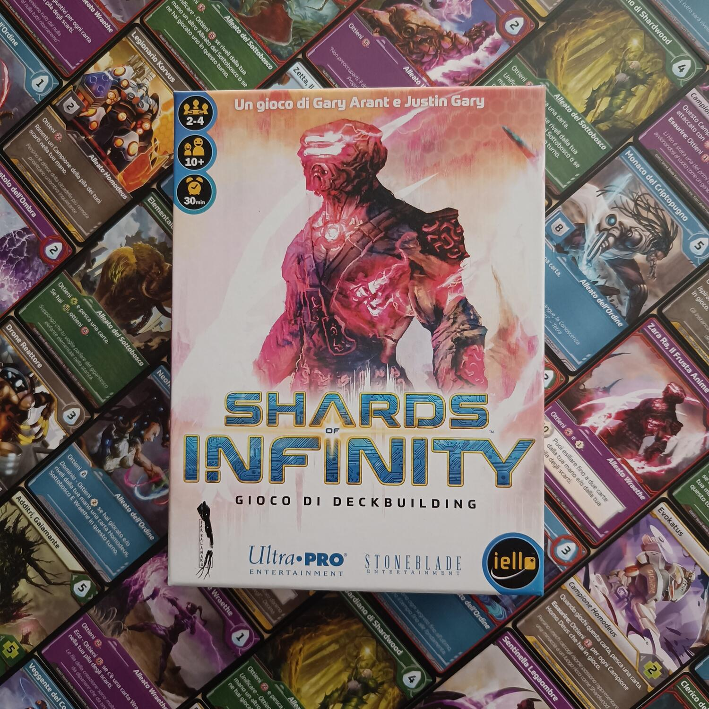
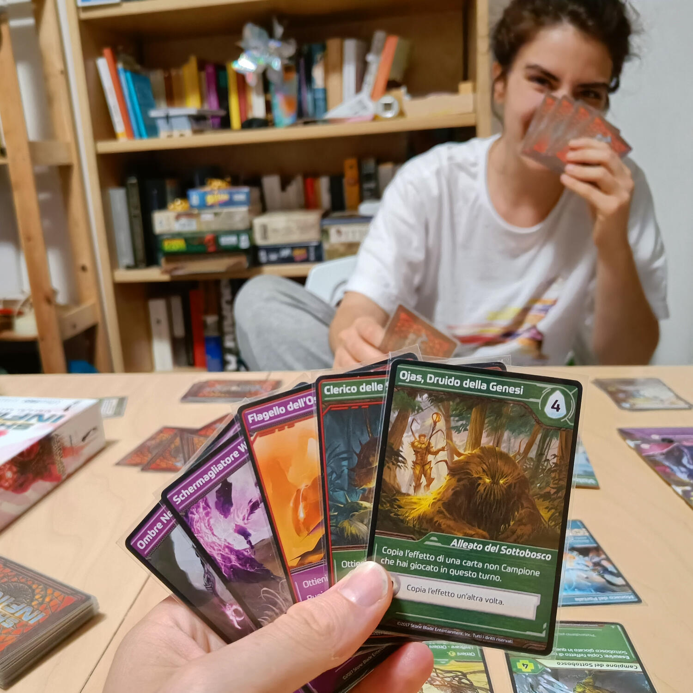
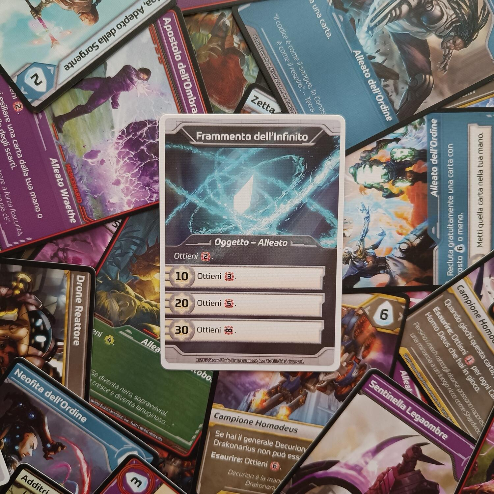

<Setting>

  In un tempo e in una dimensione che non ci appartengono, gli uomini crearono
  il Motore dell’Infinito, un congegno in grado di distorcere la realtà con il
  suo immenso potere e permettere ai suoi possessori di soggiogare tutte le
  nazioni del mondo. Dopo un millennio di schiavitù, questa potentissima arma fu
  distrutta da una rivoluzione: il Motore dell’Infinito fu polverizzato, ma i
  suoi frantumi distrussero anche tutte le città del mondo. Ora quattro diverse
  specie eredi dell’Homo Sapiens si sono levate e si battono per recuperare
  questo frammento e ricostruire così il potere perduto.
   
  Il vostro compito sarà quello di prendere il comando di una di queste specie e
  sfidare all’ultimo sangue i vostri avversari, per ripristinare questi
  potentissimi Frammenti dell’Infinito e stabilire il vostro dominio sul mondo.

</Setting>

<Rules>

  Shards of Infinity è un gioco competitivo da 2 a 4 giocatori, dove l’obiettivo
  è quello di azzerare la vita degli avversari, che inizialmente sarà pari a 50.
   
  La meccanica principale è quella del deck-building: ciascun giocatore inizierà
  con un mazzetto base di dieci carte (uguali per tutti) e, nel corso della
  partita, spendendo i cristalli a disposizione potrà acquistarne di nuove e con
  vari effetti. Queste saranno acquisibili da un pool a disposizione di tutti e
  sempre di sei carte (ogni volta che ne andrà via una ne verrà pescata un’altra
  dal mazzo principale), e verranno posizionate negli scarti di ciascun
  giocatore. Quando le carte da pescare si esauriranno (questo succederà
  numerose volte nel corso della partita), tutti gli scarti verranno mischiati
  per riformare il mazzo, che quindi conterrà anche le carte acquistate
  precedentemente.
   
  Ogni turno si pescheranno 5 carte, che potranno essere:
  <ul>
    <li>Cristalli, cioè la valuta per acquistare nuove carte;</li>
    <li>      Alleati, carte che verranno giocate ma poi scartate alla fine del turno;</li>
    <li>      Campioni, i quali invece rimarranno in gioco fino a quando un avversario
      non li sconfiggerà;</li>
  </ul>
  Ogni carta, di quattro fazioni differenti, potrà fornire punti potere (il
  danno da infliggere all’avversario o a un suo campione), ripristinare punti
  vita, permettere di pescare carte e altri effetti ancora, che spesso e
  volentieri potranno essere combinati con altre carte per creare combo
  devastanti. Alcune carte saranno dei “mercenari”, e potranno quindi essere
  usate istantaneamente per essere però poi rimosse dalla partita.
   
  Vi è inoltre la “Padronanza”, un’abilità speciale a disposizione di ciascun
  giocatore e che potrà essere pian piano implementata fino ad un massimo di 30:
  a seconda del livello raggiunto, questa aumenterà notevolmente gli effetti di
  varie carte, tra cui quella del Frammento dell’Infinito, una carta base sempre
  presente nel mazzetto iniziale di ciascun giocatore. Con una padronanza di 30,
  questa porterà ad infliggere infiniti (avete letto bene!) danni
  all’avversario, vincendo quindi ovviamente la partita.

</Rules>

<Feedback>

  Come molti di voi avranno notato, il gioco attinge a piene mani dai classici
  del deck building (sì, stiamo proprio parlando di{" "}
  <Link to="/reviews/star-realms/">Star Realms</Link>), introducendo però due
  interessanti novità: i mercenari e la Padronanza, che garantiscono un
  ulteriore livello di profondità tattica.
   
  Il gioco è semplice da spiegare e da imparare, e per noi è stata come una sana
  “droga”: le partite sono brevi ma quasi sempre creano sfide molto tirate,
  nelle quali la tensione per riuscire a rubare la giusta carta all’avversario
  si farà sempre più pressante. Inizialmente il gioco pareva sbilanciato, in
  quanto le carte verdi (la Fazione del Sottobosco) sembravano molto più forti
  delle altre: con il passare del tempo e delle partite, ci siamo però resi
  conto che le strategie in realtà sono numerose e i poteri delle carte
  equilibrati anche fra le altre fazioni.
   
  Il numero ideale di giocatori è 2: con numeri differenti il gioco non rende al
  meglio, e soprattutto in 3 le partite girano male.
   
  Per quanto il gioco base sia godibile, riteniamo quasi obbligatorio aggiungere
  fin da subito l’espansione{" "}
  <Link to="/reviews/shards-of-infinity-reliquie-del-futuro/">
    Reliquie del Futuro
  </Link>
  , che introduce asimmetria tra i giocatori e garantisce più rigiocabilità (il
  solo gioco base dopo alcune partite rischia di diventare un po’ ripetitivo).
   
  Shards of Infinity è stato per noi un’ottima scoperta: pur prendendo spunto da
  altri deck building, il gioco ha una sua chiara identità, è facile da
  intavolare, veloce e crea sempre delle sfide tese tra due giocatori. Vi diamo
  un solo avvertimento: crea dipendenza!

</Feedback>

