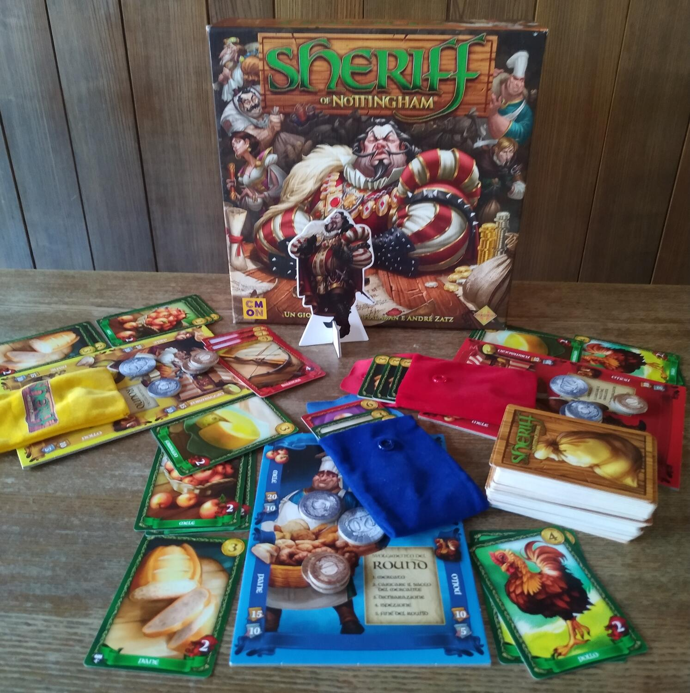
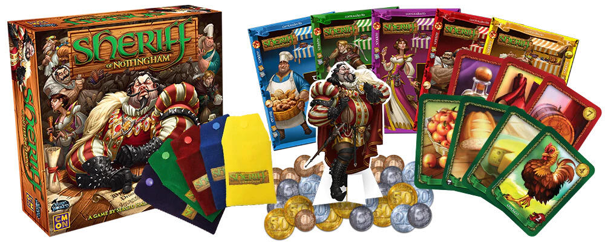

<Setting>

  Quell'avido, cupido, pavido, stupido d'un re fasullo d'Inghilterra ne ha fatta
  un'altra delle sue! Il principe Giovanni ha ordinato allo Sceriffo di
  Nottingham di perquisire ogni commerciante e confiscare tutte le merci di
  valore. Tuttavia il principe non conosce le debolezze dello Sceriffo quanto
  voi, ed è sempre possibile fargli chiudere un occhio con una bella mazzetta!
  Riusciranno i commercianti ad ingannare lo Sceriffo o sarà lui a raggirarli?

</Setting>

<Rules>

  Ogni giocatore inizia la partita con 50 soldi e 6 carte merci in mano.La
  partita si suddivide in round. In ognuno di questi un giocatore interpreta il
  ruolo dello Sceriffo, mentre gli altri sono semplici commercianti.Tutti i
  giocatori avranno 6 carte in mano che possono essere merci legali o di
  contrabbando. All'inizio del round i commercianti possono scartare fino a 5
  carte e ripescarne altrettante, dopodiché, mettono contemporaneamente fino a 5
  delle carte che hanno in mano nella propria sacca del mercante. Ciascun
  giocatore dichiarerà poi allo Sceriffo quante carte sono nella sua sacca e un
  tipo di merce legale. Ci sono quattro tipi di merci legali: mele, pani,
  formaggi e polli. A questo punto lo Sceriffo, per ogni mercante può decidere
  se ispezionare la sacca oppure no. In questa fase tutti i giocatori possono
  offrire denaro o carte che hanno venduto precedentemente per corrompere lo
  Sceriffo a non ispezionare la propria sacca o addirittura ad ispezionare le
  sacche degli altri. Allo stesso modo lo Sceriffo può chiedere una tangente
  specifica ad un giocatore per chiudere un occhio. Se la sacca di un mercante
  non viene ispezionata, questi vende tutte le merci al suo interno
  posizionandole poi nelle sue merci vendute. Se invece la sacca viene
  ispezionata ci sono due possibilità: se la sacca contiene le merci dichiarate,
  lo Sceriffo deve pagare al commerciante un’ammenda per aver dubitato della sua
  onestà, ma se anche una sola merce non è del tipo dichiarato, il giocatore
  deve pagare lo Sceriffo per ogni merce non dichiarata, queste verranno poi
  confiscate dallo Sceriffo e scartate. In ogni caso le merci dichiarate
  correttamente vengono vendute dal commerciante. Come ultima fase del round i
  commercianti ripescano fino ad avere 6 carte in mano, poi si passa al round
  successivo in cui un altro giocatore interpreta lo Sceriffo. Dopo che tutti i
  giocatori hanno interpretato due volte lo Sceriffo la partita si concluderà e
  si conteranno i soldi in possesso di ogni giocatore,aggiungendo poi il denaro
  ricavato dalle merci vendute e alcuni soldi derivanti da titoli assegnati ai
  giocatori che hanno venduto più merci legali. Il giocatore più ricco sarà
  dichiarato vincitore

</Rules>

<Feedback>

  Le regole del gioco risultano abbastanza scorrevoli , anche un bambino è in
  grado di comprenderle. Ciò che rende il gioco interessante è la fase di
  ispezione, in cui i commercianti provano a bluffare per ingannare lo Sceriffo.
  Un giocatore può non offrire nulla per corrompere lo Sceriffo perché ha solo
  le merci dichiarate, ma se invece stesse bluffando e avesse delle merci di
  contrabbando? Oppure potrebbe offrire una tangente pur non avendo merci di
  contrabbando per far credere allo Sceriffo di avere merci di contrabbando e
  farsi ispezionare. E tu quali strategie adotterai? Riuscirai a gabbare i tuoi
  amici e dimostrare di essere il miglior commerciante?

</Feedback>

