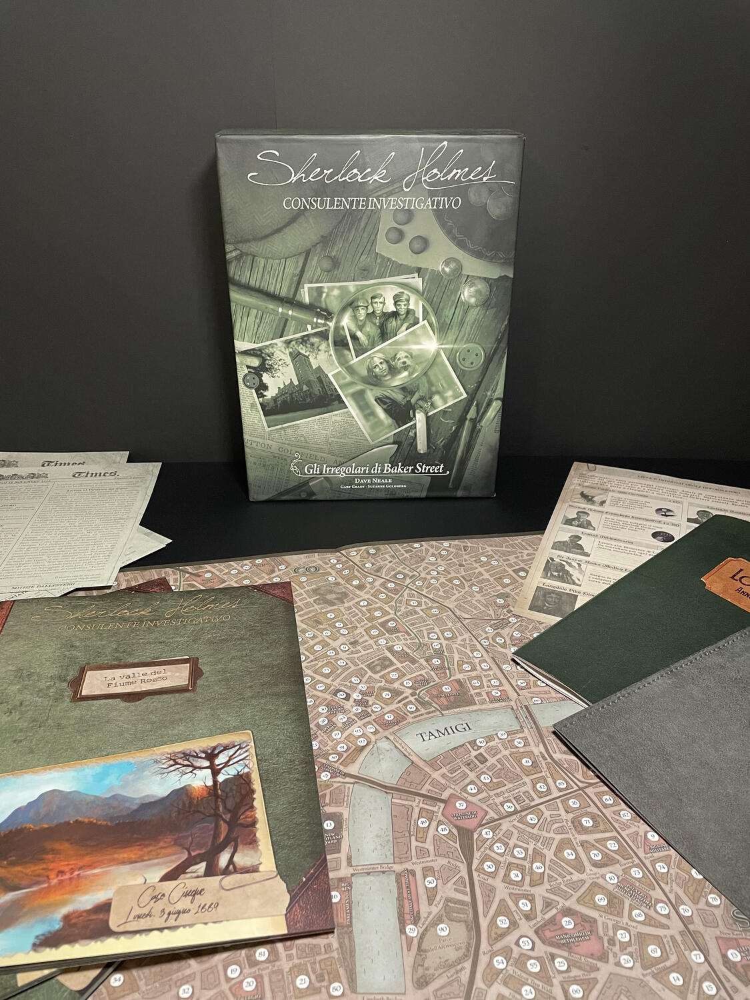
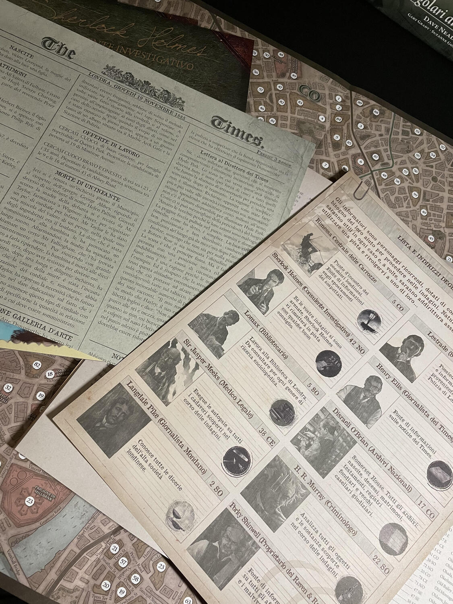

<Setting>

  Londra, ultimo quarto del XIX secolo. La città dominatrice del mondo si schiude sotto i vostri occhi, mentre crimini
  efferati, subdoli e raffinatissimi avvengono in ogni suo anfratto. Sono i tempi della Queen Victoria… Sono i tempi di
  Jack the Ripper… Sono i tempi di Sherlock Holmes! E voi non potreste cascare meglio: nei panni dei{" "}
  <strong>collaboratori ufficiosi</strong> del celebre detective, e del suo fidato Watson, sarete incaricati di svolgere
  indagini sul campo e, dopo lunghe ricerche, potrete infine cimentarvi con le elucubrazioni del maestro. Preparatevi a
  esercitare la logica, a farvi insospettire dal più piccolo dettaglio e a spremervi le meningi per superare il più
  grande investigatore di tutti i tempi!

</Setting>

<Rules>

  La fortunata serie investigativa conta attualmente 4 box indipendenti: “I delitti del Tamigi e Altri casi”, “Carlton
  House e Queen's Park”, “Jack lo Squartatore e Avventure nel West End” e “Gli irregolari di Baker Street”. Le immagini
  qui presenti si riferiscono a quest'ultima confezione e, anche se idealmente la nostra recensione le abbraccia tutte e
  quattro, “Gli Irregolari di Baker Street” (la più recente) costituisce di fatto una{" "}
  <strong>versione migliorata del sistema di gioco</strong>.
   
  Ogni scatola contiene 10 casi, più o meno indipendenti tra loro. Il vostro scopo è quello di risolvere ogni caso nel
  minor numero di piste possibili, battendo sul tempo Sherlock Holmes stesso.
   
  Fate bollire il tè, leggete l'introduzione, annotate i dati e ragionate con astuzia: sceglierete poi una pista dopo
  l'altra, leggendone il contenuto al paragrafo corrispondente, fino a trovare le informazioni che riterrete necessarie
  a risolvere il caso. Usate la carta di Londra per visualizzare le distanze e gli spostamenti, a volte utili a
  verificare un alibi; i giornali come fonte stimolante di notizie; l'annuario per localizzare gli indiziati; la lista
  dei consulenti per focalizzare meglio le vostre indagini; il tè… beh, per restare svegli un po' più a lungo (e perché
  fa tanto British).
   
  Quando sarete pronti, potrete consultare la lista di domande posta in fondo a ciascun libretto e, in base alle vostre
  risposte, guadagnerete un certo ammontare di punti. Tenete a mente, però, che perderete punti per ogni pista
  consultata in eccesso rispetto a quelle con cui Sherlock avrà risolto il caso. Battere Holmes è veramente difficile…
  ma non impossibile! Buona caccia: «The game is on!»

</Rules>

<Feedback>

  Dopo aver visto tante trasposizioni sul grande e sul piccolo schermo, soprattutto di recente, è difficile impedirsi di
  proiettare su questo titolo la vivace immaginazione e le aspettative che altri prodotti a tema analogo possono
  stimolare. Certo che, se avete almeno letto l'opera integrale di Conan Doyle, visto lo scoppiettante Sherlock Holmes
  di Robert Downey Junior e quello brillantemente sociopatico di Benedict Cumberbatch, quello belloccio e indulgente di
  Henry Cavill e quello meno fortunato, decadente e distopico, di Henry Lloyd-Hughes, vi troverete spesso ad avere
  aspettative, soprattutto in qualche caso, che vi porteranno a fantasticare sulle trame forse più del necessario. Ma
  questo, a ben vedere, non è un difetto: anzi, agli amanti del genere il gioco apparirà quasi come un{" "}
  <strong>glorioso pastiche</strong>, in cui elementi di ambientazione paralleli arricchiranno uno sfondo comune. Non
  dimentichiamo, poi, che abbiamo a che fare con una reinterpretazione squisitamente fedele del classico di Conan Doyle
  (con i suoi margini di autonomia, s'intende), che porta nelle nostre case il brivido della caccia all'uomo e lo fa
  mettendoci a confronto con il più grande segugio di tutti i tempi. E che dire della qualità straordinaria dei
  materiali? A tratti vi sembrerà davvero di trovarvi nello studiolo del 221B di Baker Street o per le strade della
  Londra d'età vittoriana, e gongolerete mentre realizzate quanto il gioco spicchi per immersività tra quelli dello
  stesso genere attualmente in circolazione.
   
  Pur nascendo come cooperativo, volendo adattare un po' il regolamento a seconda delle esigenze “domestiche” di chi lo
  gioca, è possibile sperimentarlo come competitivo, anche a squadre, cosa che a quel punto giustifica più facilmente la
  quantità di giocatori ammessi (1-8). Asmodee, peraltro, mette a disposizione sul suo sito un kit per il gioco a
  distanza: insomma, un titolo anche a prova di distanziamento! Cos'altro c'è da aggiungere?
   È <strong>impossibile</strong> non innamorarsi di questo gioco. È <strong>impossibile</strong> lamentarsi della scarsa
  rigiocabilità dei singoli casi (date le sempre più pregiate espansioni). È <strong>impossibile</strong> non restare ammaliati
  da un classico sempreverde. E, come dice Holmes (quello originale), «Una volta eliminato <strong>    l'impossibile</strong>, ciò che resta, per quanto improbabile, deve essere la verità». Elementare, no?

</Feedback>

