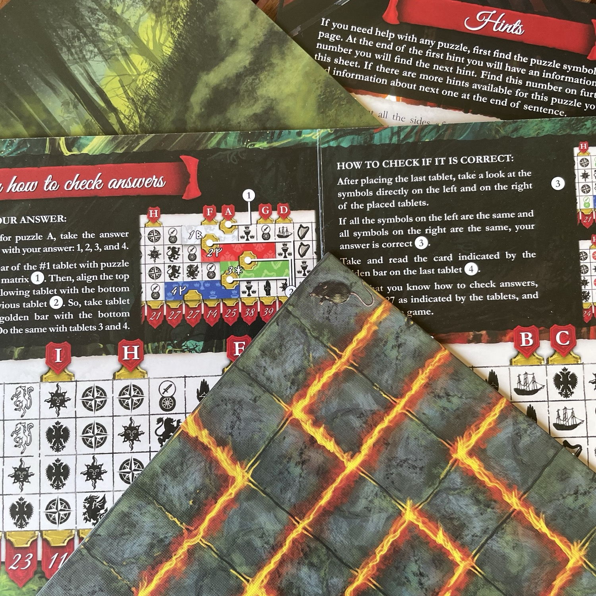
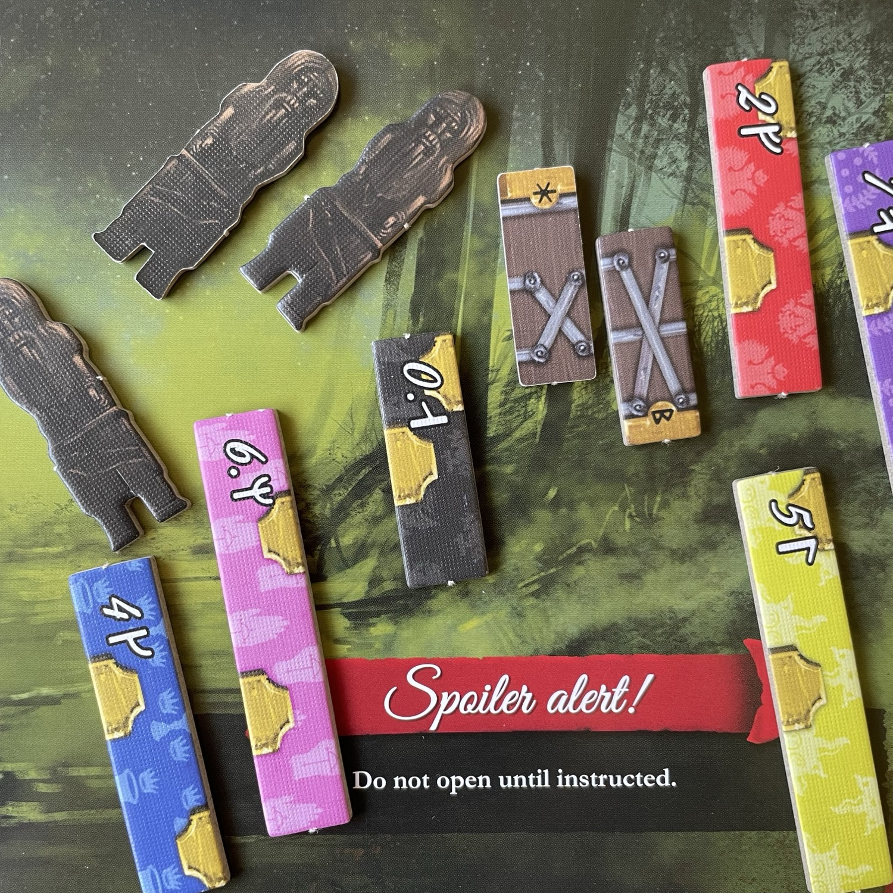
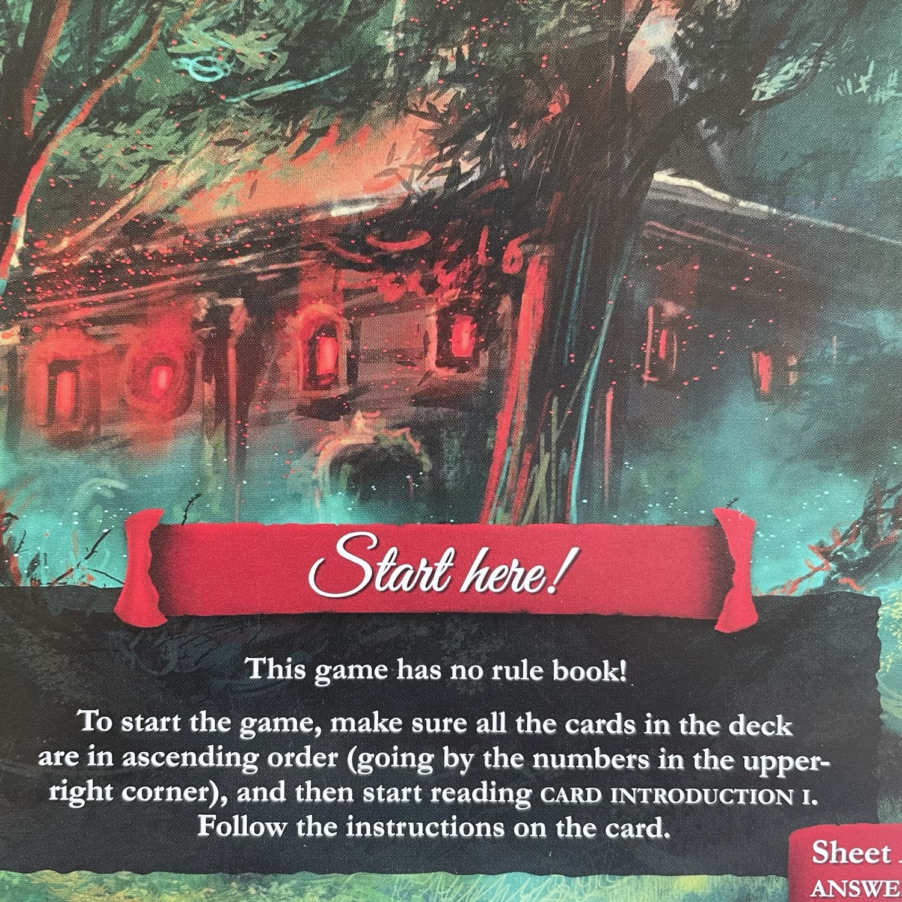

<Setting>

  Presto! A quanto avete sentito nella taverna, lo <strong>Scudo del Drago d’Acciaio</strong> può essere trovato a Nüllrode, ma l’inquisizione è già sulle sue tracce! Siete fortunati che abbiano scelto le strade: voi potrete superarli usando la scorciatoia. Dopo un paio d’ore, due insediamenti terrorizzati e un duello di sciabola assolutamente onorevole, ci siete. Il villaggio sembra noioso, ma c’è una <strong>vecchia cappella pagana</strong>, apparentemente ben sigillata. Intrufolarsi non è un’opzione: è ora di aprire la porta!
  
</Setting>

<Rules>

 Questo gioco <strong>non ha un regolamento</strong>! Consiste semplicemente in <strong>un mazzo di carte numerato</strong>, in ordine ascendente, e <strong>una scatola</strong>. Tutto quello che dovete fare non appena avrete aperto la scatola è seguire le (pochissime) istruzioni di preparazione sulle <strong>carte introduttive</strong> e iniziare la vostra avventura! Scoprirete così che la scatola stessa diventerà il mutevole scenario di gioco e la matrice delle risposte presenta già tutti i dettagli che vi occorrerà conoscere prima di provare a risolvere il primo quiz. Mai visto un regolamento così… Neanche voi, eh? Ah… siete tutti giocatori di escape? Sono l’ultimo arrivato? C’è ancora qualcuno che legge? Pronto? Pronto?? Pronto???
 
</Rules>

<Feedback>

Un’altra escape da tavolo. Ce n’era bisogno? Beh… non ce ne sono mai abbastanza! 
Side Quest 7th Sea è un’avventura abbastanza <strong>divertente</strong> anche per chi ha già fatto esperienza di escape room, a tratti <strong>alquanto cervellotica</strong>, <strong>piena zeppa di logica e intuito</strong>. Se vi piacciono le escape room “al contrario”, qui avrete pane per i vostri denti: non dovrete uscire ma entrare - come sempre, in ogni escape che si rispetti, risolvendo puzzle ed enigmi, uno dopo l’altro. Dovrete setacciare le pareti della cappella, che prenderà forma di fronte a voi: la vera intuizione di chi ha creato il gioco è appunto aver creato uno <strong>spazio tridimensionale</strong>. Forse questo elemento <strong>avrebbe potuto essere implementato e sfruttato</strong> in molti più modi, ma è già una trovata interessante. Poco significativo il ritrovamento di certe carte utensile (di fatto adatte solo a risolvere momenti di <em>impasse</em>: carte che sbloccano altre carte… avrei sperato una maggiore interazione). In ogni caso, se anche gli zucconi come il sottoscritto ce l’hanno fatta, c’è speranza per chiunque… ammesso che sappiate l'<strong>inglese</strong>! 
Il <strong>sistema di verifica delle risposte </strong>è <strong>ingegnoso</strong>, anche se <strong>non del tutto nuovo</strong>, e offre un buon momento di stacco visivo e pausa mentale dall’ultimo estenuante esercizio, consentendovi una transizione liscia da un puzzle all’altro. Il <strong>foglio dei suggerimenti</strong> è costruito in modo da offrire indizi per crescente livello di semplificazione del puzzle, per cui se non avete semplicemente capito cosa guardare o come porvi di fronte alla questione, inizialmente vi indirizzerà semplicemente verso la giusta postura e solo in seguito vi offrirà eventualmente dettagli sempre più espliciti su quello che non avete ancora capito. Per chi ha già giocato escape room, gli <strong>enigmi</strong> avranno un <strong>sapore non particolarmente innovativo</strong>, <strong>ma neppure stantio</strong>. Alcuni puzzle procedono per <strong>associazioni di idee forse un po’ peregrine</strong> e <strong>non sempre autoevidenti</strong> (questo è particolarmente vero in uno o due passaggi del finale di partita), ma con un minimo di flessibilità mentale, esperienza dei linguaggi criptici delle escape e voglia di mettersi in gioco si potrebbe anche riuscire a dare una risposta sufficientemente fantasiosa da essere corretta. Non sottovalutate nulla e abbiate spirito di osservazione. 
Il gioco ha una <strong>durata variabile</strong> tra 1h30’e le 2h (più verso le 2h), a seconda della vostra prontezza e reattività, ma si può sospendere la partita quando si vuole: nessun conto alla rovescia al cardiopalma né sistema di “conteggio punti”… solo l’ignominia di essere rimasti bloccati su quel particolare enigma spremi-meningi.  
Il gioco è comodo da portare dove si vuole, dato il <strong>peso irrisorio</strong> e le <strong>dimensioni quasi tascabili</strong>. 
Si può giocare in solitario, ma più menti all’opera accelereranno la risoluzione di alcuni rompicapo. Godetevi la <strong>dimensione narrativa</strong> che ogni carta riesce a portare in un mondo altrimenti troppo astratto: gli autori hanno davvero saputo creare un <strong>flusso di gioco divertente</strong>, che <strong>smorza la tensione </strong>cerebrale con battute e chiacchiere che alleggeriscono molto quella che poteva sembrare l’ennesima settimana enigmistica con supplemento 3D. 
Per chi non ha mai giocato escape room in versione da tavolo, la serie Side Quest si presenta come <strong>un buon punto di partenza</strong>, una <strong>valida alternativa</strong> a quelle già in circolazione. Per lo meno, il fatto che abbia incuriosito un giocatore a cui notoriamente non piacciono né le escape room né i solitari, forse vi aiuterà a dare il giusto peso ludico a questa leggerissima scatola.

</Feedback>

