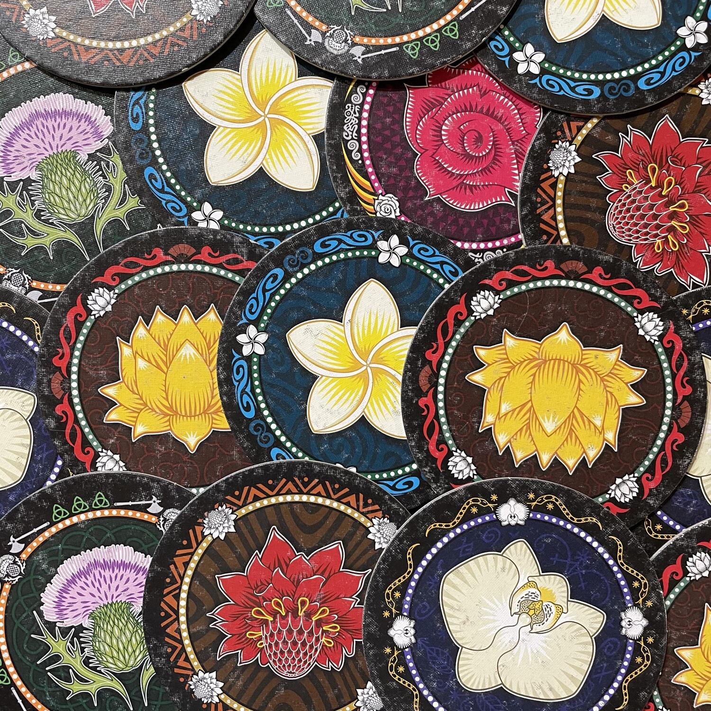
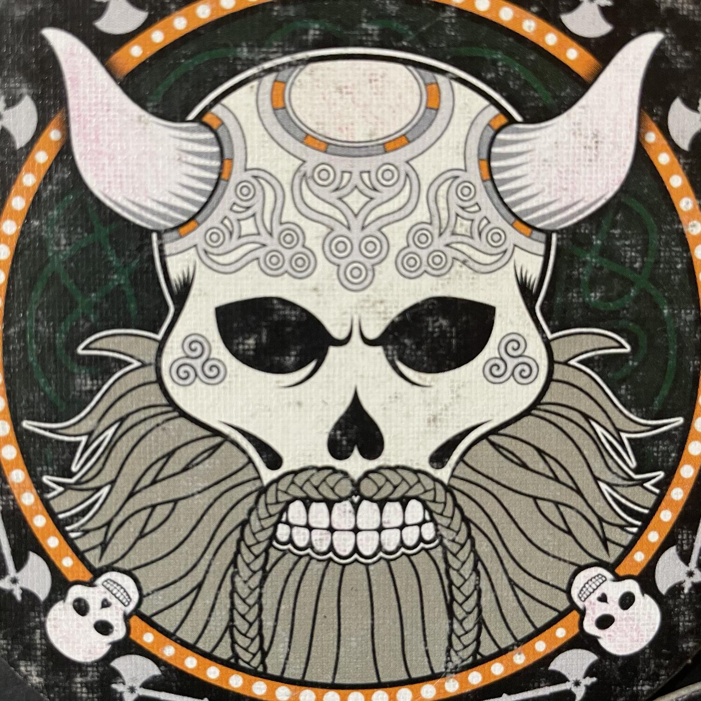

<Setting>

  12 agosto 1921: terminato il viaggio intorno al mondo, degli avventurosi
  esploratori sbarcavano a San Francisco con un bel carico di souvenir, tra i
  quali numerosi incantevoli fiori e… teschi. Decoratissimi e barocchissimi
  teschi. Fiesta de los muertos? L’ultima avventura alla Indiana Jones? Per
  nulla: ma sarà ugualmente bene non disturbare il riposo degli antenati, o
  oggi, a distanza di più di un secolo, toccherà a voi perdere una delle vostre
  preziose vite...

</Setting>

{" "}

<Rules>

  Lo scopo del gioco è quello di vincere 2 sfide prima degli altri giocatori.{" "}
  <strong>Vincere una sfida</strong> significa girare un certo numero di
  dischetti tra quelli che sono stati giocati sui tappetini senza rivelare alcun
  teschio.  
  Il gioco si sviluppa essenzialmente in <strong>3 Fasi</strong>:
    <ul>
    <li>      durante la <strong>Fase 1</strong>, a partire dal{" "}<em>secondo giocatore</em> ognuno in senso orario piazza{" "}<strong>uno dei propri dischetti</strong> dalla propria mano a faccia in giù sul proprio tappetino, senza rivelarlo agli altri;</li>
    <li>      nella <strong>Fase 2</strong> il primo giocatore (ovvero l’ultimo ad aver collocato il suo primo dischetto) è il primo a poter scegliere se{" "}<strong>aggiungere un dischetto extra</strong> sul proprio tappetino prima di cedere il turno al giocatore successivo, oppure se{" "}<strong>lanciare una sfida</strong>, ovvero avviare un’asta dichiarando il numero di dischetti che intende rivelare tra quelli giocati; dopo di lui, se l’asta non è lanciata, il giocatore successivo è posto di fronte alla stessa scelta, altrimenti deve dichiarare un numero maggiore di dischetti o passare;</li>
    <li>      nella <strong>Fase 3</strong> il giocatore che si è aggiudicato l’asta - detto <em>Sfidante</em> - girerà il numero di dischetti dichiarato, cominciando da tutti i propri e proseguendo ogni volta con il dischetto più in cima sulla pila di qualsiasi altro giocatore, finché non avrà rivelato un teschio o un numero di fiori pari al numero scommesso.</li>
  </ul>
  Ci sono sostanzialmente due<strong>esiti dell’asta</strong>: se il giocatore
  ha rivelato un teschio, interrompe il suo turno ed elimina uno dei propri
  dischetti dalla sua mano (casualmente o no, a seconda che il teschio rivelato
  appartenga a un altro giocatore o allo <em>Sfidante</em> stesso). Se il
  giocatore ha rivelato solo fiori, gira il proprio tappetino sull’altro lato, a
  segnalare che ha già vinto una Sfida. In ogni caso, lo Sfidante diventa il
  primo giocatore del Round successivo.

</Rules>

{" "}

<Feedback>

  <em>Skull</em> è essenzialmente un gioco strategico di bluff, nel quale ogni
  giocatore è chiamato ad osservare attentamente il comportamento degli altri,
  come in una partita a poker. L’atto di piazzare un dischetto può divenire una
  superba performance teatrale, nel gruppo giusto, ma questa teatralità non è
  una precondizione al divertimento. Che siate istrionici o meno, vi basterà una
  spolverata di scaltrezza e un pizzico di fortuna per sogghignare soddisfatti
  di fronte alla frustrazione degli avversari, quando scopriranno un teschio
  sperando in un fiore.  
  Come in tutti i giochi di bluff che si rispettino, ogni turno porterà con sé una
  straordinaria dose di imprevedibilità e solo i più furbi potranno reclamare una
  doppia vittoria al tavolo.  
  Il paragone con il Perudo sorge spontaneo, ma il livello di calcolo qui è meno
  sottile e più intuitivo: occorre conoscere l’avversario e riconoscerne lo
  sguardo subdolo per ottenere un vantaggio schiacciante.  
  In definitiva, più che di un party game, come si legge talvolta in qualche recensione,
  siamo in presenza di un solido filler che allieterà molte occasioni di divertimento
  e vi chiederà di essere intavolato spesso con tanti gruppi diversi.

</Feedback>

