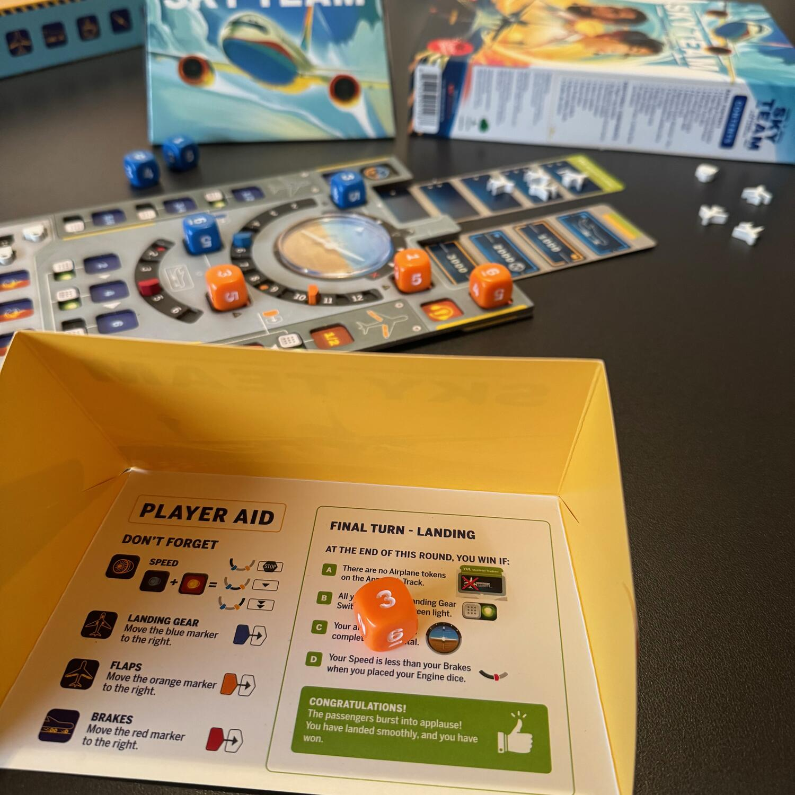
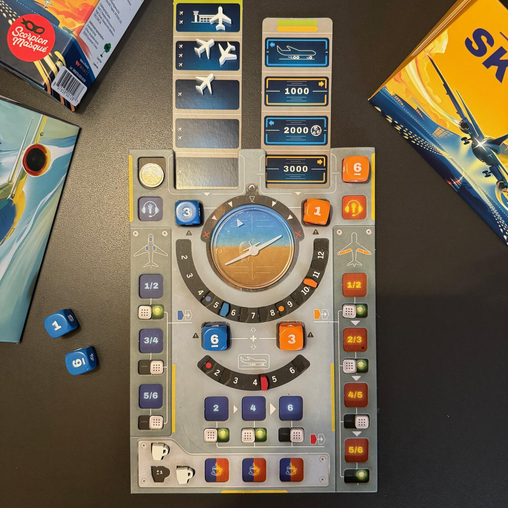

<Setting>

  <strong>Aereo</strong>: "DudeTower qui è DudePlane, piano di volo VFR da Trento a Fiumicino, posizione attuale 6
  miglia nautiche a sud del campo, stimiamo Fiume ai 15, chiediamo istruzioni, passo."
   
  <strong>Torre</strong>: "DudePlane ricevuto, continuate l'avvicinamento al campo, l'ultimo bollettino meteo di Fiume è
  visibilità 10 km, cielo sereno, vento da 340° 8 nodi, QNH 1010.9, riportate campo in vista, passo."
   
  <strong>Aereo</strong>: "Ricevuto, la visibilità è di 10 km, cielo sereno, vento da 340° 8 nodi, QNH 1010.9,
  riporteremo campo in vista, passo."
   
  <strong>Torre</strong>: "È corretto."
   
  <strong>Aereo</strong>: "Campo in vista, chiediamo istruzioni per l'atterraggio, passo."
   
  <strong>Torre</strong>: "Ricevuto, autorizzato ad entrare nel circuito di traffico a sinistra, pista in uso 34, vento
  al suolo 320° 8 nodi, QNH 1010.9, riportate sottovento, passo."
   
  <strong>Pilota</strong>: "Ricevuto, autorizzato circuito di sinistra, pista in uso 34, vento al suolo da 320° 8 nodi,
  QNH 1010.9, riporteremo sottovento, passo."
   
  <strong>Torre</strong>: "Ricevuto, autorizzato all'atterraggio, vento da 320° 8 nodi, passo."
   
  <strong>Aereo</strong>: "Ricevuto, siamo autorizzati all'atterraggio, vento da 320° 8 nodi."
   
  <small>
    Libera ispirazione da <a href="https://www.radiomasterlist.com/it/note-frasi-atterraggio.html" target="_blank">radiomasterlist</a>.
  </small>

</Setting>

<Rules>

  In Sky Team interpretate <strong>un pilota e un copilota</strong> ai comandi di un aereo di linea. Il vostro obiettivo
  è quello di far atterrare il vostro aereo… a suon di dadi!
   
  Alternandovi, giocate silenziosamente i vostri dadi per bilanciare <strong>l'asse</strong> dell'aereo, controllare{" "}
  <strong>la velocità</strong>, aprire <strong>i flap</strong>, estendere <strong>il carrello</strong> d'atterraggio,
  contattare <strong>la torre di controllo</strong> per liberare la rotta e, se lo desiderate, per bere un po' di caffè
  per migliorare la vostra concentrazione.
   
  Silenziosamente? Esatto! Prima di lanciare i vostri 4 dadi avrete la possibilità di pianificare il futuro del vostro
  volo, dirvi su cosa fare attenzione, come procedere ma evitando frasi come "se esce un 6…".
   
  Ora, alternandovi, appunto, dovrete mettere i dadi sulla plancia e attivare le azioni che pensate siano migliori con
  un solo vincolo:{" "}
  <strong>    ogni giocatore deve posizionare un dado per bilanciare l'asse dell'aereo e per controllarne la velocità</strong>
  ; gli altri due possono essere posti dove più vi fa comodo.  
  Mentre l'inclinazione dell'aereo non è importante nel corso della partita base, la velocità sarà sempre fondamentale.
  Infatti, Sky Team dura in un totale di 7 round, dopo i quali, se avrete fatto tutto correttamente, arriverete in
  aeroporto.  
  Cosa potrebbe andare storto?  
  <ul>
    <li>      potreste aver messo l'<strong>aereo sottosopra</strong>;</li>
    <li>      potreste non essere <strong>arrivati paralleli </strong> all'asfalto e quindi fare un bell'incidente in aeroporto
      che Final Destination spostati;</li>
    <li>      potreste essere andati <strong>troppo lenti</strong> e quindi atterrare prima della pista dell'aeroporto, nel
      mezzo del nulla;</li>
    <li>      potreste essere andati <strong>troppo veloci</strong> e quindi sorpassare la vostra ambita meta;</li>
    <li>      potreste <strong>non aver aperto il carrello d'atterraggio </strong> e appoggiarvi "delicatamente" sulla
      fusoliera;</li>
    <li>      potreste <strong>non aver aperto i flap</strong>;</li>
    <li>      potreste <strong>non aver frenato abbastanza</strong>;</li>
    <li>      oppure, potreste finire <strong>schiantati contro un altro aereo</strong> se non chiamate in tempo la torre di
      controllo per far spostare gli aerei che condividono il cielo con voi.</li>
  </ul>
  Insomma, <strong>i motivi per cui non arrivate possono essere tanti</strong>…  
  Se riuscite in tutto quanto sopra, complimenti! Siete pronti a complicarvi il gioco provando{" "}
  <strong>ad atterrare nei prossimi aeroporti</strong>… ma su questo non farò spoiler!

</Rules>

<Feedback>

  Non mi stuferò mai di dirlo, quest'anno sono stato ad Essen, <strong>allo Spiel</strong>! È stata la mia prima
  volta, ero in totale estasi e <strong>super in hype</strong>, a tal punto che della metà dei giochi che volevo provare
  avevo già letto il regolamento e avevo un'idea abbastanza chiara di cosa mi sarebbe piaciuto e cosa no.  
  Tra questi giochi non poteva mancare Sky Team, di cui avevo già parlato nel mio <Link to="/convention/2023-10-02-essen-spiel-tia-parte-1/">
    DudeCon pre Spiel
  </Link>! L'hype è stato ripagato.
   
  Questo gioco si presenta semplice, <strong>4 regole più facili da imparare che da descrivere</strong>, ti trasporta in
  attimi davvero intensi, di pensieri e di sguardi. "Avrà capito cosa ho in mente?", "Metti quel dado lì!" sono pensieri
  che vi culleranno dal primo all'ultimo round. <strong>La tensione è palpabile</strong> e credo che sia il fattore a cui
  questo gioco deve il suo successo!
   
  Come potete immaginare, dovendo lanciare i dadi e dovendosi basare su di questi per "portare giù il bestione", il <strong>    fattore fortuna è sicuramente presente</strong>. Questo può essere <strong>leggermente controllato</strong> attraverso l'azione di preparare il caffé, che poi
  si potrà bere quando lo riterremo necessario, aggiungendo o togliendo 1 dal valore di un qualsiasi dado. Un altro modo,
  è un re-roll di alcuni dei nostri dadi spendendo uno dei due token che otterremo nel corso della partita, uno a inizio
  partita e l'altro quando l'aereo raggiunge i 2000 piedi.
   
  Anche se sembra tutto bello, a mio avviso, c'è una cosa (abbastanza ininfluente) che dovrebbe essere sottolineata: <strong>    la scatola è terribile</strong>. L'inserto non esiste, i materiali continuano a spostarsi all'interno e, per questo, sono stato in grado di perdere
  un pezzettino, probabilmente fuoriuscito durante il trasporto. Immagino sia stata una scelta per <strong>    diminuire sia l'impatto ambientale</strong>, sia il costo della singola copia… ma c'è un limite, ecco.  
  In ogni caso, ogni volta che lo apparecchio in associazione, molta gente si ferma incuriosita e freme per poterlo
  provare la stessa sera.
   
  Il gioco è davvero ben fatto e totalizzante: in una serata si possono fare anche 2-3 partite, affrontando scenari
  sempre più difficili, <strong>con regole sempre più stringenti e con la tensione sempre più alle stelle</strong>!

</Feedback>

