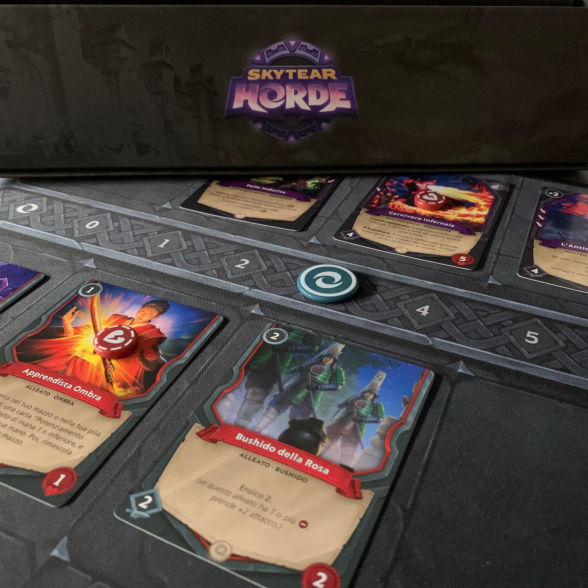
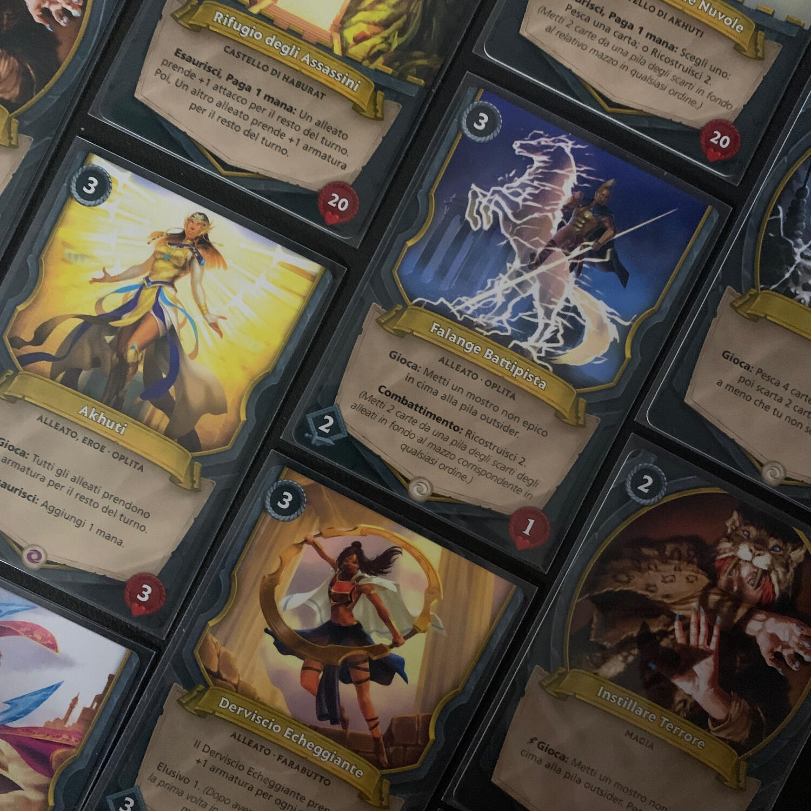
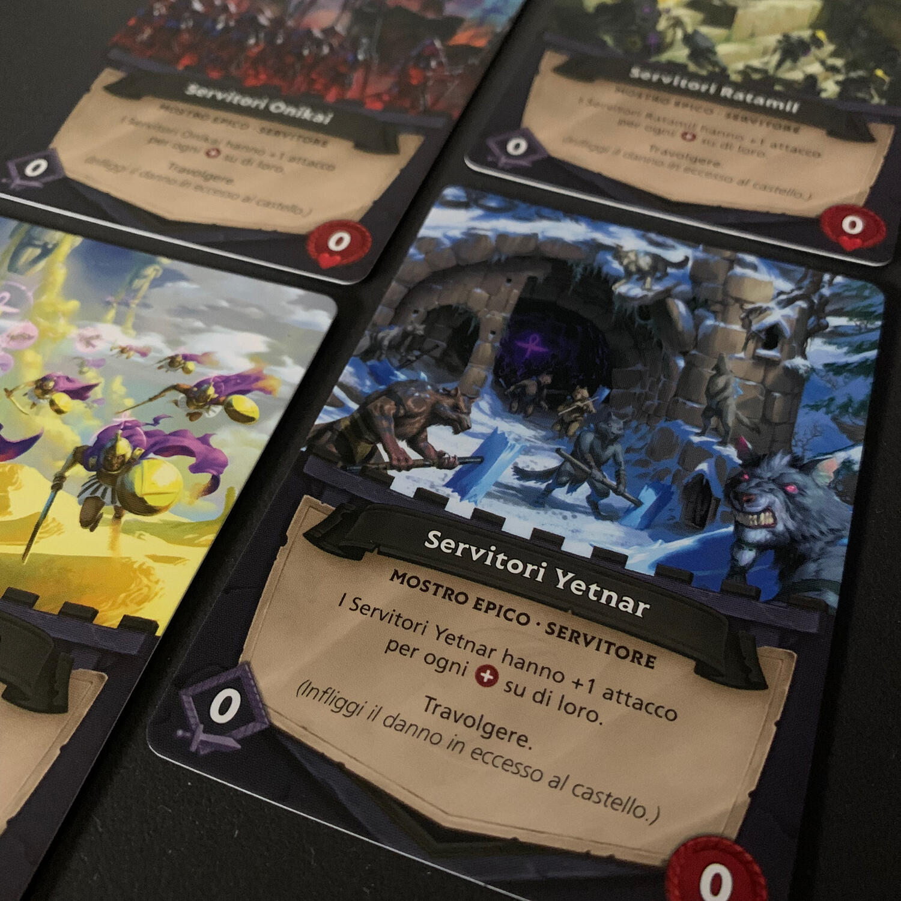

<Setting>

  Un arcano e sconosciuto potere ha invaso il <strong>mondo di Skytear</strong>,
  controllando orde di mostri guidate da terribili elementali conosciuti come
  Outsiders. I leggendari eroi giunti da ogni reame hanno messo da parte le loro
  rivalità e forgiato un'alleanza per respingere la minaccia una volta per
  tutte.
   
  Schiera alleati e torri per impedire ad ondate di nemici di{" "}
  <strong>distruggere il tuo castello</strong> e saccheggiare le tue risorse.
   
  Tuttavia difendersi non sarà sufficiente per vincere! I tuoi alleati dovranno
  contrattaccare e distruggere i portali che generano l'orda.  E una volta
  distrutti i portali, l'enorme elementale Outsider arriverà sul campo di
  battaglia per lo scontro finale. Distruggilo e conquista la vittoria.

</Setting>

<Rules>

  In Skytear Horde dovrete svolgere contemporaneamente quattro compiti:{" "}
  <strong>difendere il castello</strong>, <strong>prevenire il milling</strong>{" "}
  (macina) del mazzo da parte dei minion avversari,{" "}
  <strong>distruggere i portali</strong> nemici ed{" "}
  <strong>uccidere l'Outsider</strong> una volta per tutte.
   
  Tutto questo avviene nel corso di turni, ciascuno dei quali potrebbe essere
  l'ultimo al realizzarsi di una condizione di sconfitta o entrambe quelle di
  vittoria.
   A inizio turno ottenete del "mana" che impiegherete per giocare delle carte
  o per attivare alcune abilità. In base alla carta portale verrà messo in campo
  un certo numero di carte orda, che potranno essere <strong>    nemici</strong> o <strong>magie</strong>. I due eserciti si attaccano a vicenda, morirà
  qualcuno, alcuni danni verranno fatti al castello e altri al portale. Ricordatevi
  che, oltre ai mostri dell'orda, ci sono anche i <strong>    piccoli minion</strong> da tenere a bada. All'inizio saranno deboli e trascurabili, ma a mano
  a mano che cresceranno saranno molto più duri da abbattere degli altri nemici.
  L'unica differenza tra i mostri e i minion è che i primi fanno male, mentre i secondi,
  invece di infliggere N danni, vi fanno scartare N carte… e addio combo.  
  Una volta abbattuto il primo portale, l'Outsider si rivelerà e così avrete un
  nemico in più da tenere in considerazione. Quando lo ucciderete per due volte
  e avrete distrutto l'ultimo portale avrete vinto!

</Rules>

<Feedback>

  Avete mai giocato a un <strong>tower defense</strong> sul vostro cellulare?
  Con gli arcieri bellini che tirano frecce infuocate contro i nemici in
  avvicinamento per salvare il villaggio? Skytear riporta lo stesso feeling, ma
  stavolta sul tavolo.
   
  Chi, come me, per anni ha giocato a Magic e adora i giochi di carte, si esalta
  nel trovare combo improponibili e si arrovella per scoprire tutti i modi per
  spingere il mazzo al massimo… temo che non amerà Skytear.
   
  Tutti gli altri troveranno in Skytear Horde un gioco capace di introdurli al
  genere di cui sopra e che permette di farlo in <strong>solitaria</strong>{" "}
  nelle fredde giornate invernali. Il gioco mette a disposizione dei{" "}
  <strong>mazzi pre-costituiti asimmetrici</strong>, ognuno con i suoi punti di
  forza: ad esempio, il verde gioca molto sullo spostamento dei segnalini,
  mentre il giallo punta a non farvi macinare il mazzo dai minion.  
  Qualsiasi mazzo alleato scegliate, sarà vostro compito capire come attivare le
  combo e trarre il meglio da ogni situazione. Quando li avrete provati tutti e vorrete
  immergervi più a fondo nel mondo di Skytear, potrete anche fare del <Link to="/mechanisms/deck-building">
    deck building
  </Link> prendendo carte di diverse fazioni per creare il mazzo che corrispenderà
  di più al vostro stile di gioco.
   
  Anche <strong>i mazzi dell'orda sono diversi</strong> e dovrete capire come affrontare
  ognuno di essi.
   
  La necessità di tenere a bada le due modalità di sconfitta (danni al castello /
  aver finito il mazzo) sarà la vostra coperta troppo corta: prima o poi dovrete
  lasciare andare qualcosa per passare dalla difesa all'attacco e farvi valere contro
  l'invasore. Bisogna sempre tenere il tutto in <strong>    perfetto equilibrio</strong>: un po' di freddo alle orecchie, un po' alle dita dei piedi.
   
  Inoltre, il gioco mette a disposizione altre due modalità: <strong>    la modalità cooperativa</strong>, dove due giocatori sfideranno l'orda, e la <strong>    modalità 2vs1</strong>, dove l'orda sarà giocata da un giocatore, invece che dall'automa.
   
  Skytear Horde ha risvegliato in me un po' delle emozioni che provavo quando giocavo
  le prime volte a Magic, ma senza eccellere: le combo sono quasi tutte lampanti,
  non è difficile vedere la "matrix" che soggiace ad ogni mazzo per poterla governare
  sin dalla prima partita, sfortunatamente.
   
  In ogni caso, tenete a mente che questo gioco potrà essere un ottimo gateway per
  portarvi in questo magnifico genere, ammesso che non ne abbiate esperienza.

</Feedback>

