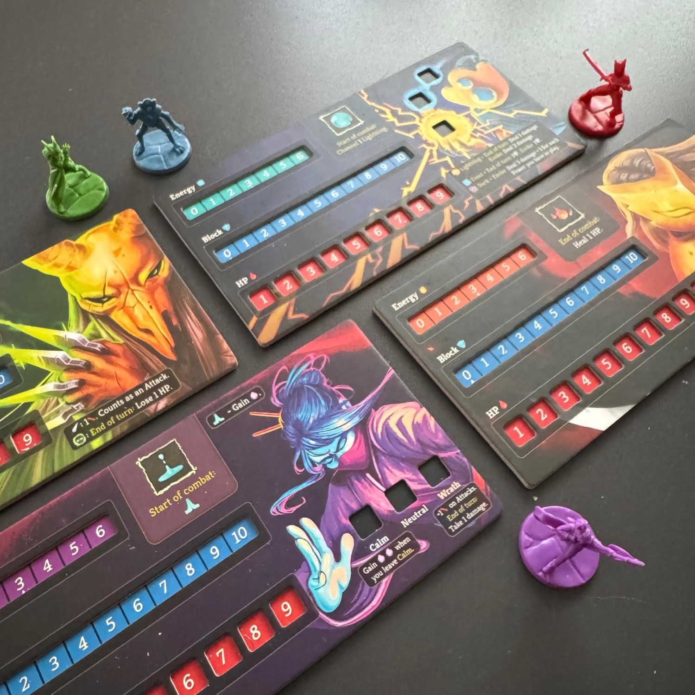
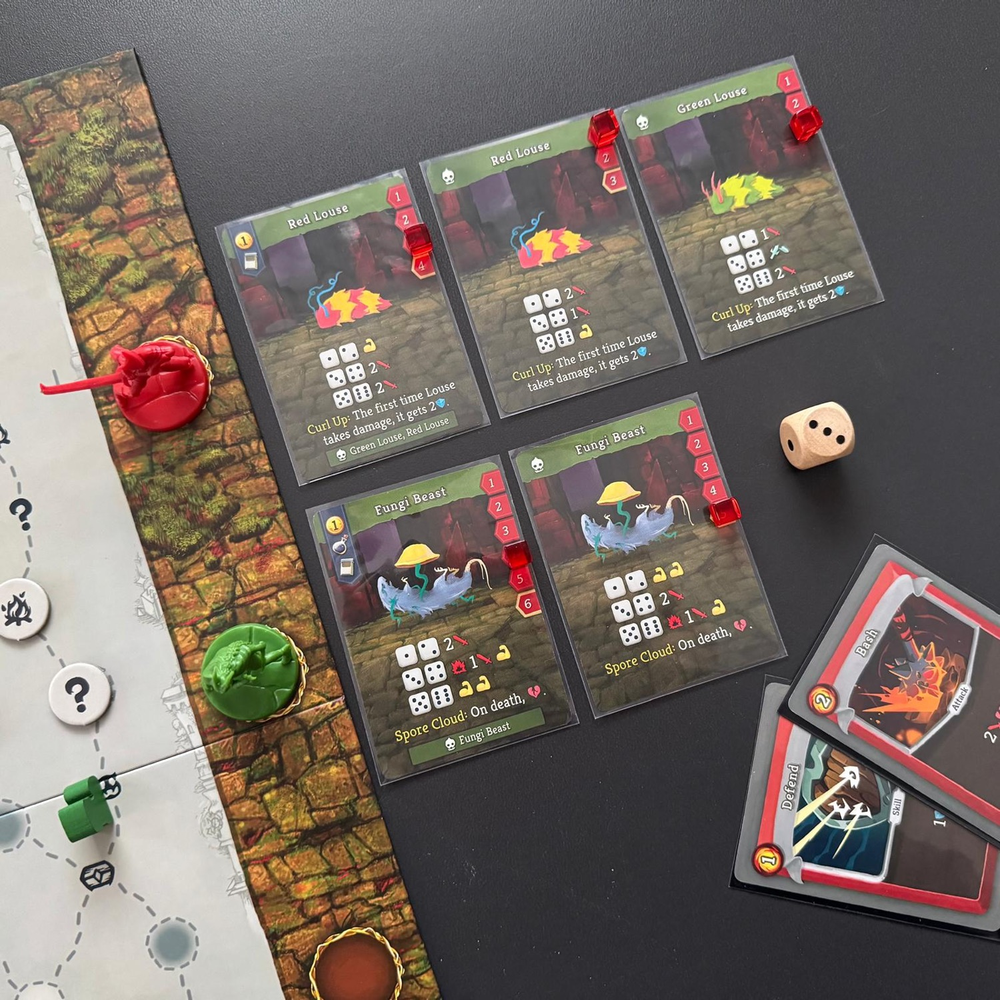
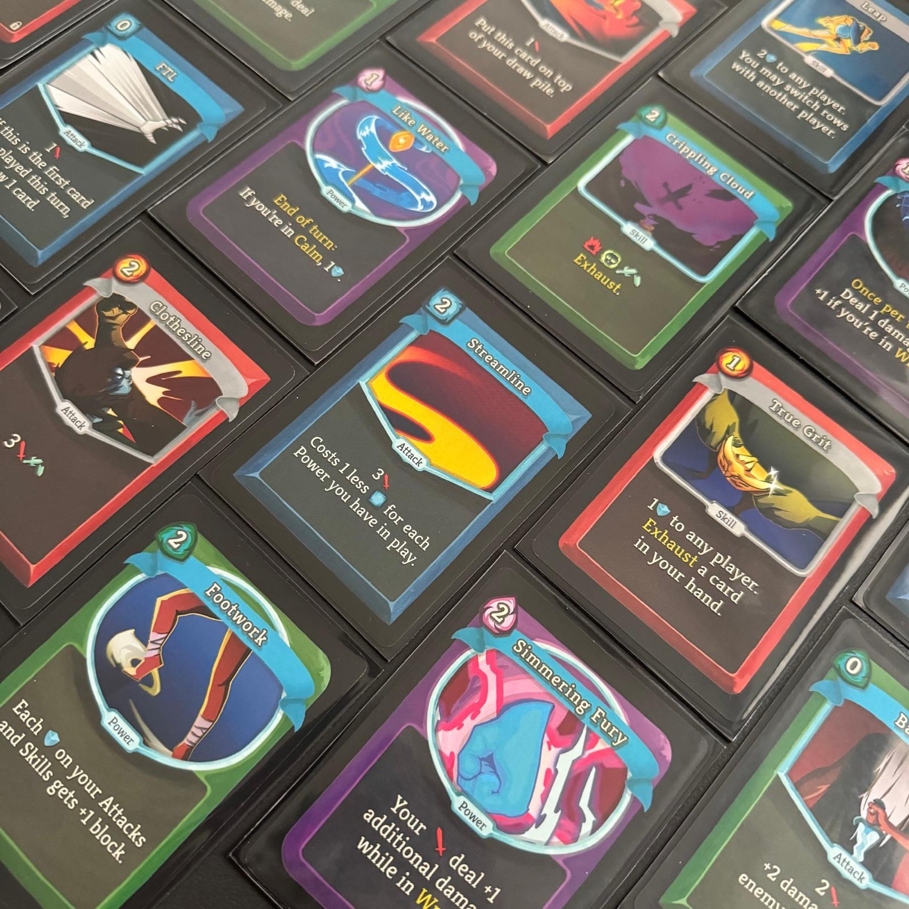

<Setting>
    
Nel cuore di un mondo sospeso tra sogno e rovina, si erge la <strong>guglia</strong>, una guglia viva, antica come il tempo stesso, che sfida le leggi della realtà e chiama a sé coloro che osano ascoltarne il richiamo. Nessuno sa cosa si nasconda alla sua sommità: potere, conoscenza, salvezza… o solo follia.

<strong>La guglia muta a ogni nuova ascensione.</strong> Le sue sale si contorcono e si dissolvono nell’ombra; i suoi corridoi sembrano custodire memorie di chi è caduto prima. Dentro di essa, il mondo si fa incubo e rivelazione: creature mai nate, reliquie di epoche dimenticate, energie che corrompono o illuminano.

Eppure, sempre qualcuno risponde al richiamo. Guerrieri, vagabondi, esseri di carne e d’acciaio, ciascuno spinto da un desiderio che arde più forte della paura. Perché chi osa scalare la guglia non cerca solo di sopravvivere.

Cerca di comprendere.

Cerca di ascendere.

Cerca la verità che giace in cima al mondo.

</Setting>

<Rules>
    
<em>Slay the Spire: the board game</em> è un gioco per 1-4 giocatori che riprende la struttura del <strong>videogioco originale</strong>. Il gruppo affronta la scalata della guglia attraverso una serie di Atti, ognuno composto da un tabellone con percorsi, incontri e boss finali.

Ogni giocatore sceglie un personaggio — Ironclad, Silent, Defect o Watcher — con un proprio mazzo iniziale e abilità uniche. L’<strong>Ironclad</strong> è un tank resistente, capace di infliggere colpi potenti e reggere molti danni; la <strong>Silent</strong> punta sulla rapidità e sullo sfruttamento di combo di attacchi e veleni; il <strong>Defect</strong> gioca con magie e orbs elementali, creando effetti continui sul campo di battaglia; la <strong>Watcher</strong> alterna stati di calma e furia, cambiando radicalmente il proprio stile di combattimento. Scegliere il personaggio giusto non è solo una questione di preferenze: ogni stile di gioco richiede strategia e cooperazione per sopravvivere.

A ogni nuova stanza della guglia, il gruppo decide quale strada intraprendere: si possono incontrare <strong>nemici</strong>, <strong>élites</strong>, <strong>eventi</strong>, <strong>mercanti</strong>, <strong>tesori</strong> o <strong>falò</strong>. I nemici sono vari e spesso richiedono tattiche diverse.

<strong>Il cuore del gioco è il combattimento</strong>, che si risolve in round. Tutti i giocatori agiscono insieme durante il turno dei giocatori, poi tocca ai nemici. L’obiettivo è coordinarsi per infliggere danni, difendersi e sfruttare al meglio le proprie abilità, fino a sconfiggere tutti gli avversari. Dopo ogni vittoria si ottengono ricompense: nuove carte, reliquie o pozioni che rendono i personaggi più forti.

Quando un Atto si conclude, <strong>il gruppo affronta il Boss</strong>. Se viene sconfitto, si può scegliere se proseguire verso il prossimo Atto o terminare la partita. <strong>La sconfitta, invece, arriva se anche un solo eroe scende a 0 punti vita.</strong>

Ogni partita è diversa: la mappa cambia, gli incontri sono casuali e il <strong>mazzo dei giocatori</strong> cresce in modo imprevedibile. La guglia è viva, mutevole e spietata: solo chi impara dai propri fallimenti potrà arrivare in cima.

</Rules>

<Feedback>
    
<strong>Ho amato questo gioco.</strong> 

È raro trovare un titolo che riesca a catturare lo stesso fascino del digitale pur reinventandolo per il tavolo. C’è una fluidità naturale nelle partite, un ritmo che ti tiene sempre sulla corda senza appesantire con calcoli o regole ingarbugliate.

<strong>Amo come ogni personaggio ti costringa a pensare in modo diverso.</strong> Non si tratta solo di scegliere chi ti piace, ma di adattare la strategia: il modo in cui l’Ironclad regge i colpi cambia completamente l’approccio rispetto alla Silent, agile e letale. Ogni scelta ha peso, ogni carta giocata può ribaltare la situazione, e questo rende ogni sessione un’esperienza fresca e stimolante.

Un dettaglio che mi ha davvero conquistato è il sistema delle <strong>carte potenziabili nelle bustine protettive.</strong> Girarle per scoprirne la versione migliore ha un impatto tattile incredibile, quasi soddisfacente quanto schiacciare il tasto “upgrade” nel videogioco originale. È un piccolo gesto che trasmette una grande sensazione di crescita e controllo sulle proprie decisioni.

<strong>L’organizer incluso è una chicca</strong> da non sottovalutare. Avere tutto in ordine, con ogni carta e componente al suo posto, trasforma la preparazione in un piacere e la pulizia in un gesto rapido. Una comodità che, soprattutto per chi gioca spesso, fa davvero la differenza.

<strong>Quello che mi ha sorpreso di più è come il gioco mantenga il feeling del digitale ma lo trasformi. </strong>La cooperazione tra giocatori aggiunge spessore, costringendo a coordinarsi, discutere e pianificare insieme, mentre molte delle complessità del videogioco – buff, debuff, calcoli intricati – vengono snellite, lasciando solo l’essenziale e rendendo il flusso di gioco incredibilmente naturale.

La campagna è un vero gioiello. A mano a mano che si procede, <strong>il gioco diventa più sfidante</strong>, con incontri e boss sempre più insidiosi, ma allo stesso tempo premia con nuovi elementi che ampliano le strategie a disposizione dei giocatori: carte aggiuntive, potenziamenti e reliquie che trasformano il mazzo e permettono di provare approcci sempre diversi. Questa progressione crea un senso di evoluzione tangibile: non si sta solo giocando una partita, ma si sta vivendo una vera e propria scalata, con ogni sessione che lascia il segno e invoglia alla successiva.

In poche parole, <em>Slay the Spire: the board game </em>riesce a essere fedele al cuore del gioco originale, ma con una personalità propria: tattico, <strong>coinvolgente</strong> e sorprendentemente <strong>elegante</strong> da giocare. Ogni partita è una nuova sfida, ogni mazzo una scoperta di strategie sorprendenti e momenti memorabili, che vi spingeranno a tornare al tavolo ancora e ancora.

</Feedback>

