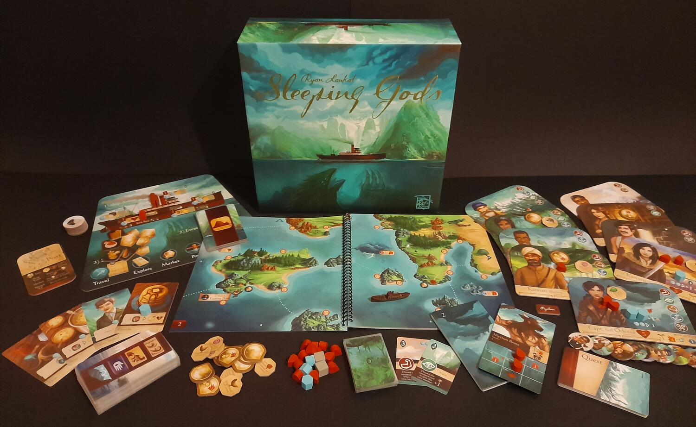
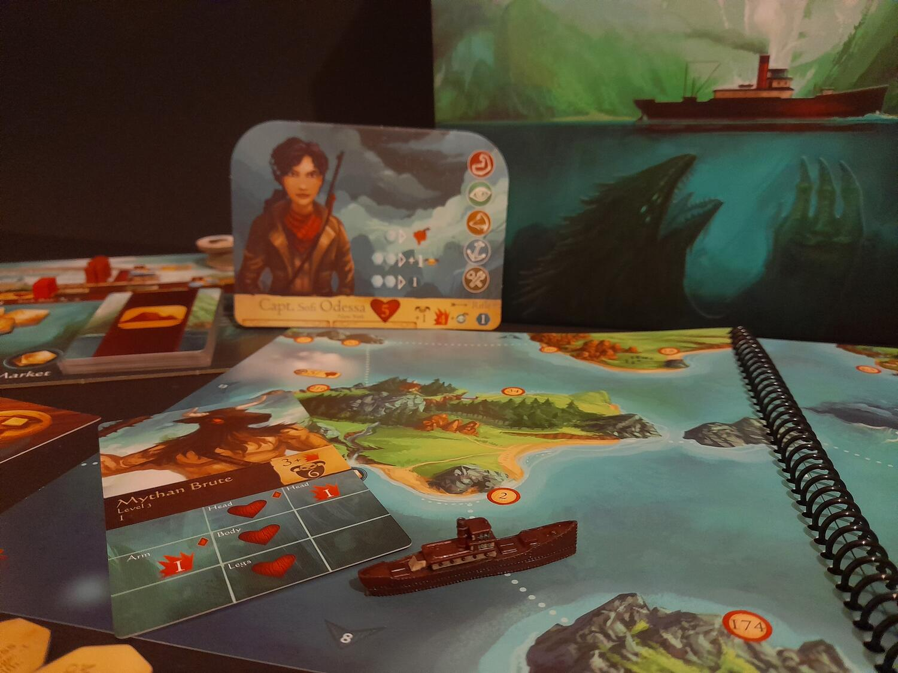

<Setting>

  1929 - Un'improvvisa tempesta trascina il capitano Odessa e la sua ciurma in
  uno sconosciuto arcipelago e in una realtà completamente estranea alla loro.
  Tra oggetti mistici, eventi misteriosi, strane creature e storie mozzafiato, i
  protagonisti dovranno esplorare le isole a bordo della nave a vapore
  Manticore, alla ricerca degli dei e soprattutto dei loro totem, nella speranza
  di riuscire a tornare a casa.

</Setting>

<Rules>

  In Sleeping Gods fino a 4 giocatori impersoneranno il capitano Odessa e il
  resto dell'equipaggio (in tutto 9 personaggi distribuiti tra i giocatori), con
  l'obiettivo di sopravvivere al mondo in cui sono capitati cercando al contempo
  di tornare nella nostra realtà. Il “Mare Vagante” è rappresentato da un
  atlante che contiene diverse mappe, virtualmente collegate tra loro e
  liberamente esplorabili, sebbene alcune zone siano più difficili da affrontare
  di altre.  
  Il gioco si sviluppa in turni alternati tra i giocatori, divisi in <b>
    azione nave
  </b>, in cui si ottengono i segnalini utili a giocare carte e attivare le abilità
  dei personaggi; <b>carta evento</b>, che porrà l'equipaggio di fronte a sfide sempre
  più difficili; e le <b>due azioni principali</b>: viaggiare, esplorare, visitare
  un mercato o un porto. Con l'azione esplorare, in particolare, si avrà accesso
  al libro delle storie, con tutte le sue missioni, avventure, sfide e combattimenti.
  Mentre le sfide andranno tentate sommando il livello dell'abilità richiesta con
  un risultato casuale, con i combattimenti bisognerà risolvere una sorta di minigioco:
  tramite i danni dei personaggi si copriranno le sezioni delle carte avversario
  contro cui si sta combattendo, principalmente cuori per azzerarne la salute ma,
  volendo, in caso di nemici particolarmente coriacei, si potranno abbassare anche
  le capacità offensive della creatura o inibirne le abilità.
   
  In qualunque momento sarà possibile salvare la partita, per poi riprenderla successivamente.
   
  Una campagna dura sempre 54 turni: al termine di questi si raggiungerà un determinato
  finale, in base alle scelte fatte, agli oggetti trovati e alle missioni completate
  durante la partita.

</Rules>

<Feedback>

  Da appassionato dei giochi di Laukat, quando ho finanziato questo gioco su
  Kickstarter ero pieno di aspettative e devo dire di non essere rimasto per
  niente deluso. Una volta cominciata l'avventura, il desiderio di proseguire è
  davvero tanto, da un lato per vedere come si concluderà la vicenda, dall'altro
  per scoprire nuovi posti, leggerne le storie, trovare nuove missioni e
  reliquie. Il senso di esplorazione e scoperta è palpabile ed è ciò che porta
  avanti il gioco, che di fatto è un grande connubio tra un libro game e un
  gioco da tavolo, le cui peculiarità si ritrovano ad esempio nella gestione
  della nave, nell'attenzione al benessere dei personaggi (salute, fatica,
  esperienza) e nei combattimenti. Rendono il tutto ancor più interessante non
  solo i differenti esiti di finale e missioni, in base alle scelte compiute, ma
  anche il fatto che in una partita, a causa del tempo contingentato, si
  riuscirà ad esplorare sì e no un quarto della mappa totale di gioco: tutto ciò
  va a favore della rigiocabilità.
   
  Tra i pochi difetti si può parlare della lunghezza di set up e de-set up tra
  una partita e l'altra, dati i tanti elementi (nel qual caso avere un tavolo
  dove lasciare il gioco apparecchiato per tutta la durata della campagna
  sarebbe l'ideale), e del molto testo da leggere, che potrebbe annoiare alcuni.{" "}
   
  I materiali sono molto buoni: pur non trovandoci di fronte a qualche mastodontica
  edizione Cmon, si nota davvero la cura per i dettagli, nell'ormai iconico stile
  artistico di Laukat.
   
  In conclusione, se siete appassionati di giochi narrativi o volete semplicemente
  vivere una bella storia in compagnia e dove le vostre scelte possono fare la differenza,
  Sleeping Gods potrebbe essere il gioco che fa per voi. Riuscirete a lasciare quel
  misterioso arcipelago e i suoi segreti o rimarrete per sempre prigionieri tra le
  sue isole?

</Feedback>

